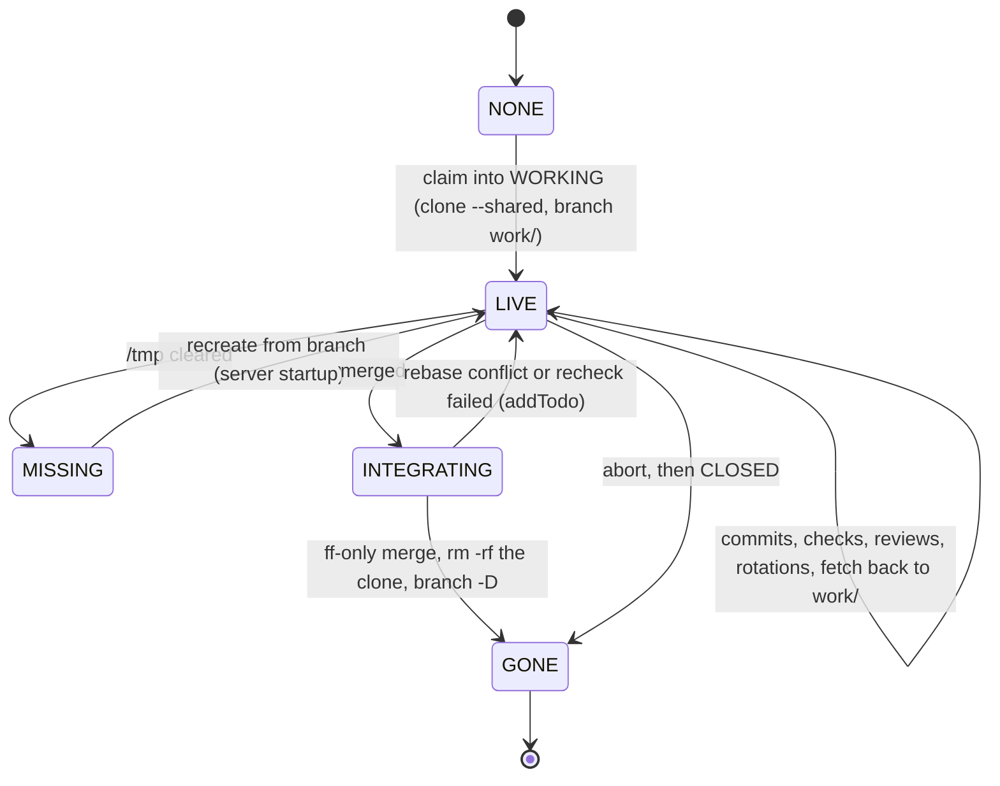
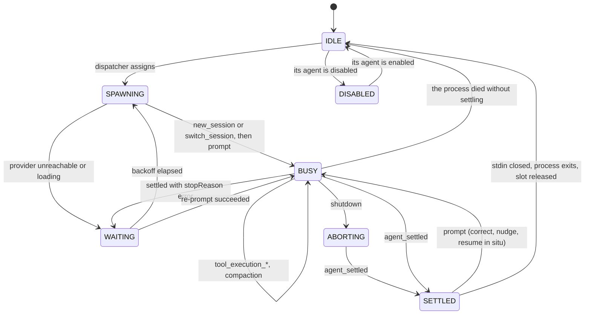
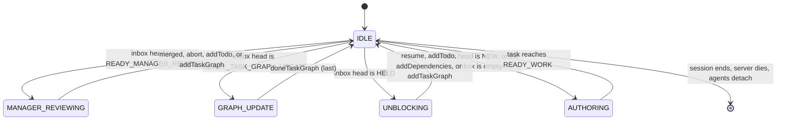

# Orchestrator

An MCP server that turns the task graph into a work queue for `pi` agents.

A manager agent (Claude Code) owns the server over stdio. The server drives `pi --mode rpc` subprocesses running in dedicated clones of the repo, each inside a `bwrap` sandbox that leaves the repo itself read-only, runs the declared checks itself, publishes a live view of everything it owns under `/tmp/task-graph-server/<repo>/`, and brings a task to the manager only when a judgement is needed.

## Topology

```text
        ┌─────────────────────────┐
        │  manager (Claude Code)  │   authors tasks, reviews commits,
        └────────────┬────────────┘   decides what enters the graph
                     │ stdio (MCP)      watches inbox/agents/checks/tasks.json
        ┌────────────┴────────────┐
        │   orchestrator server   │   scheduler · check runner · reaper
        │        (bun)            │   mechanical transitions only
        └────────────┬────────────┘
                     │ JSONL commands in, events out
     ┌───────────────┼───────────────┐
┌────┴────┐     ┌────┴────┐     ┌────┴────┐
│ pi #1   │     │ pi #2   │     │ pi #3   │   commits + ASSIGNMENT.md
│ 000042  │     │ 000057  │     │ 000058  │   no graph access
└─────────┘     └─────────┘     └─────────┘
```

Agents never touch the task graph. Each one gets an `ASSIGNMENT.md` and produces two things: commits on its own branch, and edits to that `ASSIGNMENT.md`. Nothing it writes becomes a graph mutation without passing through the server or the manager.

## The runtime directory

Everything the server knows lives under `/tmp/task-graph-server/<repo>/`, where `<repo>` is the absolute path of the manager's checkout with `/` replaced by `-`. A checkout at `/home/model/task-graph-template` gets `/tmp/task-graph-server/-home-model-task-graph-template/`. Two managers on two clones of the same project never collide, and the directory name says which clone it belongs to.

```text
/tmp/task-graph-server/-home-model-task-graph-template/
  server.log              # the server's own log, capped at 100 MB
  transitions.jsonl       # one line per applied transition, last 1000 kept
  inbox.json              # what is waiting on the manager, in priority order
  agents.json             # every slot, idle ones included
  checks.json             # every running check
  tasks.json              # the last 100 tasks to change state
  queue.json              # what the scheduler would dispatch next, and whether it is
  console-command         # a switch the console flipped, deleted as it is applied
  000042/
    ASSIGNMENT.md         # the live assignment for this task
    history/
      ASSIGNMENT.1.md     # every superseded assignment, in order
      ASSIGNMENT.2.md
    worktree/             # clone of the repo, branch work/000042
    session/
      work/019fac03-fee6-7444-89f7-e643e848eba4.jsonl
      review/019fb1d4-2a0c-7c19-9e11-77c0a5b1e332.jsonl
    agent-rpc.jsonl       # pi's rpc stream, appended across every process
    check-1.log           # stdout + stderr of checks[1]
```

`ASSIGNMENT.md` sits **beside** the workspace, not inside it. A file at the tree root shows up as untracked in every `git status` the agent runs and eventually gets committed. Outside the tree it cannot be, and the diff stays clean without a `.gitignore` entry in the project or per-task `info/exclude` bookkeeping.

Everything here is disposable. A reboot clears `/tmp`, so on startup any task whose `workspace.worktree` no longer exists is cloned again from its branch. The branch is in the repo to clone from because the server fetches it out of the workspace whenever an agent finishes — see [The workspace is a clone](#the-workspace-is-a-clone). Uncommitted work does not survive that, which is one more reason the agent contract is "commit as you go".

### The views

Five snapshots, each written to a temp file and renamed, so a reader always sees a whole document and the manager can watch mtimes instead of polling. All five carry the same `seq` — the transition cursor at the time of the write — so a view and a graph delta can be lined up.

**`inbox.json`** — everything waiting on a person, most nearly closed first. This is the one the manager reads to decide what to do next.

```json
{
  "at": "2026-07-29T02:14:09.113Z",
  "seq": 4417,
  "inbox": [
    {
      "task_id": "000042",
      "title": "Parse frontmatter with Bun.YAML",
      "rank": "READY_MANAGER_REVIEW",
      "blocking": 3,
      "open_todos": 0,
      "held_reason": null,
      "branch": "work/000042",
      "waiting_since": "2026-07-29T02:11:44.002Z"
    }
  ]
}
```

**`agents.json`** — the pool, including what is doing nothing. This is the one that answers "can I dispatch anything right now".

```json
{
  "at": "2026-07-29T02:14:09.113Z",
  "seq": 4417,
  "agents": [
    {
      "name": "pi-anthropic-claude-sonnet-4-5-1",
      "type": "pi",
      "provider": "anthropic",
      "model": "claude-sonnet-4-5",
      "slot": 1,
      "state": "BUSY",
      "task_id": "000042",
      "role": "work",
      "pid": 91733,
      "started_at": "2026-07-29T01:58:02.004Z",
      "activity": "tool: bash — bun test",
      "tokens": 105000,
      "context_percent": 30,
      "session": "/tmp/task-graph-server/-home-model-task-graph-template/000042/session/work/019fac03-fee6-7444-89f7-e643e848eba4.jsonl",
      "log": "/tmp/task-graph-server/-home-model-task-graph-template/000042/agent-rpc.jsonl"
    },
    {
      "name": "pi-llama.cpp-rocm-rocm-1",
      "type": "pi",
      "provider": "llama.cpp-rocm",
      "model": "rocm",
      "slot": 1,
      "state": "WAITING",
      "task_id": "000057",
      "role": "review",
      "pid": 92014,
      "started_at": "2026-07-29T02:09:44.221Z",
      "activity": "provider: 503 model loading",
      "retry_at": "2026-07-29T02:14:14.000Z",
      "attempt": 3
    }
  ]
}
```

`state` is one of `IDLE`, `DISABLED`, `SPAWNING`, `BUSY`, `WAITING`, `ABORTING`, `SETTLED` — the agent state machine below. An idle slot is a row with nulls, never a missing row; the pool is fixed at load and the view shows all of it. `enabled` is the agent's toggle, not the slot's: it is false on every slot of a disabled agent, including the ones still finishing a task, and those read as `BUSY` with `enabled` false until they are released.

`tokens` and `context_percent` come from `get_session_stats`. What a turn cost in dollars is not tracked: it is a provider fact that says nothing about whether the work is progressing, and the two numbers that do — how much context is left and what the agent is doing right now — are already here.

**`checks.json`** — the check runner's processes, which have nothing to do with agents and no longer share a document with them.

```json
{
  "at": "2026-07-29T02:14:09.113Z",
  "seq": 4417,
  "checks": [
    {
      "task_id": "000058",
      "index": 1,
      "command": "bun test",
      "pid": 91802,
      "started_at": "2026-07-29T02:13:51.900Z",
      "log": "/tmp/task-graph-server/-home-model-task-graph-template/000058/check-1.log"
    }
  ]
}
```

**`tasks.json`** — the graph, flattened for reading. The last 100 tasks to change state, closed ones included; the 101st drops off. Closed tasks stay visible because "what just landed" is the question a manager asks most often after a review.

```json
{
  "at": "2026-07-29T02:14:09.113Z",
  "seq": 4417,
  "tasks": [
    {
      "id": "000042",
      "title": "Parse frontmatter with Bun.YAML",
      "state": "WORKING",
      "state_entered": "2026-07-29T01:58:02.004Z",
      "open_todos": 1,
      "failures": 0,
      "open_task_graph_updates": 0,
      "depends_on": ["000007"],
      "blocking": 3,
      "claimed_by": "pi-anthropic-claude-sonnet-4-5-1",
      "held_reason": null,
      "worktree": "/tmp/task-graph-server/-home-model-task-graph-template/000042/worktree"
    }
  ]
}
```

`blocking` is the transitive dependent count — how many tasks are waiting on this one. It is the scheduler's tiebreak, the inbox's tiebreak, and the manager's reason to review one branch before another.

**`queue.json`** — what the dispatcher would hand out next, in the order it would hand it out, plus whether the scheduler is enabled at all. It is `candidates()` written down: the same ranking `dispatch` walks, so the queue a reader sees is the queue that is about to be served, not a re-derivation of it.

```json
{
  "at": "2026-07-29T02:14:09.113Z",
  "seq": 4417,
  "scheduling": true,
  "queue": [
    {
      "task_id": "000042",
      "rank": "READY_WORK_STARTED",
      "blocking": 3,
      "open_todos": 1,
      "prefer_agent": "pi-anthropic-claude-sonnet-4-5-1",
      "session": null
    }
  ]
}
```

A queued task is one waiting on a slot — `READY_AGENT_REVIEW`, `READY_WORK`, or a failed task with a session to resume. Everything else in the graph is waiting on a person, a check or an agent, and is in `inbox.json` or `tasks.json` instead.

### The transition log

One line per successful transition, appended inside the graph lock where ordering is already serialized:

```json
{
  "seq": 1481,
  "at": "2026-07-29T01:51:43.543Z",
  "task_id": "000042",
  "transition": "claim",
  "from": "READY_WORK",
  "to": "WORKING",
  "by": "pi-anthropic-claude-sonnet-4-5-2"
}
```

Three things for one: the cursor the views stamp, a cheap delta for the manager, and the history a reviewer wants when a task arrives having been claimed four times. It is a server file, not a graph file — ephemeral, rebuilt from nothing on restart, and no part of the graph's correctness depends on it.

The file keeps the **last 1000 lines**; `seq` keeps counting past them. A cursor older than the window reads back fewer entries than it asks for, which is the correct answer — the graph itself is the record, and a manager that has been away that long should read `tasks.json`, not a delta.

`server.log` is capped the same way, at **100 MB**, trimmed to whole lines from the end. Both caps exist for the same reason: nothing under `/tmp` is worth losing a machine to, and the tail is the only part anyone reads.

## ASSIGNMENT.md

`ASSIGNMENT.md` is the entire interface between an agent and the project. The server generates it at dispatch; the agent owns it from that moment until it settles.

It is three things and no more:

1. **Frontmatter.** Everything machine-readable: what is assigned, what has been done, and how it ended.
2. **The body.** Goal, scope, acceptance criteria, verification criteria, notes — copied verbatim from the task document, plus what the role needs to start.
3. **Notes.** One free-form section, the agent's own. Plan, progress, dead ends.

Nothing else. The rules of engagement live in the role's system prompt, which is appended to every agent's system prompt, so the assignment can be data.

### Frontmatter schema

```yaml
---
assignment: "000042"
todos:
  - message: "fix null handling in the parser"
    done: false
checks:
  - "bun test"
result: null
---
```

| Field        | Type                    | Written by | Meaning                                         |
| ------------ | ----------------------- | ---------- | ----------------------------------------------- |
| `assignment` | quoted six-digit string | server     | which task this is                              |
| `todos`      | `{ message, done }`     | server     | copied from the graph; **agent sets `done`**    |
| `checks`     | list of commands        | server     | what the work will be judged by                 |
| `result`     | mapping or null         | **agent**  | set last, exactly once; `null` means unfinished |

Four fields, and the agent may write two things: `todos[].done`, and `result`.

Nothing here says which agent, which branch, which worktree or which attempt. The server knows all of that — it dispatched the process, it set the working directory, it counted the rotations — and an agent that is told its own branch name is an agent that can get it wrong. What the reviewer needs to find the work, it is given as prose in the body, where being wrong is visible.

### The result

`result` is a discriminated union on `type`. What a `submit` carries depends on the role, because the two roles produce different things:

```yaml
# work, submitted: the claim is the whole message
result:
  type: submit
```

```yaml
# review, submitted
result:
  type: submit
  findings:
    - "parseHeader returns null on an empty body, and every caller dereferences it"
  delegations:
    - "the retry loop in fetch.ts has the same bug, outside this task's scope"
```

```yaml
# either role, stopped short
result:
  type: blocked
  message: "the staging database refuses every connection"
```

- **`findings`** are defects in _this_ work. Each becomes a todo in the graph, verbatim, and the task goes back to `READY_WORK`. An empty list is the reviewer saying it is satisfied.
- **`delegations`** are defects outside it. They go to the manager, who decides whether they become tasks. Keeping them out of `findings` is what stops a review from growing the task it is reviewing.
- **`message`** on a `blocked` result is required, and becomes `held_reason` verbatim.

Both lists are held to the same standard, and it is a standard about **description, not instruction**: name the symbol, the file and the input that breaks it, say what goes wrong, and stop. A reviewer that writes "use a Map here" has skipped the part only it can supply — what it saw — and substituted the part the implementer is better placed to decide. A delegation phrased as a fix is worse still: the manager is being asked to approve a solution to a problem it has not been shown.

A work result that carries fields, or a review result missing either list, is refused: the server tells the agent what is wrong and lets it fix the file. Being strict here is cheap — the agent has the file open — and it is the only way the two roles can share one parser without one of them silently writing into the void.

The frontmatter is a zod schema per role, so the message an agent gets back is the schema's, keyed by path: `result.delegations: Invalid input: expected array, received undefined`. The same holds for `agents.json` and for the `pi` records on the wire. One parser, one error shape, no hand-rolled validators drifting apart.

### Validation on settle

The server re-reads the file when the agent settles and compares it to what it dispatched. `assignment`, the todo messages and the checks are fixed; a change to any of them is a divergence.

A divergence is **repaired, not argued about**. The server rewrites the fixed fields back to what it dispatched, keeps the two fields the agent owns — a `done` flag survives if its todo message does, the `result` is untouched — and carries on with the settle in the same pass. The repair is one line in `server.log` and nothing else.

That is a deliberate reversal. Prompting an agent to restore a field it was told not to touch spends a turn re-establishing a fact the server already holds, and it spends it at the exact moment the agent believes it is finished. The server knows what it wrote; putting it back costs nothing and cannot fail. What is left for the agent to answer is only what the server genuinely cannot know: whether the work is done.

### Rotation

The server writes `ASSIGNMENT.md` exactly once per dispatch and never again — not even to record a failed check. Anything it wants to say mid-run goes through the session as a `prompt`, and the agent folds it into its own notes. One writer per file at all times, so notes can never be clobbered mid-thought.

On every dispatch that generates a file, the previous one rotates into `history/ASSIGNMENT.<n>.md` first, numbered in order. Nothing an agent wrote is ever overwritten, and the manager sees every attempt rather than the last.

Rotation is also the role handoff. When a reviewer is dispatched, the implementer's file rotates out and the reviewer's is generated from a different template. Two agents, two files, one directory, no shared session.

### The task graph is visible but off-limits

The graph is checked into the repo, so `tasks/` exists in every worktree. The agent can see it. It must not read it for instructions and must not write to it — the copy in a worktree is stale the moment the server applies any transition, and writes to it are discarded at merge.

Worth being blunt about in both system prompts. An agent that reads `tasks/` finds other people's work, and the failure mode is not a crash — it is scope creep with a plausible justification. `ASSIGNMENT.md` is the only accurate statement of what it is supposed to do.

The server enforces the other half: any diff touching `tasks/` becomes a finding at the agent review.

## Who may write what

The graph has one writer process — the server — but two authorities behind it.

**Mechanical transitions.** The server applies these on its own. Each is fully determined by an observed fact: a process settled, a command returned an exit code, a field was set.

| Transition                     | Triggering fact                                                                                          |
| ------------------------------ | -------------------------------------------------------------------------------------------------------- |
| `claim`                        | a free slot started a process, or the server started checking                                            |
| `release`                      | the claiming process is gone                                                                             |
| `doneTodo <i>`                 | `todos[i].done` is true in `ASSIGNMENT.md`                                                               |
| `submit`                       | `result.type` is `submit`, every assigned todo is done, and (for work) the branch is committed and clean |
| `pass` from `CHECKING`         | every check exited 0                                                                                     |
| `fail` from `CHECKING`         | at least one check did not; the failures carry command, code and tail                                    |
| `addTodo` in `AGENT_REVIEWING` | a `findings` entry, copied verbatim                                                                      |
| `hold <reason>`                | an issue outlasted its attempts; the reason names it                                                     |

**Judgement transitions.** Only the manager, through MCP tools. Nothing here is derivable from an observation.

| Transition                                       | Tool                                                 | Why it needs a judge                 |
| ------------------------------------------------ | ---------------------------------------------------- | ------------------------------------ |
| `create`                                         | `task_create`                                        | new work                             |
| `noDependencies`                                 | `task_done_create`                                   | whether a task is ready to be worked |
| `addTodo` in `MANAGER_REVIEWING`                 | `task_add_todo`                                      | whether a finding is real            |
| `addCheck`                                       | `task_add_check`                                     | what counts as verification          |
| `addDependencies` / `removeDependencies`         | `task_add_dependencies` / `task_remove_dependencies` | the shape of the graph               |
| `addTaskGraph`                                   | `task_add_task_graph_update`                         | which tasks should exist             |
| `doneTaskGraph`                                  | `task_done_task_graph_updates`                       | whether the graph now says the truth |
| `claim` into a manager state                     | `task_claim`                                         | which task it is working on          |
| `merged` from `MANAGER_REVIEWING`                | `task_merge`                                         | whether the work is acceptable       |
| `abort` from `MANAGER_REVIEWING` or `READY_WORK` | `task_abort`                                         | whether the task should exist at all |
| `resume` from `HELD`                             | `task_resume`                                        | whether the wall is gone             |

One tool per judgement, named for the judgement. There is no generic `task_transition` taking a transition name and a list of strings: it made every judgement look alike in the tool list, put the manager one typo away from a transition it did not mean, and pushed argument validation from the schema into a string parser. `submit`, `pass`, `fail`, `hold`, `doneTodo` and `release` are not in this table and have no tools — they are the server's, and a tool for them would be a way for the manager to state a fact it has not observed.

The line is: **the server states facts, the manager states opinions.** An agent's opinion is neither — it sits in `findings` or `delegations` until something with authority reads it.

The two mechanical `addTodo`s are the edge the server sits on deliberately: a written finding is copied, never interpreted. A failed check does not even get that far — it is a `fail` carrying the output, not a todo, because nobody has to decide anything about a red build.

## States

| State                                             | Actor       | Mechanism                                              |
| ------------------------------------------------- | ----------- | ------------------------------------------------------ |
| `NEW`                                             | manager     | authors body, `addCheck`, dependencies                 |
| `BLOCKED`                                         | —           | cleared automatically when the last dependency closes  |
| `HELD`                                            | **manager** | reads `held_reason`, then `resume` or restructures     |
| `READY_WORK` → `WORKING`                          | **agent**   | worktree + `ASSIGNMENT.md`; produces commits and edits |
| `READY_CHECK` → `CHECKING`                        | **server**  | runs every check in the worktree                       |
| `READY_AGENT_REVIEW` → `AGENT_REVIEWING`          | **agent**   | fresh session, reads the commit range, writes findings |
| `READY_MANAGER_REVIEW` → `MANAGER_REVIEWING`      | **manager** | reads the range + assignment history; then `merged`    |
| `READY_TASK_GRAPH_UPDATE` → `TASK_GRAPH_UPDATING` | **manager** | creates and edits tasks, `doneTaskGraph`               |

Two of the eight spend model tokens: `WORKING` and `AGENT_REVIEWING`. `CHECKING` is deterministic — running `bun test` and reading an exit code does not need an LLM, and making it mechanical removes the most common failure in agent pipelines, which is a checker reporting a pass it did not get.

### Why the review is split in two

Catching what a careful reader catches and deciding whether the work is acceptable are different jobs. The first is cheap, mechanical to trigger, and scales with slots. The second is a judgement and belongs to the manager. Merging them means every typo-level finding costs a manager round trip.

- **`AGENT_REVIEWING`** runs after the checks pass. A fresh agent, a fresh session, the worktree, the commit range and the acceptance criteria. It writes `findings` and `delegations` and settles. It cannot pass or close anything: the server reads what it wrote and applies it, in the same claim, before the slot is released. Findings become todos and the task drops to `READY_WORK`; no findings and it moves up to `READY_MANAGER_REVIEW`.
- **`MANAGER_REVIEWING`** is the manager, seeing only work that survived both a machine and a peer.

The reviewer never applies its own findings and the server never interprets them. A finding is copied verbatim into a todo, which is the only thing that makes the copy safe to do without a judge.

### Failing forward

`fail` is how both mechanical states send work back, and it is the only transition that writes to `failures`:

| From       | To           | What is recorded                     | Who picks it up           |
| ---------- | ------------ | ------------------------------------ | ------------------------- |
| `CHECKING` | `READY_WORK` | every failing command, code and tail | the implementer's session |

A result that cannot be read is not a failure and never reaches the graph. The agent that wrote it is still holding the claim, so the server says what is wrong in that session and the state does not move; only an agent that gets it wrong twice is `hold`.

The graph carries the failure rather than the server holding it in memory, because the resume may happen after a manager restart. Everything the resume prompt says is rendered from `failures` at dispatch time; nothing about it is remembered anywhere else. A `submit` clears the list — the agent is claiming the failures are gone, and `CHECKING` is about to re-run everything and file a fresh list if it lied.

### HELD

An agent that cannot finish sets `result.type: blocked` with a message. The server asks once whether it really is a wall — for a reviewer, a blocker that is work outside this task's scope is a `delegation`; for an implementer, a wall it can work around is not a wall — and if the next settle is blocked again it applies `hold`, which clears the claim, moves the task to `HELD`, and records the message verbatim in `held_reason`. A person is the most expensive thing the system can spend, so it is worth one prompt to be sure.

The two halves of that question are two files, `blocked-work.md` and `blocked-review.md`, each with its alternative already written into it. There is no shared fragment with a hole in it: the alternatives have nothing in common but their position in the sentence, and a template that interpolates one prose paragraph into another is a worse way to read either of them.

`HELD` is a state rather than a flag on `READY_WORK`, and that is the whole point of it. A flag needs the scheduler to remember to check it and leaves a task sitting in a queue it is not eligible for. A state cannot be forgotten: the dispatcher pulls from `READY_WORK`, a held task is not in `READY_WORK`, and nothing has to be careful.

Four ways out, all judgement:

| Transition        | To                        | The manager decided                         |
| ----------------- | ------------------------- | ------------------------------------------- |
| `resume`          | `READY_WORK`              | the wall is gone; try again unchanged       |
| `addTodo`         | `READY_WORK`              | here is the missing piece of work           |
| `addDependencies` | `BLOCKED`                 | it was waiting on something that isn't done |
| `addTaskGraph`    | `READY_TASK_GRAPH_UPDATE` | the graph was wrong, not the attempt        |

`addDependencies` is the common one, and it is the reason `HELD` and `BLOCKED` are separate states. "Waiting on another task" is a machine-resolvable condition that clears itself when the dependency closes; "waiting on a person" never clears itself. Collapsing them would mean a task that nothing can ever unblock sitting in the same bucket as one that will unblock itself in an hour.

When the manager genuinely cannot resolve it, it escalates to a human. That escalation is the only unbounded thing in the system, and it is deliberately a person rather than a state — the task stays in `HELD` while it happens, which is exactly what `HELD` means.

## Core algorithms

### Mapping pi signals onto the graph

This is the load-bearing one: everything the server does to a task in `WORKING` or `AGENT_REVIEWING` comes out of it.

Two inputs, and they are not interchangeable. The **event stream** says how the turn ended; the **`ASSIGNMENT.md` on disk** says what the agent believes it accomplished. The stream is never the outcome — a run whose every attempt failed still exits 0, and `agent_end` fires once per attempt — so the file is authoritative and the stream only decides whether the file is worth reading yet.

```text
on agent_settled:
    stopReason ← the last assistant message's stopReason

    if stopReason = error:                        # provider trouble, not the agent's
        back off, re-prompt the same session, done

    if the turn was cut short as a loop            → raise "looping"

    if stopReason = aborted:                      # shutdown or timeout
        close stdin, release the slot, done

    parse ASSIGNMENT.md as the dispatched role
    if it does not parse           → raise "unreadable-result"

    repair any divergence from dispatch, in place, silently

    if stopReason = length         → raise "no-result"
    if result = null               → raise "no-result"
    if result.type = blocked       → raise "blocked"

    if role = review:
        findings ← result.findings (+ the tasks/ guard)
        addTodo each, or submit if there are none, release the slot, done

    # role = work
    if any assigned todo is still open            → raise "open-todos"
    if the workspace is dirty, or the branch carries no commit of its own
                                                  → raise "uncommitted"
    doneTodo every open todo in the graph
    submit, release the slot
```

As a table, since these are the cases that matter:

| `stopReason` | `result`  | Server action                                            |
| ------------ | --------- | -------------------------------------------------------- |
| `stop`       | `submit`  | mark todos done, `submit`, close stdin, release the slot |
| `stop`       | `blocked` | raise `blocked`                                          |
| `stop`       | `null`    | raise `no-result`                                        |
| `length`     | any       | raise `no-result`                                        |
| `error`      | any       | leave the process up; re-prompt on backoff               |
| `aborted`    | any       | close stdin, release the slot                            |

A `length` or resultless outcome still keeps the branch, so the next attempt starts from the partial work rather than from the base.

### Issues

Everything the server can find wrong with a settle — and one thing it can find wrong before the settle — is a **named issue** with its own prompt fragment and its own number of attempts. Raising one prompts the live session with that fragment; the attempt after the last one is a `hold` whose reason names the issue.

| Issue               | Attempts | Fragment                                                       | Held as                                     |
| ------------------- | -------- | -------------------------------------------------------------- | ------------------------------------------- |
| `unreadable-result` | 4        | `unreadable-result-<role>.md`, rendered from the schema issues | the agent never wrote a readable result     |
| `no-result`         | 4        | `no-result-<role>.md`                                          | the agent stopped without setting a result  |
| `open-todos`        | 4        | `open-todos.md`, rendered from the open count                  | the agent submitted with _n_ todo(s) open   |
| `uncommitted`       | 4        | `uncommitted.md`, rendered from `git status`                   | the agent submitted work it never committed |
| `looping`           | 3        | `looping.md`, rendered from the repeated command               | the agent kept repeating one command        |
| `blocked`           | 1        | `blocked-work.md` or `blocked-review.md`                       | the agent's own `message`, verbatim         |

Attempts are counted per issue per dispatch, not per settle, so an agent that fails a parse twice and then stops without a result has spent two of one budget and one of another.

Four rather than one, because the failures these catch are ordinary and recoverable: a YAML block with the wrong indentation, a turn that ran out of context before the last line was written, a todo left unticked. Each retry costs one turn against a session that already has the whole task in it, and the alternative — `HELD` — costs a person. Escalating to the most expensive resource in the system after a single misplaced colon is the wrong trade.

`looping` is the one issue not raised from a settle, because the agent it catches never settles. Ten identical tool calls in a row — same tool, same arguments, byte for byte — and the stream flags it, `PiProcess` aborts the turn on the spot, and the settle that the abort produces raises the issue. Consecutive and within one turn: a command run ten times across ten turns is an agent checking its work, and a run broken by anything else starts the count again.

Ten, because a handful of repeats is a retry and a screenful is an agent that has stopped reading. The number that matters more is the reaction. A loop is not a failed submit, so the fragment does not correct anything — it says the command was repeated, that the answer is not in its output, and that the cause may sit outside the diff entirely, in the environment rather than the code. Then it offers the two ways out: try something else, or write `result: type: blocked` and say what the wall is. Handing the agent straight to a person would throw away a session that still has the whole task in it, and would hand over "it kept running `zig build`" instead of the blocker the agent can write in one line. Three attempts rather than four, because each one costs ten tool calls to reach, and an agent that loops three times is not going to read its way out on the fourth.

`blocked` keeps its single attempt for the opposite reason. It is not a failure: the agent stated an outcome and the second look is there to catch the one confusion the fragment can resolve — a reviewer that meant a delegation, an implementer that could route around the wall. If the agent says it again, it means it, and asking a third time is arguing with the answer.

Naming the issues is what makes any of this legible. `server.log` says which issue and how many of its attempts are gone, `held_reason` says which one won, and each fragment is a file that can be rewritten without touching the server.

### A submit has to be in the git history

`uncommitted` is the only issue that reads something other than `ASSIGNMENT.md`, and it is the one that catches the most expensive lie an implementer can tell. Two facts are checked in the workspace before the `submit` is applied, both cheap:

- `git status --porcelain` is empty. `ASSIGNMENT.md` sits outside the tree, so anything reported here is real work the agent left behind.
- `refs/remotes/origin/<base>..HEAD` counts at least one commit, so the branch carries something of the agent's own.

Neither is a judgement, which is why it is the server's to enforce. Everything downstream is a commit range: the checks run in the workspace, the reviewer is given `<base>..HEAD`, and the merge is a fast-forward of the branch. A submit with a dirty tree hands all three the wrong thing — the checks pass against files nobody will ever see again, the reviewer reads an empty diff, and the work goes when the worktree does. The base is read as a remote-tracking ref for the reason every base read inside a workspace is — see [The workspace is a clone](#the-workspace-is-a-clone).

The fragment quotes the `git status` output back — the first 20 entries, because a prompt is not a place to paste a thousand paths — and the attempt lands in the session that still holds every reason the agent had for what it wrote, so the usual outcome is one `git commit` and a second `submit`. The agent was told this in `prompts/work.md` before it started; the check is there because "commit as you go" is an instruction, and a fast-forward merge needs a fact.

Untracked counts, which is the point: a new file the agent wrote and never `git add`ed is the failure this catches most often. The cost of that is build output the project does not ignore coming back as uncommitted work, and the fix for it is a `.gitignore` entry in the project rather than a looser check here.

### Dispatch

Right to left across the state machine: capacity goes to whatever is closest to `CLOSED`, and a task nobody has touched is the last thing considered.

```text
every tick, while the scheduler is running:
    queue ← every task that is dispatchable, ranked
        1  resume            — READY_WORK or READY_AGENT_REVIEW with failures
                               recorded and a session file still on disk
        2  READY_AGENT_REVIEW
        3  READY_WORK with a workspace          (started, sent back)
        4  READY_WORK with none                 (never started)
    ties: most blocking first, then fewest open todos, then lowest id

    for each candidate, in order, while slots remain free:
        if it prefers an agent (workspace.agent) and a free slot has the
          same type-provider-model, take that one
        else if it is at the top of the queue, take any free slot
        else leave it for a tick that has its model free
```

Within every rank, most `blocking` first: unblocking three downstream tasks is worth more than unblocking none, and that is as true of a resume as of a fresh dispatch.

The point is not throughput, it is work in progress. Every task in flight holds a worktree, a branch, a session, and a slice of the manager's attention, and all of that decays — a branch that sat through four sibling merges rebases badly, and a review a day after the fact is a worse review. Ten tasks at 90% are worth less than nine closed and one started.

There is no rank for held tasks and no rule that skips them. `HELD` is not `READY_WORK`, so the dispatcher never sees one.

### Checking

```text
when a task enters READY_CHECK:
    claim it as the server
    run every check, in order, in the task's workspace, sandboxed
    failures ← the ones that exited non-zero, each with its output tail

    if failures is empty → pass       (→ READY_AGENT_REVIEW)
    else                 → fail ⟨failures⟩   (→ READY_WORK)
```

A check is spawned into the same sandbox the agent gets, except that only its own directory is writable — a check runs code the agent wrote, so it is no more trusted than the agent.

Every check runs every time. Nothing records that a check has passed, so there is no stale result to trust and no field for an agent to flip. Re-running a passing command costs seconds; believing a stale pass costs a review.

### Applying a review

```text
when a reviewer settles in AGENT_REVIEWING:
    read ASSIGNMENT.md as a review

    if it does not parse, or result is null:
        raise the issue in the session it is still holding,
        stay in AGENT_REVIEWING (past its attempts → hold)

    findings ← result.findings
    if the branch changed anything under tasks/:
        findings += "the diff writes to tasks/ …"

    if findings is empty → submit                (→ READY_MANAGER_REVIEW)
    else                 → addTodo for each      (→ READY_WORK)
```

`delegations` are not touched here. They stay in the assignment for the manager to read at `MANAGER_REVIEWING`, where deciding what should become a task is the job.

### Integration

`merged` is not a graph decision the manager can make alone — whether a branch landed is a fact about git — so the tool call does the work first and applies the transition only if it worked:

```text
attemptMerge(task):
    fetch the base into the workspace, rebase the workspace onto it
        conflict → abort the rebase, error back to the manager
    run every check again, in the rebased workspace
        failure  → error back to the manager, with the command and its tail
    fetch the rebased branch back into the repo
    fast-forward the base onto the branch
        refused  → error back to the manager
    assert the branch is now an ancestor of the base
    apply merged        → CLOSED, or READY_TASK_GRAPH_UPDATE if updates are queued
    remove the workspace, delete the branch

attemptAbort(task):
    refuse unless the task is in MANAGER_REVIEWING or READY_WORK
    refuse if the branch is already an ancestor of the base
    apply abort         → READY_TASK_GRAPH_UPDATE
    (the workspace and branch are torn down when the task closes)
```

Every failure in `attemptMerge` is an error on the tool call, and the task stays in `MANAGER_REVIEWING`. The manager asked whether the branch lands; "no, and here is why" is the answer to that question, not a reason to write a todo on the manager's behalf and hand the task to an agent. Whether a conflicted rebase is worth an agent round trip, a rewritten task or an abort is exactly the judgement `MANAGER_REVIEWING` exists for, and the manager is already holding the claim when it finds out.

The rebase and the recheck happen **after** the manager accepts, not before. A green review does not mean a mergeable branch — the base moved — and rebasing before review means reviewing a diff that no longer exists.

`abort` is the other outcome: the work is being thrown away because the task was the wrong shape, and what replaces it is a task graph update. Requiring at least one queued update is what makes an abort constructive rather than a silent delete; requiring the branch to be unmerged is what stops it from being used to disown work that already landed.

The same judgement is available one state earlier. A task in `READY_WORK` is one the manager already regrets and no agent has claimed yet — it may never have been started, or it may have come back from a failed check or a review finding — and waiting for it to be dispatched, worked, checked and reviewed before it can be thrown away spends a slot on an answer the manager already has. `task_abort` therefore takes a task in `READY_WORK` as well, on the same two conditions: something queued that says what the graph should become, and a branch that never landed. A task that was worked before it came back keeps its branch and worktree until it closes, exactly as an abort from `MANAGER_REVIEWING` does.

`READY_WORK` is the one abortable state the scheduler is also reading, so the dispatcher has to lose that race rather than win it. Every claim asserts the task is still in the state the plan saw it in, immediately before applying `claim` and after the last `await` that could have let an abort through — without it a task aborted mid-spawn would be claimed into `TASK_GRAPH_UPDATING` by an agent dispatched to work on it, since `claim` is legal from `READY_TASK_GRAPH_UPDATE` too. A claim that lost the race is a dispatch error: the slot is released and the process torn down, and the next tick plans against the graph as it now is.

### The manager inbox

The same right-to-left rule as dispatch, applied to the things only a person can do:

```text
inbox ← every task in one of these states, in this order:
    1  READY_MANAGER_REVIEW    — a branch is finished and waiting on a judgement
    2  READY_TASK_GRAPH_UPDATE — the graph itself is mid-edit
    3  HELD                    — an agent hit a wall and stopped
    4  NEW                     — a task exists but has no body yet
ties: most blocking first, then fewest open todos, then lowest id
```

A row carries `branch`, not the worktree it was built in: what the manager reads is the commit range, and it reads it from its own checkout. The worktree is the server's business.

Reviews first because a finished branch is the most perishable thing in the system and the only one holding a slot's worth of downstream work hostage. Authoring last because a task nobody has started costs nothing by waiting. A manager that authors while reviews queue up has moved the bottleneck upstream without removing it.

### Retention

```text
on every applied transition:
    move the task to the front of the recent list
    while the list is longer than 100:
        drop the last one
        if it is no longer an active task:
            delete /tmp/task-graph-server/<repo>/<id>/ entirely
```

`tasks.json` is that list. A closed task falling off it is the signal that nobody is coming back for its sessions, its rotated assignments or its check logs, so they go with it. An active task never loses its directory that way — its worktree is live, and it is only off the view because a hundred other tasks moved more recently.

## State machines

### Worktree



The workspace is created on the first `READY_WORK → WORKING` claim and survives every work → check → review round trip: the review needs the tree the checks ran in, the sessions live beside it, and the rotated assignments are the record of every attempt.

### Agent



A slot in `WAITING` is not free. Backpressure on a provider outage has to show up as reduced capacity, not as a queue of dispatches into a wall.

`DISABLED` is only entered from `IDLE`, which is what makes disabling safe to do at any moment: the transition is "this slot will not be offered again", never "drop what you are holding". A slot disabled mid-task takes the `→ IDLE` edge it would have taken anyway and lands in `DISABLED` from there.

`BUSY → IDLE` is the death of a `pi` process without `agent_settled` — an OOM kill, a segfault, a runaway tool filling the disk. The stream fails when stdout closes, the worker stops rather than trying to prompt a corpse, and the slot is released; the reaper releases the claim on the next tick, since the task is still `WORKING` under a pid that no longer exists.

### Manager



The four outgoing edges from `IDLE` are the inbox order, which is why the inbox is a view and not a suggestion.

### Server

```mermaid
stateDiagram-v2
    [*] --> STARTING
    STARTING --> RUNNING : load agents.json, reclone missing workspaces, reattach live pids, write views
    STARTING --> FAILED : bad config, or not a git repository
    RUNNING --> RUNNING : tick — settle checks, reap, check, apply reviews, dispatch, write views
    RUNNING --> PAUSED : disable_scheduler
    PAUSED --> PAUSED : tick — everything but dispatch
    PAUSED --> RUNNING : enable_scheduler
    RUNNING --> DETACHING : manager exits
    PAUSED --> DETACHING : manager exits
    DETACHING --> [*] : views left on disk, agents left running
    FAILED --> [*]
```



`PAUSED` still applies transitions. Disabling the scheduler means "start nothing new", not "stop watching" — an agent mid-run when the manager pauses still gets its submit applied and its slot released.

`DETACHING` is why the runtime directory exists at all. The MCP server dies with the manager; the agents are detached and do not. The next manager reads `agents.json`, finds pids that are still alive, and reattaches to their rpc streams instead of orphaning live work.

## Sessions

Sessions belong to a task **and a role**. A slot is a concurrency unit that runs one process at a time; a session is a conversation that outlives the process holding it, because `pi` writes it to disk as it goes.

In rpc mode a `pi` process is a long-lived server on stdin/stdout. It does not exit when the agent finishes — it emits `agent_settled` and waits. That is the whole reason for rpc over `--mode json`: the server can ask questions after the fact (`get_session_stats`), interrupt (`abort`), and follow up (`prompt`) without respawning anything.

An assignment is therefore a conversation with a process, not a command line:

```jsonl
→ {"id":"1","type":"new_session"}
← {"id":"1","type":"response","command":"new_session","success":true,"data":{"cancelled":false}}
→ {"id":"2","type":"prompt","message":"Read ASSIGNMENT.md at <path> and do the work it describes."}
← {"id":"2","type":"response","command":"prompt","success":true}
← {"type":"agent_start"} … {"type":"tool_execution_start", …} … {"type":"agent_end","willRetry":false}
← {"type":"agent_settled"}
→ {"id":"3","type":"get_session_stats"}
```

A resume is the same process type pointed at an existing session file:

```jsonl
→ {"id":"1","type":"switch_session","sessionPath":"<workspace.session>"}
→ {"id":"2","type":"prompt","message":"<the fragment rendered from failures>"}
```

The session path comes out of `get_state` after `new_session` and is recorded in `workspace.session`; without it a resume cannot be found after a manager restart.

The process is started **before** the claim. It has a pid the moment it exists, so `claim` records the agent's real pid rather than the supervisor's, and `release` — which requires a dead pid — works unchanged.

### Roles never share a session

Session directories are per role: `session/work`, `session/review`. A reviewer is given a new session that has never seen the implementer's.

This is not tidiness. An implementer's session contains every rationalisation it built while convincing itself the work was done — the shortcut it decided was acceptable, the test it decided was flaky, the edge case it decided was out of scope. A reviewer that inherits that context inherits the conclusions with it, and agrees. The entire value of the review is that it is an independent read of the commits against the acceptance criteria by something that was not there.

So the reviewer gets: the worktree, the commit range, the goal, the acceptance criteria and the checks that passed. It does not get the implementer's notes, and it does not get the reasoning behind them.

The same applies in reverse. A rejected task starts a fresh session rather than switching back: by the time review comes back, the context worth keeping has been distilled into todos, and the context not worth keeping is the part that produced the rejection.

**Resume only within the same submit cycle.** A failed check is seconds after the work — the agent still holds every reason it made its choices, and re-reading the assignment from scratch would waste all of it. A review rejection is minutes or hours later, after todos have been restructured; that gets a fresh session and a regenerated file.

| Trigger                       | Session          | `ASSIGNMENT.md`        |
| ----------------------------- | ---------------- | ---------------------- |
| first dispatch                | `new_session`    | generated              |
| check failed                  | `switch_session` | `result` cleared       |
| result unreadable             | `prompt` in situ | untouched              |
| settled without a result      | `prompt` in situ | untouched              |
| submitted with todos open     | `prompt` in situ | untouched              |
| came back blocked             | `prompt` in situ | untouched              |
| divergence from what was sent | none             | repaired by the server |
| agent review rejected         | `new_session`    | regenerated            |
| manager review rejected       | `new_session`    | regenerated            |
| resumed out of `HELD`         | `new_session`    | regenerated            |
| provider error                | `prompt` in situ | untouched              |

The `in situ` rows are the ones where the process is still alive and still holds the session — nothing needs switching. Only a resume arriving after the slot was released has to reopen the file.

A check-failed resume clears `result` and nothing else. The fragment tells the agent its result was reset, and it has to be true: the file is not regenerated, so a standing `submit` would let the agent settle without touching anything and the server could not tell the difference. Clearing one field between the old process dying and the new one starting is safe — there is no writer at that moment.

An unreadable result is **not** cleared. The agent needs to see the block it wrote in order to fix it, and the fragment quotes the schema issues that came back.

The divergence row is the only one where the file changes without the agent being told. It is safe for the same reason the check-failed clear is: the server is writing between two of the agent's turns, and the fields it touches are ones the agent was never allowed to write.

### Resuming on a different agent

A session file is JSONL on disk, not a provider handle, so any agent can open one. Continuing a `claude-sonnet-4-5` session on a local model works: the transcript is replayed as context and the new model reads what the old one wrote.

It is worse, though, and predictably so — the reasoning in that transcript was produced by a different model, and the resuming model treats it as given rather than as its own. So the rule is a preference, not a constraint: a free slot of the same `type-provider-model` takes the resume; if none is free and the resume is the highest-ranked item in the queue, any free slot takes it.

`workspace.agent` records the full agent name; the match is on everything before the final `-<slot>`, because two slots of the same model are interchangeable. The fallback is what stops a single saturated provider from stalling every fix in flight; the preference is what keeps that from being the normal case.

### The slot handoff

The moment a `submit` result appears and the server applies `submit`, it closes stdin, releases the claim, and the slot takes the next queued item. Checks then run in the background against the worktree, which is still there.

When those checks fail, the session that must be resumed is on disk and its process is gone. The resume needs a slot of its own, which is why resumes are their own rank and outrank fresh dispatch: a fix that is already understood is worth more than a task nobody has looked at, and the alternative — holding the slot open until checks clear — throws away exactly the parallelism this design exists for.

## Agents configuration

`agents.json` in the directory the server was launched from declares the pool — normally the root of the repo being driven, and never a file inside the orchestrator's own checkout, so one orchestrator can drive several projects with different pools. `agents.example.json` in this checkout is the one to copy. Every slot is a general-purpose slot; there is no checker or manager agent, because those roles belong to the server and the manager.

```json
{
  "agents": [
    {
      "type": "pi",
      "provider": "anthropic",
      "model": "claude-sonnet-4-5",
      "slots": 3,
      "write": ["~/.cache"]
    },
    {
      "type": "pi",
      "provider": "llama.cpp-rocm",
      "model": "rocm",
      "slots": 1,
      "enabled": false
    }
  ]
}
```

Six keys, and no more: an entry is a model on a provider, how many of it may run at once, whether it may run at all, and what it may write outside its worktree. Names are not configured, they are derived — `type-provider-model-slot`, slots numbered from 1 — so that config produces `pi-anthropic-claude-sonnet-4-5-1`, `-2`, `-3` and `pi-llama.cpp-rocm-rocm-1`. The name goes into `claimed_by` and `workspace.agent`, so a claim in the graph says exactly which model on which provider is holding the task.

Rejected on load, not at spawn time: an unknown key, a missing field, a duplicate `type`+`provider`+`model` triple, `slots < 1`. A config that would fail on the tenth dispatch should fail on startup.

### What an agent may write

`write` defaults to `["~/.cache"]` and is the only knob on the sandbox. Declaring it replaces the default rather than extending it, so a pool that needs a rust toolchain writes the whole list — `["~/.cache", "~/.cargo", "~/.rustup"]` — and a pool that should have nothing but its worktree writes `[]`. `~` expands to the home of the user running the server, a relative path resolves against the launch directory, and a path that does not exist on the host is dropped, because `bwrap` cannot overlay what is not there. The paths are resolved at spawn, not at load, so a cache created after startup is picked up. See [The sandbox](#the-sandbox) for what the array actually buys and why every entry is an overlay rather than a bind.

### Turning an agent off

`enabled` defaults to true and is a property of the agent, not of one slot — an entry is a model on a provider, and there is no case where slot 2 of a model should be dispatchable while slot 1 is not. Setting it false in `agents.json` starts that agent parked; `disable_agent` and `enable_agent` move it at runtime, keyed by the agent name — `type-provider-model`, with no slot number — and so does the switch on that agent's pane in the console.

Disabling never interrupts work. A slot mid-task keeps it, settles it, and runs its checks; it is simply not offered as capacity again. That is visible rather than implied: `enabled` is false on every row of the agent from the moment it is disabled, while `state` still reads `BUSY` or `SETTLED` for as long as the task is in flight, and becomes `DISABLED` when the slot is released. An agent being drained and an agent already idle are different situations and the view says which one you are looking at.

The runtime toggle is not written back to `agents.json`. The file is the declared pool and survives a restart; the toggle is an operational override for a provider that has gone bad mid-run, and a restart is exactly when you want the declared pool back.

Nothing here bounds retries, and nothing needs to. A task that keeps bouncing shows up as repeated `claim` lines against the same `task_id` in the transition log, and the manager is the thing watching.

### When the provider is down

`pi` retries inside a turn on its own; the server sees that as `auto_retry_start` and does nothing. What the server handles is the case where `pi` gives up and settles with `stopReason: error`, and the case where a local inference server is not answering at all.

| Condition                        | Server behaviour                                                   |
| -------------------------------- | ------------------------------------------------------------------ |
| connection refused, timeout, 5xx | re-`prompt` the same session after 1s, 2s, 4s … capped at 64s      |
| `503` with a model-loading body  | re-`prompt` every 5s, indefinitely, without escalating the backoff |
| any success                      | backoff resets to 1s                                               |

The distinction matters because they are different events. A refused connection means the provider is broken and every retry costs something; the exponential decay keeps a dead endpoint from being hammered while still recovering within a minute of it coming back. A 503 during model load means the provider is working — a large model on a cold ROCm box takes minutes to map weights — so the server waits rather than backing off, and the attempt counter never advances.

Neither ever exhausts. There is no retry limit, because the failure is not the task's fault and dropping the assignment would lose a live worktree and a session for a reason that will resolve on its own. The slot sits in `WAITING`, `agents.json` shows the reason and the next `retry_at`, and the manager can see at a glance that its capacity is halved and why.

## Workspace lifecycle

```bash
# claim, then create
git clone --quiet --shared --branch master <repo> \
  /tmp/task-graph-server/-home-model-task-graph-template/000042/worktree
git -C …/000042/worktree checkout -b work/000042

# inside the workspace: the range to review, and what a submit is checked against
git log --patch $(git merge-base refs/remotes/origin/master HEAD)..HEAD
git rev-list --count refs/remotes/origin/master..HEAD
git status --porcelain

# whenever an agent finishes, bring the branch back
git -C <repo> fetch --force …/000042/worktree work/000042:work/000042

# accept
git merge --ff-only work/000042        # after rebase + recheck
rm -rf /tmp/task-graph-server/-home-model-task-graph-template/000042/worktree
git branch -D work/000042
```

### The workspace is a clone

A linked worktree keeps its refs, its index and its objects in the repo's `.git`, so committing in one writes to the repo. An agent that cannot write the repo cannot commit in a linked worktree at all — `git worktree add` and a read-only repo are mutually exclusive, and that is why the workspace is a clone.

`--shared` points the clone's `objects/info/alternates` at the repo's object store. No history is copied, the clone costs a checkout, and nothing is written to the repo to create one. What a clone does _not_ copy is local config, so the commit identity is read out of the repo and set in the clone; without that, the first commit fails in any repo that keeps `user.email` local.

Objects only flow the other way on a `fetch`. The server fetches `work/<id>` out of the workspace whenever an agent finishes and again after the merge rebase, so the branch is a fact in the repo rather than in a directory under `/tmp`: everything the server and the manager read — `diff --name-only`, `merge-base --is-ancestor`, `merge --ff-only`, the reclone after a cleared `/tmp` — reads the repo's own refs. It is also what makes the work durable, since a `git gc --prune` in the repo can collect objects that only a clone's alternates still reach.

Inside a workspace the base is always `refs/remotes/origin/<base>`, never the bare name. A clone made from the base has a local branch of that name, but one recloned from a surviving `work/<id>` after `/tmp` was cleared has only the remote-tracking ref — and `git merge-base master HEAD` in that clone is a fatal error, not a fallback. The remote-tracking ref is there in both cases, so the review range and the commit count read the same way whether the workspace is the original or a reclone. (The one exception is the merge rebase, which `fetch origin <base>:<base>` right before it, precisely to have a local ref to rebase onto.)

The branch is `work/<id>` rather than `task/<id>` for the same reason the file is `ASSIGNMENT.md`: everything an agent reads is phrased in terms of the work in front of it, never in terms of the graph it is not allowed to see.

Two commit streams that never collide:

- **work branches** carry code. Agents commit there.
- **the base branch** carries `tasks/`. The server commits graph mutations there, in the main checkout.

The manager's checkout is the only graph that matters. Every worktree is created from it, so an agent reading `tasks/` reads a stale copy of the same thing, and there is never a second graph to reconcile.

## Spawning pi

```
pi --mode rpc \
   --provider  <agent.provider> \
   --model     <agent.model> \
   --session-dir /tmp/task-graph-server/<repo>/000042/session/work \
   --name      "000042 work" \
   --approve \
   --append-system-prompt @/path/to/task-graph-template/orchestrator/prompts/work.md
```

- No `-p` and no positional message. `--mode rpc` is a run mode, not an output mode: the process reads commands from stdin until stdin closes, and the work is requested with a `prompt` command.
- There is no `--cwd`. The working directory is set at spawn, as `--chdir <workspace>` on the sandbox around it.
- The system prompt is the **role's**: `prompts/work.md` or `prompts/review.md`. The path is absolute and points into the orchestrator's own checkout, because the child's cwd is the worktree and the prompts do not live in the driven repo.
- The prompt stays one line on purpose. The work lives in `ASSIGNMENT.md`, where it can be re-read after compaction; a brief pasted into the conversation cannot be re-read once it scrolls out.
- `pi` has no MCP client — the project rejects MCP by design and expects agents to drive CLI tools over bash. That and the manager-owns-the-graph rule point the same way: the agent's interface to the outside world is a file, not a tool.
- Spawn detached, tee stdout to `/tmp/task-graph-server/<repo>/000042/agent-rpc.jsonl`, appending. Every process that ever ran against this task writes to that one file, in order, so the record of an assignment that took four attempts across two roles reads as one stream.

### The sandbox

Every process the server spawns — agents and checks alike — is wrapped in a cgroup scope, an oom score, and `bwrap`:

```
systemd-run --user --scope --quiet --collect \
      -p MemoryMax=8G -p MemorySwapMax=0 -p TasksMax=512 -- \
choom -n <300 agent | 400 check> -- \
bwrap --ro-bind / / --dev /dev --proc /proc --tmpfs /tmp \
      --ro-bind <repo> <repo> \
      --overlay-src ~/.cache --tmp-overlay ~/.cache \
      --overlay-src ~/.pi --tmp-overlay ~/.pi \
      --bind  /tmp/task-graph-server/<repo>/000042 \
              /tmp/task-graph-server/<repo>/000042 \
      --unshare-user --unshare-pid --unshare-ipc --unshare-uts --new-session \
      --chdir <workspace> -- pi --mode rpc …
```

- `--ro-bind / /` is recursive, so everything an agent needs to read stays readable — toolchains under `/usr/local`, the prompts in the orchestrator's own checkout — and everything not named below is unwritable. `--approve` auto-approves every tool call, so this is the only boundary there is.
- The repo is re-bound read-only **after** `--tmpfs /tmp`, because a repo can sit under `/tmp`.
- The bound-writable set is one directory: the task's own runtime directory. That is the workspace, `ASSIGNMENT.md` and the session files — not the repo, not another task's directory, not the views, not the manager's home.
- `/tmp` is a private tmpfs, so whatever an agent or a check scribbles there goes when the process does.
- Everything else an agent may write to is declared, not hardcoded: the `write` array on its `agents.json` entry, each path mounted as a throwaway overlay. Reads see the host, writes land in an upper layer that is discarded with the sandbox.
- `~/.pi` is added to that list for any agent of type `pi`, declared or not. `pi` takes a lock under it at startup; reads see the real settings and writes are discarded, so an agent cannot edit the settings of the next one.
- `~/.cache` is the default `write` entry, and its purpose is zig. A build tool keeps a cache outside the workspace — `zig` under `~/.cache/zig`, and cargo, go and npm under their own — and a read-only one is not a slow build but a hard failure: `zig build` cannot even compile `build.zig` and dies with `manifest_create ReadOnlyFileSystem`, which reads like a compile error and sends an agent hunting through its own diff. The overlay keeps the host's warm cache readable, so a build is not paying to rebuild the standard library, while every entry the task writes is discarded with the sandbox.
- A check has no agent, so it gets no `~/.pi` and runs with the union of the `write` paths declared across the pool — a check runs the same build the agent just ran, and would hit the same read-only cache.
- No `--unshare-net`. Calling a provider is the whole job, and a network namespace has nothing but loopback — a fresh one, so even a llama.cpp server on `127.0.0.1` is unreachable from inside it.
- No `--die-with-parent`. Agents outlive the manager on purpose; tying the sandbox to its parent would undo `detach`.
- `bwrap` stays as the parent of what it spawns, which is what keeps the process bookkeeping honest: the recorded pid is a `bwrap` owned by the server's own user, so `kill(pid, 0)` still answers "is this agent alive" and `kill` still stops it. Because that `bwrap` is pid 1 of the namespace, the tool subprocesses an agent left behind die with it instead of leaking. Both wrappers `exec` in place rather than forking, so the recorded pid is still the `bwrap` and none of that bookkeeping changes.
- `bwrap` is not a resource limit. It gives namespaces, bind mounts and seccomp, and has no notion of how much memory or how many processes live inside it — `--unshare-pid` isolates the pid namespace but puts no bound on what may be spawned in it. A check that fork-bombs took the host down once: `zig build spec-test` re-entered its own parent branch in every child and reached at least 6337 live processes and 36G of rss, and because nothing was scoped the kernel's `global_oom` reaped a llama.cpp server, `dbus-broker` and the user's own `systemd` before it got to the agent.
- The cap therefore comes from cgroup v2, which is a property of the scope and not of the sandbox. Every spawn gets its own transient scope, so a runaway task is contained to itself and the other slots keep running. `TasksMax` is what actually stops a fork bomb, and cheaply — it dies at process 512 rather than at 50000. `MemoryMax` contains it too, but by triggering a cgroup oom that kills inside the scope instead of letting the kernel choose victims across the machine. `MemorySwapMax=0` matters as much as either: thrashing swap is what makes the host unresponsive well before anything is killed.
- `--collect` so a scope whose process died is garbage collected rather than left behind as a failed unit.
- `OOMScoreAdjust` is an exec property and a scope has no exec context, so systemd rejects it outright — `Unknown assignment: OOMScoreAdjust=300`. `choom` sets it instead, and because `oom_score_adj` is inherited across both `fork` and `exec` it reaches every descendant inside the sandbox. Checks sit above agents (400 against 300) because a check is the more disposable of the two, and both sit well above anything of the user's, so the kernel takes a task apart before it takes the session apart.
- If `systemd-run` is missing, or the host has no cgroup delegation, the server warns once at startup and spawns bare `bwrap`. The isolation is unchanged; only the limits are gone.

### The command channel

Commands are JSONL on stdin, one object per line, `\n` only. Every command may carry an `id`, and the matching `{"type":"response","id":…,"success":…}` comes back on stdout. Split stdout on `\n` alone — Node's `readline` also splits on U+2028/U+2029 and will corrupt a stream containing them.

| Command                          | Used for                                         |
| -------------------------------- | ------------------------------------------------ |
| `new_session` / `switch_session` | start an assignment, or reopen one for a resume  |
| `prompt`                         | the dispatch message, and every fragment         |
| `abort`                          | shutdown                                         |
| `get_state`                      | the session file path, right after `new_session` |
| `get_session_stats`              | tokens and context percent for `agents.json`     |
| `get_last_assistant_text`        | the agent's closing words, for the log           |

### Reading the stream

Verified against pi 0.81.1:

| Signal             | Value                                                                                          |
| ------------------ | ---------------------------------------------------------------------------------------------- |
| completion         | `agent_settled` — the only event meaning "pi will not continue"                                |
| **not** completion | `agent_end` — fires once per attempt; a failing run emitted four, three with `willRetry: true` |
| outcome            | `stopReason` on the final assistant message: `stop`, `length`, `toolUse`, `error`, `aborted`   |
| error text         | `errorMessage` on that same message                                                            |
| progress           | `tool_execution_start` / `tool_execution_end` (`isError`)                                      |
| trouble            | `auto_retry_start` (`attempt`, `maxAttempts`), `compaction_start` (`reason: "overflow"`)       |

Treating `agent_end` as "the agent finished" is the mistake this design is most likely to make; `willRetry` is the field that distinguishes them, and `agent_settled` is the one to wait on. The exit code is no help at all — in rpc mode the process outlives the turn.

## MCP tool surface

One stdio server, calling `task.ts` and `transition.ts` in process. There is no command-line path into the graph for the manager to reach for: a single writer is what keeps the lock meaningful and the transition log complete.

**Authoring**

| Tool                                     | Effect                                 |
| ---------------------------------------- | -------------------------------------- |
| `task_create(title)`                     | a new document in `NEW`, path returned |
| `task_write_body(id, body)`              | replaces the body under the lock       |
| `task_add_check(id, command)`            | one more command the work is judged by |
| `task_add_dependencies(id, task_ids)`    | `NEW` → `BLOCKED`                      |
| `task_remove_dependencies(id, task_ids)` | the last one removed → `READY_WORK`    |
| `task_done_create(id)`                   | `NEW` → `READY_WORK`                   |

**Judgement**

| Tool                                                    | Effect                                                                          |
| ------------------------------------------------------- | ------------------------------------------------------------------------------- |
| `task_claim(id)`                                        | `READY_*` → the matching manager state                                          |
| `task_add_todo(id, message)`                            | → `READY_WORK` from a review or from `HELD`                                     |
| `task_resume(id)`                                       | `HELD` → `READY_WORK`                                                           |
| `task_add_task_graph_update(id, op, task_id?, message)` | queues a change the graph needs                                                 |
| `task_done_task_graph_updates(id)`                      | every queued update done → `CLOSED`                                             |
| `task_merge(id)`                                        | rebase, recheck, fast-forward, then `merged`                                    |
| `task_abort(id)`                                        | `abort` from `MANAGER_REVIEWING` or `READY_WORK`, refusing a branch that landed |

`task_merge` and `task_abort` are the two that do work before they touch the graph, and the two whose failures come straight back to the caller rather than into the task.

`task_done_task_graph_updates` takes no index and is called once. The manager does not report progress through a queue of its own edits — it says the graph now matches what it promised, and the task closes. An index-at-a-time tool would be a way to close a task with half the graph updated.

**Dispatch**

| Tool                   | Behaviour                                                           |
| ---------------------- | ------------------------------------------------------------------- |
| `enable_scheduler()`   | begin dispatching; returns immediately                              |
| `disable_scheduler()`  | start nothing new; running processes are still settled and released |
| `disable_agent(agent)` | stop dispatching to every slot of one agent; running slots drain    |
| `enable_agent(agent)`  | offer that agent's slots again                                      |

`disable_scheduler` and `disable_agent` are the same verb at different scopes: the first parks the whole pool, the second parks one model on one provider when it is the thing misbehaving. Both return the slots they affected, so the caller can see what is still draining. `agent` is `type-provider-model` with no slot number — there is no way to disable a single slot, because a slot is a concurrency unit and not something you can have an opinion about.

**Resources**

| Resource         | Contents                                                       |
| ---------------- | -------------------------------------------------------------- |
| `inbox`          | `inbox.json` — what is waiting on the manager, in order        |
| `agents`         | `agents.json`                                                  |
| `checks`         | `checks.json`                                                  |
| `tasks`          | `tasks.json`                                                   |
| `queue`          | `queue.json` — what the scheduler would dispatch next          |
| `workspace_path` | the path to `/tmp/task-graph-server/<repo>`, for file watchers |

### The manager owns what it holds

`task_create` returns a path, and the document at that path is the manager's to edit with ordinary file writes until it transitions out of `NEW`. The same applies on the other end: when the manager claims a task into `MANAGER_REVIEWING`, the document becomes its to edit directly — folding the assignment history into the Implementation History section is exactly the kind of prose work that should not go through a tool.

This is safe because ownership follows the claim. The server applies no transitions to a task the manager holds, so there is no second writer to race with. `task_write_body` exists for the case where the manager wants to rewrite a body it does not hold; direct editing is for the case where it does.

## Prompts and templates

Every word an agent reads is a file. Nothing in `orchestrator/*.ts` builds a sentence, so a prompt can be rewritten without a diff to the server, and reading the thirteen files is reading everything the agents are told.

| File                                  | Kind            | Given to                                            |
| ------------------------------------- | --------------- | --------------------------------------------------- |
| `prompts/work.md`                     | system prompt   | every `WORKING` agent                               |
| `prompts/review.md`                   | system prompt   | every `AGENT_REVIEWING` agent                       |
| `prompts/dispatch.md`                 | prompt fragment | every agent, as the first thing it is asked         |
| `prompts/check-failed.md`             | prompt fragment | a resumed implementer, rendered from `failures`     |
| `prompts/no-result-work.md`           | prompt fragment | an implementer that settled without a result        |
| `prompts/no-result-review.md`         | prompt fragment | a reviewer that settled without a result            |
| `prompts/unreadable-result-work.md`   | prompt fragment | an implementer whose frontmatter did not parse      |
| `prompts/unreadable-result-review.md` | prompt fragment | a reviewer whose frontmatter did not parse          |
| `prompts/open-todos.md`               | prompt fragment | an implementer that submitted with todos open       |
| `prompts/uncommitted.md`              | prompt fragment | an implementer that submitted uncommitted work      |
| `prompts/looping.md`                  | prompt fragment | either role, caught repeating one command           |
| `prompts/blocked-work.md`             | prompt fragment | an implementer that came back blocked               |
| `prompts/blocked-review.md`           | prompt fragment | a reviewer that came back blocked                   |
| `prompts/wrote-to-tasks.md`           | finding         | appended by the server when a diff touches `tasks/` |
| `templates/working.md`                | state template  | generated at every work dispatch                    |
| `templates/agent-review.md`           | state template  | generated at every review dispatch                  |

There are no templates for `CHECKING`, `MANAGER_REVIEWING` or `TASK_GRAPH_UPDATING`: the first is the server, and the last two are the manager, which has the graph and does not need a file handed to it.

### A fragment names the edit, not the mistake

Every issue fragment is an instruction to make a specific edit to a specific file, and the exact block to write is in the fragment. None of them is a description of what the agent got wrong.

That is a correction to how these read at first. `no-result.md` used to say "You stopped without setting `result` … Set it now: `type: submit` if every todo is done", and a capable model answered it four times by writing `type: blocked` **as prose in its reply**, reasoning each time that it had already given the result and the system must not be picking it up. It was held with the work finished and a perfectly good blocker message that never reached the graph. Nothing about that prompt was untrue; it just never said "edit the file", and a model that has spent forty turns talking to a person will answer a sentence in the register it was asked in.

So each fragment now leads with the imperative — `Edit ../ASSIGNMENT.md and replace the result: null line …`, `Commit your work in this worktree, then submit again:` — carries the literal YAML or shell block to write, and says outright that the file is the only thing read and a reply is discarded. `open-todos.md` lists the three edits that end the situation instead of counting the todos that are open.

The same reasoning splits `no-result` and `unreadable-result` per role, the way `blocked` already was. A prompt that shows the exact block to write cannot show one block to both roles: an implementer writes a bare `type: submit`, a reviewer writes one with `findings` and `delegations`, and a reviewer shown the implementer's block would be told to write something the parser refuses. One file per role, each with its own shape in it, and no fragment with a hole for the other one to fill.

### The system prompt is what gives the path

Both system prompts name `../ASSIGNMENT.md`, and that is the only place the location appears. The agent's working directory is the worktree and the assignment sits beside it, so one relative path is correct for every task, every role and every attempt.

That is what lets `dispatch.md` be a static file — "Do the work `../ASSIGNMENT.md` describes." — rather than a string the server interpolates an absolute path into. A path in the system prompt is re-read on every turn and survives compaction; a path pasted into the first message scrolls away with it.

### The two system prompts differ because the two jobs do

They are not one file with a conditional. An implementer is told to commit as it goes, to stop at the scope boundary, and that `submit` means every check passes. A reviewer is told that it did not write the code and was not told why any of it is the way it is, that a finding it cannot phrase as a concrete defect is not a finding, and that anything it would have fixed but must not belongs in `delegations`. Each prompt shows exactly the `result` shape that role is allowed to write, which is the same thing the parser enforces.

The overlap — read `ASSIGNMENT.md` first, keep `## Notes` current, ignore `tasks/`, stopping without a result is the only unrecoverable failure — is short enough to state twice and worth stating in each role's own terms.

### `templates/working.md`

```markdown
---
assignment: "{{id}}"
todos:
  {{#todos}}
  - message: "{{message}}"
    done: false
  {{/todos}}
checks:
  {{#checks}}
  - "{{command}}"
  {{/checks}}
result: null
---

# {{title}}

{{body}}

## Notes
```

`{{body}}` is the task document body, copied verbatim: Goal, Scope, Acceptance Criteria, Verification Criteria, Notes. Neither it nor `{{title}}` is rewritten for the agent, which means a badly written task reads badly to the agent too — the right place for that pressure.

An empty list is emitted as `todos: []`, not as a bare `todos:` with nothing under it — the second parses as null and every reader downstream has to guess.

### `templates/agent-review.md`

```markdown
---
assignment: "{{id}}"
todos: []
checks:
  {{#checks}}
  - "{{command}}"
  {{/checks}}
result: null
---

# {{title}}

{{body}}

## What you are reviewing (given)

The work is the commit range `{{range}}` in the worktree you are running in,
`{{worktree}}`. Read it however you like — `git log`, `git show`, the files
themselves — and read the tree around it, not only the lines that changed.

Every check above was run against this range and passed.

You do not fix anything and you do not commit.

## Notes
```

`{{range}}` is `<merge-base>..<head>`, both resolved to commit ids at dispatch. Two properties come out of that: the reviewer is pinned to exactly the commits the checks ran against even if something moves underneath it, and it can read the whole tree rather than a diff someone chose for it. Handing over a pre-computed diff would answer "what changed" while hiding "what it changed against", and the second question is most of a review.

### Fragments

Sent as `prompt` payloads into a live or reopened session. They regenerate nothing.

`prompts/check-failed.md` is rendered from the task's `failures`, so an agent that broke three commands is told about three:

````markdown
The checks were run against the work you just submitted, and these failed:

{{#failures}}
`{{command}}` (exit {{exit_code}}):

```
{{output}}
```

{{/failures}}
Fix them in this worktree and commit. Record what you did under `## Notes`.
Your `result` was reset to null — set it back to `type: submit` once every
check passes, or to `type: blocked` with a message if you cannot get there.
````

## Running it

The orchestrator lives outside the repo it drives; only `tasks/` is copied into that repo. From the project root, with the template checked out beside it:

```bash
cp ../task-graph-template/agents.example.json agents.json   # the pool, read from the cwd
bun ../task-graph-template/orchestrator/mcp.ts [repo]       # stdio; repo defaults to the cwd
```

Prompts and templates are read from beside the server's own source, not from the driven repo, which is what lets the checkout be shared. Register it with the manager as an MCP server — `claude mcp add task-graph -- bun ../task-graph-template/orchestrator/mcp.ts`, run from the project root, since Claude Code spawns the server there. It owns the graph from that moment: the manager creates tasks, writes bodies and applies judgement transitions through the tools, and reads `inbox`, `agents`, `checks` and `tasks` as resources or by watching the files under `workspace_path`.

Files are laid out by feature, not by kind. There is no `views.ts` holding every view and no `types.ts` holding every interface: the agent pool's row and the pool's config are both in `agents.ts`, the inbox's row and its ranking are both in `inbox.ts`, and what the four views share — an `{at, seq, rows}` envelope written atomically — is three lines in `runtime.ts`.

| File                             | What it is                                                            |
| -------------------------------- | --------------------------------------------------------------------- |
| `agents.json` in the cwd         | the pool; rejected on load, not at spawn time                         |
| `agents.example.json`            | the pool config to copy into a launch directory                       |
| `orchestrator/prompts/`          | every word an agent is given, system prompts and fragments alike      |
| `orchestrator/templates/`        | `working.md` and `agent-review.md`, the two state templates           |
| `orchestrator/mcp.ts`            | the stdio server, its tools and its tick loop                         |
| `orchestrator/server.ts`         | the scheduler, the check runner and the settle logic                  |
| `orchestrator/agents.ts`         | the pool config and `agents.json`                                     |
| `orchestrator/task.ts`           | the task document: schema, YAML, the lock and `createTask()`          |
| `orchestrator/transition.ts`     | the state machine every graph mutation goes through                   |
| `orchestrator/graph.ts`          | reading `tasks/`, blocking counts and `tasks.json`                    |
| `orchestrator/inbox.ts`          | the inbox ranking and `inbox.json`                                    |
| `orchestrator/checks.ts`         | the check runner and `checks.json`                                    |
| `orchestrator/scheduler.ts`      | the dispatch ranking                                                  |
| `orchestrator/assignment.ts`     | parsing, repairing, serializing and rotating `ASSIGNMENT.md`          |
| `orchestrator/prompts.ts`        | the issue registry and rendering the fragments                        |
| `orchestrator/template.ts`       | the `{{…}}` renderer the templates and fragments share                |
| `orchestrator/schema.ts`         | one zod-to-issue-list error shape for everything that parses          |
| `orchestrator/rpc.ts`            | the `pi --mode rpc` client                                            |
| `orchestrator/runtime.ts`        | the runtime directory, atomic writes and the view envelope            |
| `orchestrator/transition-log.ts` | the capped transition log                                             |
| `orchestrator/command.ts`        | the console command file: written by the console, eaten by the server |
| `orchestrator/console.ts`        | the terminal view of the queue and the pool, one pane per slot        |
| `orchestrator/monitor.ts`        | an entry point: the console in read-only mode                         |

`orchestrator/console.ts` is the human's window onto the same views, run against a repository from a second terminal:

```
bun orchestrator/console.ts [repo]     # switches you can click
bun orchestrator/monitor.ts [repo]     # the same screen, read-only
```

One line across the top is the queue: the scheduler's switch, then the tasks waiting on a slot in the order the dispatcher will take them, each under the state it is queued in — `READY_WORK`, `READY_AGENT_REVIEW`, or `resume` for a failed task with a session to pick back up — left to right until the row runs out, and how many there are in total at the right end. A rule under that row separates the queue from the panes below it. Under it, one pane per slot, four header lines each — the agent's switch and identity, its state, the task and its pid, the current activity or running check, tokens and context against the usage tailed out of the agent's session file.

It opens nothing but the runtime directory: the views for everything structural and the `session` path each row carries for the transcript. `j`/`k`, page keys and the wheel scroll all panes together, `g`/`G` jump to the ends, `q` quits. A scrolled pane is anchored to the line it was left on, so output arriving underneath does not shift what is being read; `G` goes back to following the tail.

### The switches

Clicking a switch writes one file — `console-command`, in the runtime directory — and does nothing else. The server is watching that directory with `fs.watch`, not polling it: an event takes the file, deletes it, and applies it exactly as if the manager had called the matching tool. `scheduler` is `enable_scheduler`/`disable_scheduler`, `agent` is `enable_agent`/`disable_agent`, and an agent switch moves every slot of that agent, because `enabled` is a property of the agent and not of one slot. A command left behind by a server that died is taken at startup, which is also what keeps a stale file from wedging the console forever.

There is one command file, not a queue of them, and the console will not write while it exists — a click landing on an unapplied command is dropped rather than overwriting it. The file is written to a temp name and renamed, so the server never reads half of one, and the watcher fires on any change to the directory rather than on a filename, because a rename surfaces under the name it moved _from_.

The console holds no state of its own. A flipped switch does not move until the server has applied the command and the next view says so, which is the only honest thing it can render: the server is the one that decides, and a switch that lied for a second would be a switch you could not trust. The command is parsed with zod like everything else; one that does not parse, or that names an agent the pool does not have, is logged and dropped, and the file is deleted either way.

`monitor.ts` is the console with `readOnly` true: the switches render as `enabled`/`disabled` labels, no click has a target, and nothing it does can touch the graph, so it is safe to leave running in a window you do not watch.

The server ticks twice a second: it applies finished checks, reaps dead claims, starts new checks, converts reviews into graph state, dispatches if the scheduler is enabled, and rewrites the five views. Everything it does to the graph goes through `transition.ts` under the same lock the manager uses, and every applied transition is one line in `transitions.jsonl`.

Two details worth knowing before reading the code:

- **The agent's notes are the last `## Notes` in the file.** The task body copied into an assignment has a `## Notes` section of its own, and the assignment appends the agent's. The generator always puts the agent's last.
- **A resumed submit is trusted no further than the next check run.** The agent's claim is that the failures are fixed; `submit` clears them and `CHECKING` immediately re-runs every command and files a fresh list if it lied.

### What "the process is gone" means

Three things independently decide a claim is dead, and all three have to agree with reality or a task sits in `WORKING` forever with nobody working on it.

A **task file that does not parse** is skipped, not fatal. A tick reads every task in `tasks/`, so a single bad frontmatter block used to throw before the reaper ran — the whole server stopped reaping, checking and dispatching, twice a second, over one hand-edited file. Each unreadable file is now logged once when it breaks and once when it parses again, and the rest of the graph proceeds without it. The manager sees the task disappear from the views, which is the honest report: the server cannot read it.

A **slot only shields its task while its process is alive.** The reaper skips tasks a worker is holding, and a worker holds a `PiProcess` object, not a live process. When `pi` dies the object stays until the flow that owns it finishes, so the test has to be liveness, not existence.

A **child that has exited but not yet been waited on is dead.** `kill(pid, 0)` succeeds against a zombie, which is precisely the state a `pi` child is in for the moment between its stdout closing and the runtime reaping it — the moment the server notices and tries to release. `isProcessAlive` reads `/proc/<pid>/stat` and treats state `Z` as dead. Without that, `release` refuses its own precondition (`release is only for dead claims`) against a process that has certainly died.

The rpc layer has the matching rule: once a stream has failed, every later request rejects instead of registering a waiter nobody will answer. A dead `pi` cannot respond to `get_last_assistant_text`, and a promise that neither resolves nor rejects strands the worker holding it — the slot is never released, and the task it holds is never reaped.
