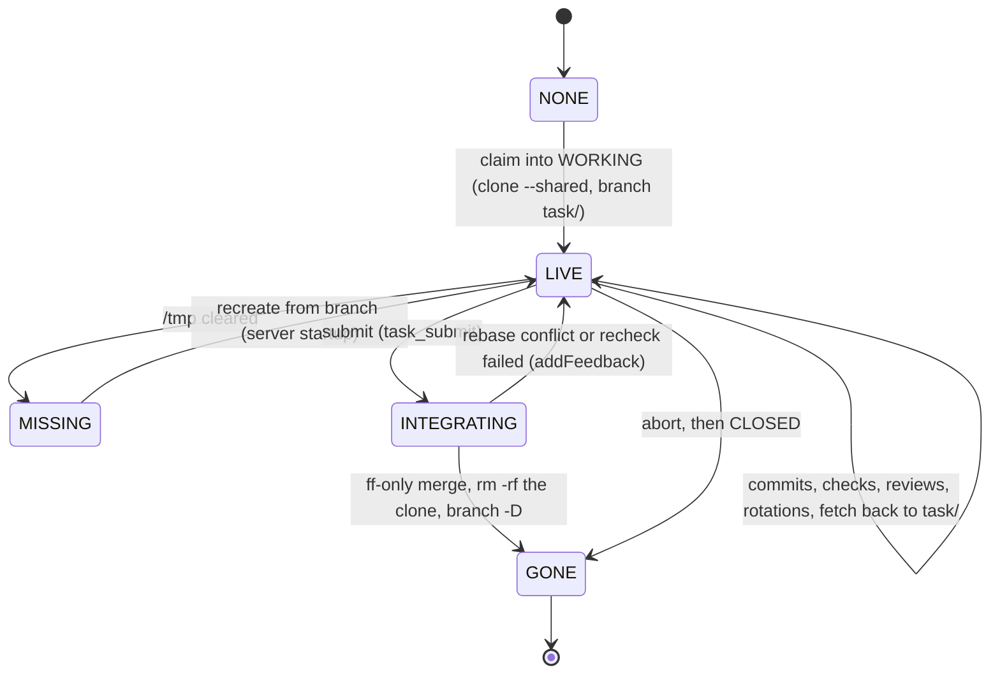
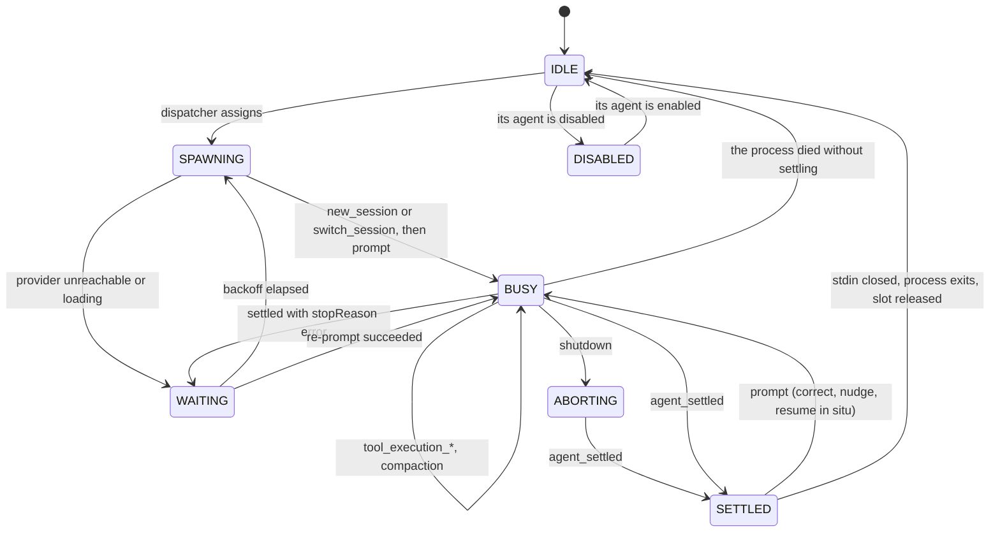
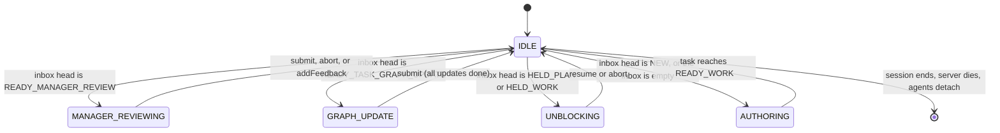
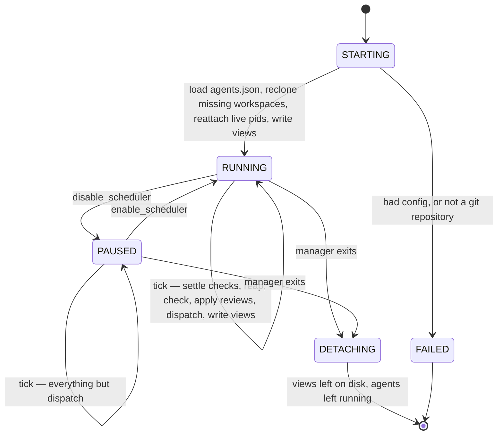

# Orchestrator

An MCP server that turns the task graph into a work queue for `pi` agents.

A manager agent (Claude Code) owns the server over stdio. The server drives `pi --mode rpc` subprocesses running in dedicated clones of the repo, each inside a `bwrap` sandbox that leaves the repo itself read-only, runs the declared checks itself, publishes a live view of everything it owns under `/tmp/task-graph-server/<repo>/`, and brings a task to the manager only when a judgement is needed.

## Topology

```text
        ┌─────────────────────────┐
        │  manager (Claude Code)  │   authors tasks, reviews commits,
        └────────────┬────────────┘   decides what enters the graph
                     │ stdio (MCP)      watches inbox/agents/checks/tasks.json
        ┌────────────┴────────────┐
        │   orchestrator server   │   scheduler · check runner · reaper
        │        (bun)            │   mechanical transitions only
        └────────────┬────────────┘
                     │ JSONL commands in, events out
     ┌───────────────┼───────────────┐
┌────┴────┐     ┌────┴────┐     ┌────┴────┐
│ pi #1   │     │ pi #2   │     │ pi #3   │   commits + ASSIGNMENT.md
│ 000042  │     │ 000057  │     │ 000058  │   no graph access
└─────────┘     └─────────┘     └─────────┘
```

Agents never touch the task graph. Each one gets an `ASSIGNMENT.md` and produces two things: commits on its own branch, and edits to that `ASSIGNMENT.md`. Nothing it writes becomes a graph mutation without passing through the server or the manager.

## The runtime directory

Everything the server knows lives under `/tmp/task-graph-server/<repo>/`, where `<repo>` is the absolute path of the manager's checkout with `/` replaced by `-`. A checkout at `/home/model/task-graph-template` gets `/tmp/task-graph-server/-home-model-task-graph-template/`. Two managers on two clones of the same project never collide, and the directory name says which clone it belongs to.

```text
/tmp/task-graph-server/-home-model-task-graph-template/
  server.log              # the server's own log, capped at 100 MB
  transitions.jsonl       # one line per applied transition, last 1000 kept
  inbox.json              # what is waiting on the manager, in priority order
  agents.json             # every slot, idle ones included
  checks.json             # every running check
  tasks.json              # the last 100 tasks to change state
  queue.json              # what the scheduler would dispatch next, and whether it is
  console-command         # a switch the console flipped, deleted as it is applied
  000042/
    ASSIGNMENT.md         # the live assignment for this task
    history/
      ASSIGNMENT.1.md     # every superseded assignment, in order
      ASSIGNMENT.2.md
    worktree/             # clone of the repo, branch task/000042
    session/
      worker/019fac03-fee6-7444-89f7-e643e848eba4.jsonl
      reviewer/019fb1d4-2a0c-7c19-9e11-77c0a5b1e332.jsonl
    agent-rpc.jsonl       # pi's rpc stream, appended across every process
    check-1.log           # stdout + stderr of checks[1]
```

`ASSIGNMENT.md` sits **beside** the workspace, not inside it. A file at the tree root shows up as untracked in every `git status` the agent runs and eventually gets committed. Outside the tree it cannot be, and the diff stays clean without a `.gitignore` entry in the project or per-task `info/exclude` bookkeeping.

Everything here is disposable. A reboot clears `/tmp`, so on startup any task whose `workspace.worktree` no longer exists is cloned again from its branch. The branch is in the repo to clone from because the server fetches it out of the workspace whenever an agent finishes — see [The workspace is a clone](#the-workspace-is-a-clone). Uncommitted work does not survive that, which is one more reason the agent contract is "commit as you go".

### The views

Five snapshots, each written to a temp file and renamed, so a reader always sees a whole document and the manager can watch mtimes instead of polling. All five carry the same `seq` — the transition cursor at the time of the write — so a view and a graph delta can be lined up.

**`inbox.json`** — everything waiting on a person, most nearly closed first. This is the one the manager reads to decide what to do next.

```json
{
  "at": "2026-07-29T02:14:09.113Z",
  "seq": 4417,
  "inbox": [
    {
      "task_id": "000042",
      "title": "Parse frontmatter with Bun.YAML",
      "rank": "READY_MANAGER_REVIEW",
      "blocking": 3,
      "open_todos": 0,
      "held_reason": null,
      "branch": "task/000042",
      "waiting_since": "2026-07-29T02:11:44.002Z"
    }
  ]
}
```

**`agents.json`** — the pool, including what is doing nothing. This is the one that answers "can I dispatch anything right now".

```json
{
  "at": "2026-07-29T02:14:09.113Z",
  "seq": 4417,
  "agents": [
    {
      "name": "pi-anthropic-claude-sonnet-4-5-1",
      "type": "pi",
      "provider": "anthropic",
      "model": "claude-sonnet-4-5",
      "slot": 1,
      "state": "BUSY",
      "task_id": "000042",
      "role": "worker",
      "pid": 91733,
      "started_at": "2026-07-29T01:58:02.004Z",
      "activity": "tool: bash — bun test",
      "tokens": 105000,
      "context_percent": 30,
      "session": "/tmp/task-graph-server/-home-model-task-graph-template/000042/session/worker/019fac03-fee6-7444-89f7-e643e848eba4.jsonl",
      "log": "/tmp/task-graph-server/-home-model-task-graph-template/000042/agent-rpc.jsonl"
    },
    {
      "name": "pi-llama.cpp-rocm-rocm-1",
      "type": "pi",
      "provider": "llama.cpp-rocm",
      "model": "rocm",
      "slot": 1,
      "state": "WAITING",
      "task_id": "000057",
      "role": "reviewer",
      "pid": 92014,
      "started_at": "2026-07-29T02:09:44.221Z",
      "activity": "provider: 503 model loading",
      "retry_at": "2026-07-29T02:14:14.000Z",
      "attempt": 3
    }
  ]
}
```

`state` is one of `IDLE`, `DISABLED`, `SPAWNING`, `BUSY`, `WAITING`, `ABORTING`, `SETTLED` — the agent state machine below. An idle slot is a row with nulls, never a missing row; the pool is fixed at load and the view shows all of it. `enabled` is the agent's toggle, not the slot's: it is false on every slot of a disabled agent, including the ones still finishing a task, and those read as `BUSY` with `enabled` false until they are released.

`tokens` and `context_percent` come from `get_session_stats`. What a turn cost in dollars is not tracked: it is a provider fact that says nothing about whether the work is progressing, and the two numbers that do — how much context is left and what the agent is doing right now — are already here.

**`checks.json`** — the check runner's processes, which have nothing to do with agents and no longer share a document with them.

```json
{
  "at": "2026-07-29T02:14:09.113Z",
  "seq": 4417,
  "checks": [
    {
      "task_id": "000058",
      "index": 1,
      "command": "bun test",
      "pid": 91802,
      "started_at": "2026-07-29T02:13:51.900Z",
      "log": "/tmp/task-graph-server/-home-model-task-graph-template/000058/check-1.log"
    }
  ]
}
```

**`tasks.json`** — the graph, flattened for reading. The last 100 tasks to change state, closed ones included; the 101st drops off. Closed tasks stay visible because "what just landed" is the question a manager asks most often after a review.

```json
{
  "at": "2026-07-29T02:14:09.113Z",
  "seq": 4417,
  "tasks": [
    {
      "id": "000042",
      "title": "Parse frontmatter with Bun.YAML",
      "state": "WORKING",
      "state_entered": "2026-07-29T01:58:02.004Z",
      "open_task_graph_updates": 0,
      "depends_on": ["000007"],
      "blocking": 3,
      "claimed_by": "pi-anthropic-claude-sonnet-4-5-1",
      "held_reason": null,
      "worktree": "/tmp/task-graph-server/-home-model-task-graph-template/000042/worktree"
    }
  ]
}
```

`blocking` is the transitive dependent count — how many tasks are waiting on this one. It is the scheduler's tiebreak, the inbox's tiebreak, and the manager's reason to review one branch before another.

**`queue.json`** — what the dispatcher would hand out next, in the order it would hand it out, plus whether the scheduler is enabled at all. It is `candidates()` written down: the same ranking `dispatch` walks, so the queue a reader sees is the queue that is about to be served, not a re-derivation of it.

```json
{
  "at": "2026-07-29T02:14:09.113Z",
  "seq": 4417,
  "scheduling": true,
  "queue": [
    {
      "task_id": "000042",
      "rank": "READY_WORK_STARTED",
      "blocking": 3,
      "open_todos": 1,
      "prefer_agent": "pi-anthropic-claude-sonnet-4-5-1",
      "session": null
    }
  ]
}
```

A queued task is one waiting on a slot — `READY_WORK_REVIEW`, `READY_WORK`, `READY_PLAN_REVIEW`, `READY_PLAN`, or a failed task with a session to resume. Everything else in the graph is waiting on a person, a check or an agent, and is in `inbox.json` or `tasks.json` instead.

### The transition log

One line per successful transition, appended inside the graph lock where ordering is already serialized:

```json
{
  "seq": 1481,
  "at": "2026-07-29T01:51:43.543Z",
  "task_id": "000042",
  "transition": "claim",
  "from": "READY_WORK",
  "to": "WORKING",
  "by": "pi-anthropic-claude-sonnet-4-5-2"
}
```

Three things for one: the cursor the views stamp, a cheap delta for the manager, and the history a reviewer wants when a task arrives having been claimed four times. It is a server file, not a graph file — ephemeral, rebuilt from nothing on restart, and no part of the graph's correctness depends on it.

The file keeps the **last 1000 lines**; `seq` keeps counting past them. A cursor older than the window reads back fewer entries than it asks for, which is the correct answer — the graph itself is the record, and a manager that has been away that long should read `tasks.json`, not a delta.

`server.log` is capped the same way, at **100 MB**, trimmed to whole lines from the end. Both caps exist for the same reason: nothing under `/tmp` is worth losing a machine to, and the tail is the only part anyone reads.

## ASSIGNMENT.md

`ASSIGNMENT.md` is the entire interface between an agent and the project. The server generates it at dispatch; the agent owns it from that moment until it settles.

It is the task body, verbatim — nothing else. No frontmatter, no title, no role prose. The task document's body is the assignment, and the assignment becomes the task document's body again when the work is accepted: the graph and the agent read and write the same text. The rules of engagement — which section the role may write, and how it ends — live entirely in the role's system prompt.

### Append-only

The agent may only append to `ASSIGNMENT.md`. What it may append depends on the role:

- the **planner** appends a `## Todos` section: a numbered list (`1.` to `n.`, consecutively) of the executable plan, each entry specific and verifiable enough for a worker to execute without the planner present;
- the **worker** appends `## Implementation Notes`, addressing every todo by number — the change, the commit, and how it saw the work;
- **reviewers** append nothing at all.

At settle the server compares the file to what it dispatched. `live.startsWith(dispatched)` is an append and passes; anything else is a divergence. A settle that changed nothing above the appended section is answered in the session, not argued about — the divergence and the missing append are told to the agent (`modified-assignment`, `missing-todos`, `missing-notes`) and it fixes the file. What is left for the agent to answer is only what the server genuinely cannot know: whether the work is done.

### The result

The result is not a file edit. Every session is loaded with a terminating result tool — `submit`, or `blocked` when the one thing standing in the way is a wall — and the call ends the turn. There is one extension per role, so the same `submit` name works in every state while the schema the model sees stays role-appropriate: the planner's and the worker's `submit` takes no arguments, the reviewer's takes `findings` (and `delegations` for a work review). The union is split per state, four result types, one per role-phase pair, sharing the `blocked` arm:

| Tool      | Arguments                                      | Result                                    | States                |
| --------- | ---------------------------------------------- | ----------------------------------------- | --------------------- |
| `submit`  | none (planner/worker extension)                | `{type: "submit"}`                        | `PLANNING`, `WORKING` |
| `submit`  | `findings: string[]` (reviewer extension)      | `{type: "submit", findings}`              | `PLAN_REVIEWING`      |
| `submit`  | `findings`, `delegations` (reviewer extension) | `{type: "submit", findings, delegations}` | `WORK_REVIEWING`      |
| `blocked` | `message: string`                              | `{type: "blocked", message}`              | every state           |

Each tool returns `terminate: true`, so the call ends the turn on the spot: the result is a tool call, not prose, and there is nothing to mis-parse on the way out. The system prompt names the exact shape for the state, and the wrong arguments are refused just like the wrong JSON shape was — a plain `submit` carrying `findings`, or a plan review carrying `delegations`, is an unparsable result, not a silent approval.

- **`findings`** on a plan review are the gaps between the plan and the acceptance criteria, plus any way the list is missing or misnumbered. Each goes to the planner's prompt queue, verbatim, and the task goes back to `READY_PLAN`. An empty list approves the plan.
- **`findings`** on a work review are defects in _this_ work. Each is appended to the task body under `# Review findings`, verbatim, with a fresh `## Implementation Notes` heading for the next round, and the worker is reminded of the findings at dispatch. The task goes back to `READY_WORK`. An empty list is the reviewer saying it is satisfied.
- **`delegations`** are defects outside it. They go to the manager, who decides whether they become tasks. Keeping them out of `findings` is what stops a review from growing the task it is reviewing.
- **`message`** on a `blocked` result is required, and becomes `held_reason` verbatim.

Both lists are held to the same standard, and it is a standard about **description, not instruction**: name the symbol, the file and the input that breaks it, say what goes wrong, and stop. A reviewer that writes "use a Map here" has skipped the part only it can supply — what it saw — and substituted the part the worker is better placed to decide. A delegation phrased as a fix is worse still: the manager is being asked to approve a solution to a problem it has not been shown.

A result tool call is refused when it does not fit the state: the server tells the agent what is wrong and lets it call again. Being strict here is cheap — the agent is still in the session — and it is the only way the four states can share one result contract without one of them silently writing into the void. The tool schemas validate the arguments at execution (`findings` is a list of non-empty strings or the call is rejected), and the server re-validates against the claimed state before it applies anything.

### Validation on settle

The server reads the result tool calls out of the session's rpc stream — the same records it already parses for activity — and maps the last one through the state's contract. A settle whose last call does not fit the state's shape (prose instead of a call included) is answered in the session with the contract's issues (`unparsable-result`), and a settle with no result call at all (a truncated context, an aborted turn) is `missing-result`. Both are retried a fixed number of times and then held.

### The prompt queues

Transient feedback is queued per state in the runtime directory — `queue/<STATE>.md`, plain markdown, nothing structured — and delivered into the agent's session as one prompt at the next dispatch of that state:

- plan review findings queue to `PLANNING`;
- failing checks, work review findings and manager findings queue to `WORKING`.

The queue is drained when the state is dispatched, so a task that fails its checks is resumed with the failures already in its session. Nothing in the queues is ever written to the task document.

### Rotation

The server writes `ASSIGNMENT.md` exactly once per dispatch and never again — not even to record a failed check. Anything it wants to say mid-run goes through the session as a `prompt`, and the agent folds it into its own appended notes. One writer per file at all times, so notes can never be clobbered mid-thought.

On every dispatch that generates a file, the previous one rotates into `history/ASSIGNMENT.<n>.md` first, numbered in order. Nothing an agent wrote is ever overwritten, and the manager sees every attempt rather than the last. A re-dispatch after a hold rotates; a resume reopens the same file in the same session and rotates nothing.

Rotation is also the role handoff. When a reviewer is dispatched, the worker's file is carried forward, not regenerated — the reviewer reads the worker's own appended sections. The file is regenerated from the task body only at a fresh planner or worker dispatch.

### The task graph is visible but off-limits

The graph is checked into the repo, so `tasks/` exists in every worktree. The agent can see it. It must not read it for instructions and must not write to it — the copy in a worktree is stale the moment the server applies any transition, and writes to it are discarded at merge.

Worth being blunt about in both system prompts. An agent that reads `tasks/` finds other people's work, and the failure mode is not a crash — it is scope creep with a plausible justification. `ASSIGNMENT.md` is the only accurate statement of what it is supposed to do.

The server enforces the other half: any diff touching `tasks/` becomes a finding at the agent review.

## Who may write what

The graph has one writer process — the server — but two authorities behind it.

**Mechanical transitions.** The server applies these on its own. Each is fully determined by an observed fact: a process settled, a command returned an exit code, a result tool was called.

| Transition                                               | Triggering fact                                                                                                            |
| -------------------------------------------------------- | -------------------------------------------------------------------------------------------------------------------------- |
| `claim`                                                  | a free slot started a process, or the server started checking                                                              |
| `release`                                                | the claiming process is gone                                                                                               |
| `submit` from `PLANNING`                                 | a `submit` call with the `## Todos` section appended                                                                       |
| `submit` from `PLAN_REVIEWING`                           | a `submit` call with empty `findings`; the accepted `ASSIGNMENT.md` becomes the task body                                  |
| `submit` from `WORKING`                                  | a `submit` call with notes appended, and the branch committed and clean                                                    |
| `submit` from `WORK_REVIEWING`                           | a `submit` call with empty `findings`                                                                                      |
| `pass` from `CHECKING`                                   | every check exited 0                                                                                                       |
| `fail` from `CHECKING`                                   | at least one check did not; command, code and tail go to the worker's prompt queue                                         |
| `addFeedback` in `WORK_REVIEWING` or `MANAGER_REVIEWING` | a `findings` list, copied verbatim into the body under `# Review findings`, with a fresh `## Implementation Notes` heading |
| `addFeedback` in `PLAN_REVIEWING`                        | a plan review finding, copied verbatim into the planner's prompt queue                                                     |
| `hold <reason>`                                          | an issue outlasted its attempts; the reason names it                                                                       |

**Judgement transitions.** Only the manager, through MCP tools. Nothing here is derivable from an observation.

| Transition                                                                   | Tool                | Why it needs a judge                             |
| ---------------------------------------------------------------------------- | ------------------- | ------------------------------------------------ |
| `create`                                                                     | `task_create`       | new work                                         |
| `submit` from `NEW`, `BLOCKED`, `MANAGER_REVIEWING` or `TASK_GRAPH_UPDATING` | `task_submit`       | whether the task is done with the stage it is in |
| `addFeedback` in `MANAGER_REVIEWING`                                         | `task_add_feedback` | whether a finding is real                        |
| `hold` from any planning or work state                                       | `task_hold`         | whether a task should wait                       |
| `claim` into a manager state                                                 | `task_claim`        | which task it is working on                      |
| `abort` from `MANAGER_REVIEWING`, `HELD_PLAN` or `HELD_WORK`                 | `task_abort`        | whether the task should exist at all             |
| `resume` from `HELD_PLAN` or `HELD_WORK`                                     | `task_resume`       | whether the wall is gone                         |

One tool per judgement, named for the judgement. There is no generic `task_transition` taking a transition name and a list of strings: it made every judgement look alike in the tool list, put the manager one typo away from a transition it did not mean, and pushed argument validation from the schema into a string parser. `task_submit` is the one name that spans three states because they are the same judgement — the task is done with where it is — with the branch landing added when it is asked at `MANAGER_REVIEWING`; the rest is not in this table and has no tools, because the manager edits the task document directly for what it is allowed to change (`checks`, `depends_on`, `task_graph_updates`, the title), and the server's transitions (`pass`, `fail`, `release`, and the agent `submit`s) are the server's, a tool for them being a way for the manager to state a fact it has not observed.

The line is: **the server states facts, the manager states opinions.** An agent's opinion is neither — it sits in `findings` or `delegations` until something with authority reads it.

The mechanical `addFeedback`s are the edge the server sits on deliberately: a written finding is copied, never interpreted. A failed check does not even get that far — it is a `fail` whose details go to the prompt queue, not to the graph, because nobody has to decide anything about a red build.

To resolve a held task the manager edits the task directly — the document, or `task_write_body` — and `resume`s. There is no todo-adding anywhere; the todo list is the planner's to write.

## States

| State                                             | Actor       | Mechanism                                                       |
| ------------------------------------------------- | ----------- | --------------------------------------------------------------- |
| `NEW`                                             | manager     | authors the document; `submit` routes it by the dependencies    |
| `BLOCKED`                                         | —           | cleared automatically when the last dependency closes           |
| `HELD_PLAN`                                       | **manager** | reads `held_reason`; `resume`, `abort` or restructures          |
| `HELD_WORK`                                       | **manager** | reads `held_reason`; `resume`, `abort` or restructures          |
| `READY_PLAN` → `PLANNING`                         | **agent**   | a fresh `planner` appends the numbered `## Todos` list          |
| `READY_PLAN_REVIEW` → `PLAN_REVIEWING`            | **agent**   | a `reviewer` checks the list against the criteria               |
| `READY_WORK` → `WORKING`                          | **agent**   | worktree + `ASSIGNMENT.md`; produces commits and notes          |
| `READY_CHECK` → `CHECKING`                        | **server**  | runs every check in the worktree                                |
| `READY_WORK_REVIEW` → `WORK_REVIEWING`            | **agent**   | fresh session, reads the commits and the notes, writes findings |
| `READY_MANAGER_REVIEW` → `MANAGER_REVIEWING`      | **manager** | reads the task document; then `submit` or `task_add_feedback`   |
| `READY_TASK_GRAPH_UPDATE` → `TASK_GRAPH_UPDATING` | **manager** | creates and edits tasks, then `submit`                          |

Four of the twelve spend model tokens: `PLANNING`, `PLAN_REVIEWING`, `WORKING` and `WORK_REVIEWING`. `CHECKING` is deterministic — running `bun test` and reading an exit code does not need an LLM, and making it mechanical removes the most common failure in agent pipelines, which is a checker reporting a pass it did not get.

### Why the review is split in two

Catching what a careful reader catches and deciding whether the work is acceptable are different jobs. The first is cheap, mechanical to trigger, and scales with slots. The second is a judgement and belongs to the manager. Merging them means every typo-level finding costs a manager round trip.

- **`WORK_REVIEWING`** runs after the checks pass. A fresh agent, a fresh session, the worktree and the acceptance criteria; the worker's appended notes are in the assignment it carries forward. It calls `submit` with `findings` and `delegations` and settles. It cannot pass or close anything: the server reads its tool call and applies it, in the same claim, before the slot is released. Findings are appended to the task body under `# Review findings` and the task drops to `READY_WORK`; no findings and it moves up to `READY_MANAGER_REVIEW`.
- **`MANAGER_REVIEWING`** is the manager, seeing only work that survived both a machine and a peer.

The reviewer never applies its own findings and the server never interprets them. A finding is copied verbatim into the body, which is the only thing that makes the copy safe to do without a judge.

### The planning phase

Every task is planned before it is worked. `task_submit` sends it to `READY_PLAN` — or `BLOCKED`, when the manager edited dependencies into it — and a `planner` in a fresh session reads the goal and the acceptance criteria and appends a `## Todos` section to `ASSIGNMENT.md` — a numbered list, `1.` to `n.` consecutively — and only a plan that survived a `reviewer` opens `READY_WORK`. At plan acceptance the whole assignment becomes the task body, so the todo list lands in the graph verbatim.

The planner writes nothing but that section. It runs in the same worktree the work will happen in, so it can read the code it is planning against — and the server checks, at every settle, that it left that worktree exactly as it found it: `git status` clean and no commits of its own, and the assignment unchanged above its appended section. A planner that writes or commits is prompted in situ to undo it (up to four attempts, then `HELD_PLAN`), because a dirty worktree or a stray commit would poison the work phase that follows. The plan itself lives only in `../ASSIGNMENT.md`, like every other deliverable.

The accepted plan is the assignment itself: at `PLAN_REVIEWING` with empty `findings` the server submits the whole `ASSIGNMENT.md` as the new task body, so the appended todo list lands in the graph verbatim. A settle that appended nothing is refused (`missing-todos`, in situ, then `HELD_PLAN`) — a plan with no steps is not a plan, and the planner is the one that knows.

The plan review is a review of the plan, not of code. The reviewer carries the planner's own file forward — the appended `## Todos` list is what it reads — and its `findings` — the gaps between the list and the acceptance criteria, plus any way the list is missing or misnumbered — go back to the planner **verbatim** through its prompt queue. The planner must address every one; a second rejection queues again, so the planner is always answering the latest review. The first plan that satisfies the reviewer moves the task to `READY_WORK` — and the rejected plan itself never touches the body, by the transition rule rather than by the settle, so no trace of the rejection survives into the work. A finding is a description of the gap, not a prescription of the fix — the same standard as the work review, for the same reason: the planner is the one better placed to decide how to cover the criterion.

The two planning states share the worktree with the work phase. The workspace is created at the first `PLANNING` claim and survives through planning, work, checks and reviews, so the planner's reading of the code and the worker's edits happen against the same tree and the same branch. A task held from `PLANNING` or `PLAN_REVIEWING` lands in `HELD_PLAN` and resumes to `READY_PLAN`; one held from the work phase lands in `HELD_WORK` and resumes to `READY_WORK` — the state itself records which phase the wall stopped, so `resume` sends the task back to the plan it does not have.

### Failing forward

`fail` is how `CHECKING` sends work back, and it records nothing in the graph:

| From       | To           | What is delivered                                                  | Who picks it up      |
| ---------- | ------------ | ------------------------------------------------------------------ | -------------------- |
| `CHECKING` | `READY_WORK` | every failing command, code and tail, in the worker's prompt queue | the worker's session |

A result that cannot be read is not a failure and never reaches the graph. The agent that wrote it is still holding the claim, so the server says what is wrong in that session and the state does not move; only an agent that gets it wrong repeatedly is `hold`.

The queue carries the failure rather than the server holding it in memory, because the resume may happen after a manager restart. Everything the resume prompt says is rendered from the queue at dispatch time; nothing about it is remembered anywhere else. The queue is drained when the state is dispatched — the agent is claiming the failures are gone, and `CHECKING` is about to re-run everything and file a fresh entry if it lied.

### HELD_PLAN and HELD_WORK

An agent that cannot finish sets `result.type: blocked` with a message. The server asks once whether it really is a wall — for a reviewer, a blocker that is work outside this task's scope is a `delegation`; for a worker, a wall it can work around is not a wall — and if the next settle is blocked again it applies `hold`, which clears the claim and records the message verbatim in `held_reason`. A person is the most expensive thing the system can spend, so it is worth one prompt to be sure.

The four halves of that question are four files, `blocked-WORKING.md`, `blocked-WORK_REVIEWING.md`, `blocked-PLANNING.md` and `blocked-PLAN_REVIEWING.md`, each with its alternative already written into it. There is no shared fragment with a hole in it: the alternatives have nothing in common but their position in the sentence, and a template that interpolates one prose paragraph into another is a worse way to read either of them.

The two held states are states rather than a flag on `READY_WORK` or `READY_PLAN`, and that is the whole point of them. A flag needs the scheduler to remember to check it and leaves a task sitting in a queue it is not eligible for. A state cannot be forgotten: the dispatcher pulls from `READY_WORK` and `READY_PLAN`, a held task is in neither, and nothing has to be careful. The split is the flag: `hold` lands the task in `HELD_PLAN` from any planning-phase state — `READY_PLAN`, `PLANNING`, `READY_PLAN_REVIEW`, `PLAN_REVIEWING` — and in `HELD_WORK` from any work-phase state — `READY_WORK`, `WORKING`, `READY_CHECK`, `CHECKING`, `READY_WORK_REVIEW`, `WORK_REVIEWING` — so the phase a task is held from is a fact about the state, not a field on it, and `resume` never has to guess where the task belongs.

Three ways out, all judgement:

| Transition            | To                                                           | The manager decided                                                       |
| --------------------- | ------------------------------------------------------------ | ------------------------------------------------------------------------- |
| `resume`              | `READY_PLAN` from `HELD_PLAN`, `READY_WORK` from `HELD_WORK` | the wall is gone; try again unchanged, back to the phase the wall stopped |
| `resume` (deps added) | `BLOCKED`                                                    | it was waiting on something that isn't done                               |
| `abort`               | `READY_TASK_GRAPH_UPDATE` (updates) or `CLOSED`              | the task was the wrong shape; the graph may need rewriting first          |

To resolve a hold the manager first **updates the task directly** — edit the document, or `task_write_body` to fix the acceptance criteria or append guidance, editing `checks`, `depends_on` and `task_graph_updates` in the frontmatter if those are what was missing — then `resume`, or `abort` to throw the task away. There is no todo-adding; the todo list is the planner's to write, and a task held before it was planned is re-planned.

The dependencies-added `resume` is the common one, and it is the reason the held states and `BLOCKED` are separate. "Waiting on another task" is a machine-resolvable condition that clears itself when the dependency closes; "waiting on a person" never clears itself. Collapsing them would mean a task that nothing can ever unblock sitting in the same bucket as one that will unblock itself in an hour.

When the manager genuinely cannot resolve it, it escalates to a human. That escalation is the only unbounded thing in the system, and it is deliberately a person rather than a state — the task stays in `HELD_PLAN` or `HELD_WORK` while it happens, which is exactly what those states mean.

## Core algorithms

### Mapping pi signals onto the graph

This is the load-bearing one: everything the server does to a task in `PLANNING`, `PLAN_REVIEWING`, `WORKING` or `WORK_REVIEWING` comes out of it.

Two inputs, and they are not interchangeable. The **event stream** says how the turn ended; the **`ASSIGNMENT.md` on disk** says what the agent believes it accomplished. The stream is also where the result tool calls land — a `submit` or `blocked` call is an event like any other, read back at settle with the activity that surrounded it — and the file is authoritative for everything else: a run whose every attempt failed still exits 0, and `agent_end` fires once per attempt, so the file is only worth reading once the stream says the turn settled.

```text
on agent_settled:
    stopReason ← the last assistant message's stopReason

    if stopReason = error:                        # provider trouble, not the agent's
        back off, re-prompt the same session, done

    if the turn was cut short as a loop            → raise "looping"

    if stopReason = aborted:                      # shutdown or timeout
        close stdin, release the slot, done

    calls ← the result tools called this turn, from the rpc stream
    if stopReason = length, or there is no call → raise "missing-result"

    map the last call through the claimed state's result contract
    if it does not fit the state   → raise "unparsable-result"
    if the tool is blocked         → raise "blocked"

    compare ASSIGNMENT.md to what was dispatched
    if it changed above the appended section       → raise "modified-assignment"

    if the claimed state is PLANNING:
        if nothing was appended                   → raise "missing-todos"
        if the worktree is dirty or carries commits  → raise "modified-worktree"
        submit, release the slot, done

    if the claimed state is PLAN_REVIEWING:
        if the assignment changed at all          → raise "modified-assignment"
        if the worktree is dirty or carries commits
                                                → raise "modified-worktree"
        if findings is empty → submit with the assignment as the new body, done
        findings → the planner's prompt queue, release the slot, done

    if the claimed state is WORK_REVIEWING:
        if the assignment changed at all          → raise "modified-assignment"
        findings ← result.findings (+ the tasks/ guard)
        findings → the body under # Review findings and the worker's queue,
                   or submit if there are none, release the slot, done

    # the claimed state is WORKING
    if nothing was appended                       → raise "missing-notes"
    if the workspace is dirty, or the branch carries no commit of its own
                                                  → raise "uncommitted"
    submit with the assignment as the new body, release the slot
```

As a table, since these are the cases that matter:

| `stopReason` | result tool call | Server action                                             |
| ------------ | ---------------- | --------------------------------------------------------- |
| `toolUse`    | `submit`         | per-state settle, `submit`, close stdin, release the slot |
| `stop`       | `blocked`        | raise `blocked`                                           |
| `toolUse`    | wrong arguments  | raise `unparsable-result`                                 |
| `length`     | any              | raise `missing-result`                                    |
| `error`      | any              | leave the process up; re-prompt on backoff                |
| `aborted`    | any              | close stdin, release the slot                             |

A `length` or resultless outcome still keeps the branch, so the next attempt starts from the partial work rather than from the base.

### Issues

Everything the server can find wrong with a settle — and one thing it can find wrong before the settle — is a **named issue** with its own prompt fragment and its own number of attempts. Raising one prompts the live session with that fragment; the attempt after the last one is a `hold` whose reason names the issue.

| Issue                 | Attempts | Fragment                                                          | Held as                                                        |
| --------------------- | -------- | ----------------------------------------------------------------- | -------------------------------------------------------------- |
| `unparsable-result`   | 4        | `unparsable-result-<state>.md`, rendered from the contract issues | the agent's result tool call was not a valid one for its state |
| `missing-result`      | 4        | `missing-result-<state>.md`                                       | the agent stopped without calling a submit or blocked tool     |
| `missing-todos`       | 4        | `missing-todos.md`                                                | the planner submitted without appending a todo list            |
| `missing-notes`       | 4        | `missing-notes.md`                                                | the worker submitted without appending implementation notes    |
| `modified-assignment` | 4        | `modified-assignment-<state>.md`                                  | the agent changed parts of the assignment it may not           |
| `uncommitted`         | 4        | `uncommitted.md`, rendered from `git status`                      | the agent submitted work it never committed                    |
| `looping`             | 3        | `looping-<state>.md`, rendered from the repeated command          | the agent kept repeating one command                           |
| `blocked`             | 1        | `blocked-<state>.md`, one per claimed state                       | the agent's own `message`, verbatim                            |
| `modified-worktree`   | 4        | `modified-worktree-<state>.md`                                    | the agent wrote to the worktree during planning                |

Each issue is scoped to the states that can raise it: `missing-todos`, `missing-notes` and `uncommitted` fire from exactly one state and keep a plain fragment name, while an issue that can fire from several — `looping`, `blocked`, `modified-worktree`, `modified-assignment`, and the parse-and-result issues — is one file per state, so a project can override the planner's looping nudge without touching the worker's.

Attempts are counted per issue per dispatch, not per settle, so an agent that fails a parse twice and then stops without a result has spent two of one budget and one of another.

Four rather than one, because the failures these catch are ordinary and recoverable: a result tool call with the wrong arguments, a turn that ran out of context before the final call was made, a section not yet appended. Each retry costs one turn against a session that already has the whole task in it, and the alternative — a hold — costs a person. Escalating to the most expensive resource in the system after a single misplaced brace is the wrong trade.

`looping` is the one issue not raised from a settle, because the agent it catches never settles. Ten identical tool calls in a row — same tool, same arguments, byte for byte — and the stream flags it, `PiProcess` aborts the turn on the spot, and the settle that the abort produces raises the issue. Consecutive and within one turn: a command run ten times across ten turns is an agent checking its work, and a run broken by anything else starts the count again.

Ten, because a handful of repeats is a retry and a screenful is an agent that has stopped reading. The number that matters more is the reaction. A loop is not a failed submit, so the fragment does not correct anything — it says the command was repeated, that the answer is not in its output, and that the cause may sit outside the diff entirely, in the environment rather than the code. Then it offers the two ways out: try something else, or send `{"type": "blocked", "message": ...}` and say what the wall is. Handing the agent straight to a person would throw away a session that still has the whole task in it, and would hand over "it kept running `zig build`" instead of the blocker the agent can write in one line. Three attempts rather than four, because each one costs ten tool calls to reach, and an agent that loops three times is not going to read its way out on the fourth.

`blocked` keeps its single attempt for the opposite reason. It is not a failure: the agent stated an outcome and the second look is there to catch the one confusion the fragment can resolve — a reviewer that meant a delegation, a worker that could route around the wall. If the agent says it again, it means it, and asking a third time is arguing with the answer.

Naming the issues is what makes any of this legible. `server.log` says which issue and how many of its attempts are gone, `held_reason` says which one won, and each fragment is a file that can be rewritten without touching the server.

### A submit has to be in the git history

`uncommitted` is one of two issues that reads something other than `ASSIGNMENT.md` — `modified-worktree` is the other, and it is the same check with the requirements inverted: the planner and the plan reviewer must leave the worktree exactly as they found it, so any dirty file or any commit is an issue for them, where a worker is required to have both. `uncommitted` is the one that catches the most expensive lie a worker can tell. Two facts are checked in the workspace before the `submit` is applied, both cheap:

- `git status --porcelain` is empty. `ASSIGNMENT.md` sits outside the tree, so anything reported here is real work the agent left behind.
- `refs/remotes/origin/<base>..HEAD` counts at least one commit, so the branch carries something of the agent's own.

Neither is a judgement, which is why it is the server's to enforce. Everything downstream is a commit range: the checks run in the workspace, the reviewer is given `<base>..HEAD`, and the merge is a fast-forward of the branch. A submit with a dirty tree hands all three the wrong thing — the checks pass against files nobody will ever see again, the reviewer reads an empty diff, and the work goes when the worktree does. The base is read as a remote-tracking ref for the reason every base read inside a workspace is — see [The workspace is a clone](#the-workspace-is-a-clone).

The fragment quotes the `git status` output back — the first 20 entries, because a prompt is not a place to paste a thousand paths — and the attempt lands in the session that still holds every reason the agent had for what it wrote, so the usual outcome is one `git commit` and a second `submit`. The agent was told this in `prompts/WORKING.md` before it started; the check is there because "commit as you go" is an instruction, and a fast-forward merge needs a fact.

Untracked counts, which is the point: a new file the agent wrote and never `git add`ed is the failure this catches most often. The cost of that is build output the project does not ignore coming back as uncommitted work, and the fix for it is a `.gitignore` entry in the project rather than a looser check here.

### Dispatch

Right to left across the state machine: capacity goes to whatever is closest to `CLOSED`, and a task nobody has touched is the last thing considered.

```text
every tick, while the scheduler is running:
    queue ← every task that is dispatchable, ranked
        1  resume            — READY_WORK with a queued check failure
                               and a session file still on disk
        2  READY_WORK_REVIEW
        3  READY_WORK with a workspace          (started, sent back)
        4  READY_WORK with none                 (never started)
        5  READY_PLAN_REVIEW
        6  READY_PLAN with a workspace          (re-planning after a rejection)
        7  READY_PLAN with none                 (never planned)
    ties: most blocking first, then lowest id

    for each candidate, in order, while slots remain free:
        skip free slots whose roles do not include the one this task needs
          (planning needs planner, reviews need reviewer,
           everything else worker)
        if it prefers an agent (workspace.agent) and a free slot has the
          same type-provider-model, take that one
        else if it is at the top of the queue, take any free slot
        else leave it for a tick that has its model free
```

Within every rank, most `blocking` first: unblocking three downstream tasks is worth more than unblocking none, and that is as true of a resume as of a fresh dispatch.

The point is not throughput, it is work in progress. Every task in flight holds a worktree, a branch, a session, and a slice of the manager's attention, and all of that decays — a branch that sat through four sibling merges rebases badly, and a review a day after the fact is a worse review. Ten tasks at 90% are worth less than nine closed and one started.

There is no rank for held tasks and no rule that skips them. `HELD_PLAN` and `HELD_WORK` are not `READY_WORK` or `READY_PLAN`, so the dispatcher never sees one.

### Checking

```text
when a task enters READY_CHECK:
    claim it as the server
    run every check, in order, in the task's workspace, sandboxed
    failures ← the ones that exited non-zero, each with its output tail

    if failures is empty → pass       (→ READY_WORK_REVIEW)
    else                 → fail, and queue the failures to the
                           worker's prompt queue   (→ READY_WORK)
```

A check is spawned into the same sandbox the agent gets, except that only its own directory is writable — a check runs code the agent wrote, so it is no more trusted than the agent.

Every check runs every time. Nothing records that a check has passed, so there is no stale result to trust and no field for an agent to flip. Re-running a passing command costs seconds; believing a stale pass costs a review.

### Applying a review

```text
when a reviewer settles in WORK_REVIEWING:
    call ← the last result tool called this turn

    if the call is not the state's submit or blocked:
        raise the issue in the session it is still holding,
        stay in WORK_REVIEWING (past its attempts → hold)

    if the assignment changed at all:
        raise "modified-assignment", stay in WORK_REVIEWING

    findings ← result.findings
    if the branch changed anything under tasks/:
        findings += "the diff writes to tasks/ …"

    if findings is empty → submit                (→ READY_MANAGER_REVIEW)
    else → addFeedback with the findings, which appends them to the body
           under # Review findings, plus a fresh ## Implementation Notes
           heading; the findings are also queued to the worker's
           session                                    (→ READY_WORK)
```

`delegations` are not touched here. They are part of the `submit` call and the manager decides at `MANAGER_REVIEWING` what should become a task.

### Integration

The manager-review `submit` is not a graph decision the manager can make alone — whether a branch landed is a fact about git — so the tool call does the work first and applies the transition only if it worked:

```text
attemptMerge(task):
    fetch the base into the workspace, rebase the workspace onto it
        conflict → abort the rebase, error back to the manager
    run every check again, in the rebased workspace
        failure  → error back to the manager, with the command and its tail
    fetch the rebased branch back into the repo
    fast-forward the base onto the branch
        refused  → error back to the manager
    assert the branch is now an ancestor of the base
    apply submit        → CLOSED, or READY_TASK_GRAPH_UPDATE if updates are queued
    remove the workspace, delete the branch

attemptAbort(task):
    refuse unless the task is in MANAGER_REVIEWING or HELD_PLAN or HELD_WORK
    refuse if the branch is already an ancestor of the base
    apply abort         → CLOSED, or READY_TASK_GRAPH_UPDATE if updates are queued
    (the workspace and branch are torn down when the task closes)
```

Every failure in `attemptMerge` is an error on the tool call, and the task stays in `MANAGER_REVIEWING`. The manager asked whether the branch lands; "no, and here is why" is the answer to that question, not a reason to write a todo on the manager's behalf and hand the task to an agent. Whether a conflicted rebase is worth an agent round trip, a rewritten task or an abort is exactly the judgement `MANAGER_REVIEWING` exists for, and the manager is already holding the claim when it finds out.

The rebase and the recheck happen **after** the manager accepts, not before. A green review does not mean a mergeable branch — the base moved — and rebasing before review means reviewing a diff that no longer exists.

`abort` is the other outcome: the work is being thrown away because the task was the wrong shape, and what replaces it is a task graph update when the manager edited one in. Requiring the branch to be unmerged is what stops it from being used to disown work that already landed; an abort with no queued updates closes the task outright.

The same judgement is available while a task waits. A task in `READY_WORK` or `READY_PLAN` is one the manager already regrets and no agent has claimed yet — it may never have been started, or it may have come back from a failed check or a review finding — and waiting for it to be dispatched, worked, checked and reviewed before it can be thrown away spends a slot on an answer the manager already has. `task_hold` parks it and `task_abort` then throws it away, with the same branch rule: a task that was worked before it came back keeps its branch and worktree until it closes, exactly as an abort from `MANAGER_REVIEWING` does.

`READY_WORK` is one of the abortable task's holding states that the scheduler is also reading, so the dispatcher has to lose that race rather than win it. Every claim asserts the task is still in the state the plan saw it in, immediately before applying `claim` and after the last `await` that could have let a hold-and-abort through — without it a task aborted mid-spawn would be claimed into `TASK_GRAPH_UPDATING` by an agent dispatched to work on it, since `claim` is legal from `READY_TASK_GRAPH_UPDATE` too. A claim that lost the race is a dispatch error: the slot is released and the process torn down, and the next tick plans against the graph as it now is.

### The manager inbox

The same right-to-left rule as dispatch, applied to the things only a person can do:

```text
inbox ← every task in one of these states, in this order:
    1  READY_MANAGER_REVIEW    — a branch is finished and waiting on a judgement
    2  READY_TASK_GRAPH_UPDATE — the graph itself is mid-edit
    3  HELD_PLAN / HELD_WORK  — an agent hit a wall and stopped
    4  NEW                     — a task exists but has no body yet
ties: most blocking first, then fewest open todos, then lowest id
```

A row carries `branch`, not the worktree it was built in: what the manager reads is the commit range, and it reads it from its own checkout. The worktree is the server's business.

Reviews first because a finished branch is the most perishable thing in the system and the only one holding a slot's worth of downstream work hostage. Authoring last because a task nobody has started costs nothing by waiting. A manager that authors while reviews queue up has moved the bottleneck upstream without removing it.

### Retention

```text
on every applied transition:
    if the task reached CLOSED:
        remove the worktree, delete the branch
        delete /tmp/task-graph-server/<repo>/<id>/ entirely
    move the task to the front of the recent list
    while the list is longer than 100:
        drop the last one
        if it is no longer an active task:
            delete /tmp/task-graph-server/<repo>/<id>/ entirely
```

`CLOSED` is terminal: no agent is ever dispatched against that task again, and the branch is either in `master` or thrown away. So the sessions, the rotated assignments, the rpc log and the check logs go at that moment rather than sitting in `/tmp` until a hundred other tasks have pushed the id off the recent list. The row survives — `tasks.json` still shows it as `CLOSED` out of the in-memory archive, with `worktree` null — but nothing on disk backs it.

The retention sweep stays as the second half of the same rule, covering the directory of a task that left the active set without a closing transition: a task file deleted by hand, or one closed by a server that died before it could clean up. An active task never loses its directory that way — its worktree is live, and it is only off the view because a hundred other tasks moved more recently.

## State machines

### Worktree



The workspace is created on the first `READY_WORK → WORKING` claim and survives every work → check → review round trip: the review needs the tree the checks ran in, the sessions live beside it, and the rotated assignments are the record of every attempt.

### Agent



A slot in `WAITING` is not free. Backpressure on a provider outage has to show up as reduced capacity, not as a queue of dispatches into a wall.

`DISABLED` is only entered from `IDLE`, which is what makes disabling safe to do at any moment: the transition is "this slot will not be offered again", never "drop what you are holding". A slot disabled mid-task takes the `→ IDLE` edge it would have taken anyway and lands in `DISABLED` from there.

`BUSY → IDLE` is the death of a `pi` process without `agent_settled` — an OOM kill, a segfault, a runaway tool filling the disk. The stream fails when stdout closes, the worker stops rather than trying to prompt a corpse, and the slot is released; the reaper releases the claim on the next tick, since the task is still `WORKING` under a pid that no longer exists.

### Manager



The four outgoing edges from `IDLE` are the inbox order, which is why the inbox is a view and not a suggestion.

### Server



`PAUSED` still applies transitions. Disabling the scheduler means "start nothing new", not "stop watching" — an agent mid-run when the manager pauses still gets its submit applied and its slot released.

`DETACHING` is why the runtime directory exists at all. The MCP server dies with the manager; the agents are detached and do not. The next manager reads `agents.json`, finds pids that are still alive, and reattaches to their rpc streams instead of orphaning live work.

### The four system prompts differ because the four jobs do

They are not one file with a conditional. A planner is told that the deliverable is the `## Todos` section it appends to `ASSIGNMENT.md` — numbered `1.` to `n.`, consecutively — that a submit that appends nothing is refused, and that it writes nothing else and commits nothing — the assignment is verified unchanged above its section and the worktree untouched at every settle. A plan reviewer is told it reviews a plan, not code: the list must be present and correctly numbered, each todo must be executable without the planner present, and the todos together must cover every acceptance criterion; an empty `findings` list approves. An worker is told to append `## Implementation Notes` addressing every todo by number, to commit as it goes, to stop at the scope boundary, and that `submit` means every todo is addressed, every check passes and the work is committed. A work reviewer is told that it did not write the code and was not told why any of it is the way it is, that a finding it cannot phrase as a concrete defect is not a finding, and that anything it would have fixed but must not belongs in `delegations`. Each prompt shows exactly the final-message JSON object that state is allowed to send, which is the same thing the parser enforces.

The overlap — read `ASSIGNMENT.md` first, append only your own section, ignore `tasks/`, stopping without calling a submit or blocked tool is the only unrecoverable failure — is short enough to state four times and worth stating in each state's own terms.

### The schema jig

`bun orchestrator/tools-jig.ts --provider <provider> --model <model> [--trials N] [--states ...]` measures how reliably a model ends with the right result tool. For each state and each scenario — submit, blocked, and the reviewer variants — it spawns a `pi` session loaded with the state's real role extension (`result-tools-<role>.ts`) and the real `prompts/<STATE>.md`, sends a trivial assignment, and checks which result tool the last call was. The report is a per-scenario pass rate with the failure modes (wrong tool, no call) and the calls that failed, and the exit code is non-zero when any scenario passes nothing. It is the tool for iterating on the wording of the result contract in the prompts: run it against a provider, read where it fails, tighten the prompt, run it again.

## Sessions

Sessions belong to a task **and a role**. A slot is a concurrency unit that runs one process at a time; a session is a conversation that outlives the process holding it, because `pi` writes it to disk as it goes.

In rpc mode a `pi` process is a long-lived server on stdin/stdout. It does not exit when the agent finishes — it emits `agent_settled` and waits. That is the whole reason for rpc over `--mode json`: the server can ask questions after the fact (`get_session_stats`), interrupt (`abort`), and follow up (`prompt`) without respawning anything.

An assignment is therefore a conversation with a process, not a command line:

```jsonl
→ {"id":"1","type":"new_session"}
← {"id":"1","type":"response","command":"new_session","success":true,"data":{"cancelled":false}}
→ {"id":"2","type":"prompt","message":"Read ASSIGNMENT.md at <path> and do the work it describes."}
← {"id":"2","type":"response","command":"prompt","success":true}
← {"type":"agent_start"} … {"type":"tool_execution_start", …} … {"type":"agent_end","willRetry":false}
← {"type":"agent_settled"}
→ {"id":"3","type":"get_session_stats"}
```

A resume is the same process type pointed at an existing session file:

```jsonl
→ {"id":"1","type":"switch_session","sessionPath":"<workspace.session>"}
→ {"id":"2","type":"prompt","message":"<the fragment rendered from failures>"}
```

The session path comes out of `get_state` after `new_session` and is recorded in `workspace.session`; without it a resume cannot be found after a manager restart.

The process is started **before** the claim. It has a pid the moment it exists, so `claim` records the agent's real pid rather than the supervisor's, and `release` — which requires a dead pid — works unchanged.

### Roles never share a session

Session directories are per role: `session/worker`, `session/reviewer`, `session/planner`. A reviewer is given a new session that has never seen the worker's, and a planner one that has never seen either. A plan review runs in `session/reviewer` like a work review does — the role owns the session directory, the phase names the files inside it — but a re-plan is always a fresh `planner` session, because the previous planner's reasoning is exactly what the review rejected.

This is not tidiness. An worker's session contains every rationalisation it built while convincing itself the work was done — the shortcut it decided was acceptable, the test it decided was flaky, the edge case it decided was out of scope. A reviewer that inherits that context inherits the conclusions with it, and agrees. The entire value of the review is that it is an independent read of the commits against the acceptance criteria by something that was not there.

So the reviewer gets: the worktree, the commit range, the goal, the acceptance criteria and the checks that passed. It does not get the worker's notes, and it does not get the reasoning behind them.

The same applies in reverse. A rejected task starts a fresh session rather than switching back: by the time review comes back, the context worth keeping has been distilled into todos, and the context not worth keeping is the part that produced the rejection.

**Resume only within the same submit cycle.** A failed check is seconds after the work — the agent still holds every reason it made its choices, and re-reading the assignment from scratch would waste all of it. A review rejection is minutes or hours later, after todos have been restructured; that gets a fresh session and a regenerated file.

| Trigger                                       | Session          | `ASSIGNMENT.md`                                                                                                |
| --------------------------------------------- | ---------------- | -------------------------------------------------------------------------------------------------------------- |
| first dispatch                                | `new_session`    | generated from the task body                                                                                   |
| plan review rejected                          | `new_session`    | regenerated; the findings arrive in the prompt queue                                                           |
| check failed                                  | `switch_session` | carried forward, with the worker's notes                                                                       |
| result unreadable                             | `prompt` in situ | untouched                                                                                                      |
| settled without a result                      | `prompt` in situ | untouched                                                                                                      |
| appended nothing                              | `prompt` in situ | untouched                                                                                                      |
| came back blocked                             | `prompt` in situ | untouched                                                                                                      |
| assignment changed above the appended section | `prompt` in situ | untouched; the agent restores it                                                                               |
| work review rejected                          | `switch_session` | regenerated from the body, which now carries `# Review findings` and a fresh `## Implementation Notes` heading |
| manager review rejected                       | `switch_session` | regenerated the same way                                                                                       |
| resumed out of a held state                   | `new_session`    | regenerated                                                                                                    |
| provider error                                | `prompt` in situ | untouched                                                                                                      |

The `in situ` rows are the ones where the process is still alive and still holds the session — nothing needs switching. Only a resume arriving after the slot was released has to reopen the file.

A check-failed resume cannot carry a stale submit: the result is the tool call in the stream, and a fresh process starts with an empty call record, so the agent must call `submit` again — the fragment tells it exactly that. Nothing is cleared because nothing persists.

An unreadable result is **not** reset either. The agent needs to see the call it made in order to fix it, and the fragment quotes the contract issues that came back.

The divergence row is the only one where the file changes without the agent being told. It is safe for the same reason the check-failed clear is: the server is writing between two of the agent's turns, and the fields it touches are ones the agent was never allowed to write.

### Resuming a failed check

A failed check returns the task to `READY_WORK`, and the scheduler's top rank is the resume: the same session is reopened, the same branch and worktree, and the queued failures are already in the session as the first prompt. The assignment is not regenerated — the worker's file, with its appended notes, is carried forward, and `worker.dispatched` is re-based on it so the append-only check still holds for the round that follows.

### The slot handoff

The moment a `submit` result appears and the server applies `submit`, it closes stdin, releases the claim, and the slot takes the next queued item. Checks then run in the background against the worktree, which is still there.

When those checks fail, the session that must be resumed is on disk and its process is gone. The resume needs a slot of its own, which is why resumes are their own rank and outrank fresh dispatch: a fix that is already understood is worth more than a task nobody has looked at, and the alternative — holding the slot open until checks clear — throws away exactly the parallelism this design exists for.

## Agents configuration

`agents.json` in the directory the server was launched from declares the pool — normally the root of the repo being driven, and never a file inside the orchestrator's own checkout, so one orchestrator can drive several projects with different pools. `agents.example.json` in this checkout is the one to copy. There is no checker or manager agent, because those roles belong to the server and the manager; the agent roles are the three below, and a slot may be restricted to the ones its model is good at.

```json
{
  "agents": [
    {
      "type": "pi",
      "provider": "anthropic",
      "model": "claude-sonnet-4-5",
      "slots": 3,
      "write": ["~/.cache"]
    },
    {
      "type": "pi",
      "provider": "llama.cpp-rocm",
      "model": "rocm",
      "slots": 1,
      "roles": ["worker"],
      "enabled": false
    }
  ]
}
```

Seven keys, and no more: an entry is a model on a provider, how many of it may run at once, whether it may run at all, what it may write outside its worktree, and which roles it may take. Names are not configured, they are derived — `type-provider-model-slot`, slots numbered from 1 — so that config produces `pi-anthropic-claude-sonnet-4-5-1`, `-2`, `-3` and `pi-llama.cpp-rocm-rocm-1`. The name goes into `claimed_by` and `workspace.agent`, so a claim in the graph says exactly which model on which provider is holding the task.

Rejected on load, not at spawn time: an unknown key, a missing field, a duplicate `type`+`provider`+`model` triple, `slots < 1`, an unknown role. A config that would fail on the tenth dispatch should fail on startup.

### Which roles an agent may take

`roles` defaults to all three — `worker`, `reviewer`, `planner` — and is the only knob on what a slot may be handed. A task's state decides the role it needs: planning takes a `planner`, working takes a `worker`, and both review states take a `reviewer`. A slot whose `roles` do not include the one a task needs is skipped by the dispatcher, so a pool can say which model is which: the cheap local model only works, the expensive one only reviews. Nothing else about the entry changes — a restricted slot is still offered for every task whose role it does allow, and the role of a claim is still derived from the task's state, never from the slot.

Restricting does not promise capacity. A pool whose only slots take `worker` leaves every planner and reviewer waiting; the queue view shows the work and the slots pane shows idle slots, and the mismatch is the config, not a scheduler bug.

### What an agent may write

`write` defaults to `["~/.cache"]` and is the only knob on the sandbox. Declaring it replaces the default rather than extending it, so a pool that needs a rust toolchain writes the whole list — `["~/.cache", "~/.cargo", "~/.rustup"]` — and a pool that should have nothing but its worktree writes `[]`. `~` expands to the home of the user running the server, a relative path resolves against the launch directory, and a path that does not exist on the host is dropped, because `bwrap` cannot overlay what is not there. The paths are resolved at spawn, not at load, so a cache created after startup is picked up. See [The sandbox](#the-sandbox) for what the array actually buys and why every entry is an overlay rather than a bind.

### Turning an agent off

`enabled` defaults to true and is a property of the agent, not of one slot — an entry is a model on a provider, and there is no case where slot 2 of a model should be dispatchable while slot 1 is not. Setting it false in `agents.json` starts that agent parked; `disable_agent` and `enable_agent` move it at runtime, keyed by the agent name — `type-provider-model`, with no slot number — and so does the switch on that agent's pane in the console.

Disabling never interrupts work. A slot mid-task keeps it, settles it, and runs its checks; it is simply not offered as capacity again. That is visible rather than implied: `enabled` is false on every row of the agent from the moment it is disabled, while `state` still reads `BUSY` or `SETTLED` for as long as the task is in flight, and becomes `DISABLED` when the slot is released. An agent being drained and an agent already idle are different situations and the view says which one you are looking at.

The runtime toggle is not written back to `agents.json`. The file is the declared pool and survives a restart; the toggle is an operational override for a provider that has gone bad mid-run, and a restart is exactly when you want the declared pool back.

Nothing here bounds retries, and nothing needs to. A task that keeps bouncing shows up as repeated `claim` lines against the same `task_id` in the transition log, and the manager is the thing watching.

### When the provider is down

`pi` retries inside a turn on its own; the server sees that as `auto_retry_start` and does nothing. What the server handles is the case where `pi` gives up and settles with `stopReason: error`, and the case where a local inference server is not answering at all.

| Condition                        | Server behaviour                                                   |
| -------------------------------- | ------------------------------------------------------------------ |
| connection refused, timeout, 5xx | re-`prompt` the same session after 1s, 2s, 4s … capped at 64s      |
| `503` with a model-loading body  | re-`prompt` every 5s, indefinitely, without escalating the backoff |
| any success                      | backoff resets to 1s                                               |

The distinction matters because they are different events. A refused connection means the provider is broken and every retry costs something; the exponential decay keeps a dead endpoint from being hammered while still recovering within a minute of it coming back. A 503 during model load means the provider is working — a large model on a cold ROCm box takes minutes to map weights — so the server waits rather than backing off, and the attempt counter never advances.

Neither ever exhausts. There is no retry limit, because the failure is not the task's fault and dropping the assignment would lose a live worktree and a session for a reason that will resolve on its own. The slot sits in `WAITING`, `agents.json` shows the reason and the next `retry_at`, and the manager can see at a glance that its capacity is halved and why.

## Workspace lifecycle

```bash
# claim, then create
git clone --quiet --shared --branch master <repo> \
  /tmp/task-graph-server/-home-model-task-graph-template/000042/worktree
git -C …/000042/worktree checkout -b task/000042

# inside the workspace: the range to review, and what a submit is checked against
git log --patch $(git merge-base refs/remotes/origin/master HEAD)..HEAD
git rev-list --count refs/remotes/origin/master..HEAD
git status --porcelain

# whenever an agent finishes, bring the branch back
git -C <repo> fetch --force …/000042/worktree task/000042:task/000042

# accept
git merge --ff-only task/000042        # after rebase + recheck
rm -rf /tmp/task-graph-server/-home-model-task-graph-template/000042/worktree
git branch -D task/000042

# close: the whole runtime directory goes, worktree and all
rm -rf /tmp/task-graph-server/-home-model-task-graph-template/000042
```

### The workspace is a clone

A linked worktree keeps its refs, its index and its objects in the repo's `.git`, so committing in one writes to the repo. An agent that cannot write the repo cannot commit in a linked worktree at all — `git worktree add` and a read-only repo are mutually exclusive, and that is why the workspace is a clone.

`--shared` points the clone's `objects/info/alternates` at the repo's object store. No history is copied, the clone costs a checkout, and nothing is written to the repo to create one. What a clone does _not_ copy is local config, so the commit identity is read out of the repo and set in the clone; without that, the first commit fails in any repo that keeps `user.email` local.

Objects only flow the other way on a `fetch`. The server fetches `task/<id>` out of the workspace whenever an agent finishes and again after the merge rebase, so the branch is a fact in the repo rather than in a directory under `/tmp`: everything the server and the manager read — `diff --name-only`, `merge-base --is-ancestor`, `merge --ff-only`, the reclone after a cleared `/tmp` — reads the repo's own refs. It is also what makes the work durable, since a `git gc --prune` in the repo can collect objects that only a clone's alternates still reach.

Inside a workspace the base is always `refs/remotes/origin/<base>`, never the bare name. A clone made from the base has a local branch of that name, but one recloned from a surviving `task/<id>` after `/tmp` was cleared has only the remote-tracking ref — and `git merge-base master HEAD` in that clone is a fatal error, not a fallback. The remote-tracking ref is there in both cases, so the review range and the commit count read the same way whether the workspace is the original or a reclone. (The one exception is the merge rebase, which `fetch origin <base>:<base>` right before it, precisely to have a local ref to rebase onto.)

The branch is `task/<id>`, and that name is minted exactly once — at the claim that creates the workspace. Everything afterwards reads `workspace.branch` out of the task document: the fetch back, the reclone, the review guard, the fast-forward merge, the abort check and the teardown. Nothing derives the name a second time, so the prefix is a fact about new workspaces rather than a rule the whole system has to agree on, and a task already carrying a branch keeps it. Changing the prefix needs no migration and no code that knows the old one.

Two commit streams that never collide:

- **work branches** carry code. Agents commit there.
- **the base branch** carries `tasks/`. The server commits graph mutations there, in the main checkout.

The manager's checkout is the only graph that matters. Every worktree is created from it, so an agent reading `tasks/` reads a stale copy of the same thing, and there is never a second graph to reconcile.

## Spawning pi

```
pi --mode rpc \
   --provider  <agent.provider> \
   --model     <agent.model> \
   --session-dir /tmp/task-graph-server/<repo>/000042/session/worker \
   --name      "000042 worker" \
   --approve \
   --append-system-prompt @/path/to/task-graph-template/orchestrator/prompts/WORKING.md
```

- No `-p` and no positional message. `--mode rpc` is a run mode, not an output mode: the process reads commands from stdin until stdin closes, and the work is requested with a `prompt` command.
- There is no `--cwd`. The working directory is set at spawn, as `--chdir <workspace>` on the sandbox around it.
- The system prompt is the **claimed state's**: `prompts/PLANNING.md`, `prompts/PLAN_REVIEWING.md`, `prompts/WORKING.md` or `prompts/WORK_REVIEWING.md`. The path is absolute and points into the orchestrator's own checkout, because the child's cwd is the worktree and the prompts do not live in the driven repo.
- The prompt stays one line on purpose. The work lives in `ASSIGNMENT.md`, where it can be re-read after compaction; a brief pasted into the conversation cannot be re-read once it scrolls out.
- `pi` has no MCP client — the project rejects MCP by design and expects agents to drive CLI tools over bash. That and the manager-owns-the-graph rule point the same way: the agent's interface to the outside world is a file, not a tool.
- Spawn detached, tee stdout to `/tmp/task-graph-server/<repo>/000042/agent-rpc.jsonl`, appending. Every process that ever ran against this task writes to that one file, in order, so the record of an assignment that took four attempts across three roles reads as one stream.

### The sandbox

Every process the server spawns — agents and checks alike — is wrapped in a cgroup scope, an oom score, and `bwrap`:

```
systemd-run --user --scope --quiet --collect \
      -p MemoryMax=8G -p MemorySwapMax=0 -p TasksMax=512 -- \
choom -n <300 agent | 400 check> -- \
bwrap --ro-bind / / --dev /dev --proc /proc --tmpfs /tmp \
      --ro-bind <repo> <repo> \
      --ro-bind <orchestrator> <orchestrator> \
      --overlay-src ~/.cache --tmp-overlay ~/.cache \
      --overlay-src ~/.pi --tmp-overlay ~/.pi \
      --bind  /tmp/task-graph-server/<repo>/000042 \
              /tmp/task-graph-server/<repo>/000042 \
      --setenv GIT_EDITOR true --setenv EDITOR true --setenv VISUAL true \
      --unshare-user --unshare-pid --unshare-ipc --unshare-uts --new-session \
      --chdir <workspace> -- pi --mode rpc …
```

- `--ro-bind / /` is recursive, so everything an agent needs to read stays readable — toolchains under `/usr/local`, the prompts in the orchestrator's own checkout — and everything not named below is unwritable. `--approve` auto-approves every tool call, so this is the only boundary there is.
- The repo is re-bound read-only **after** `--tmpfs /tmp`, because a repo can sit under `/tmp`. The orchestrator's own checkout is re-bound for the same reason and only for agents: `pi` reads the system prompt file from inside the sandbox, and a checkout under `/tmp` would otherwise be behind the tmpfs. A check runs no prompt, so it does not get that bind.
- The bound-writable set is one directory: the task's own runtime directory. That is the workspace, `ASSIGNMENT.md` and the session files — not the repo, not another task's directory, not the views, not the manager's home.
- `/tmp` is a private tmpfs, so whatever an agent or a check scribbles there goes when the process does.
- `GIT_EDITOR`, `EDITOR` and `VISUAL` are all forced to `true`, the command that does nothing and succeeds. An agent that runs `git commit` without `-m` otherwise gets whatever editor the host has configured, and an editor waiting for input on a stdin the agent is not driving is a wedge with no timeout behind it: the slot is held, the rpc stream is silent, and the only evidence is a `nvim …/COMMIT_EDITMSG` under the workspace. With the no-op editor the same command fails in under a second with `Aborting commit due to empty commit message`, which the agent can read and correct. The same applies to `git rebase -i` and to any tool that reaches for `$EDITOR`.
- Everything else an agent may write to is declared, not hardcoded: the `write` array on its `agents.json` entry, each path mounted as a throwaway overlay. Reads see the host, writes land in an upper layer that is discarded with the sandbox.
- `~/.pi` is added to that list for any agent of type `pi`, declared or not. `pi` takes a lock under it at startup; reads see the real settings and writes are discarded, so an agent cannot edit the settings of the next one.
- `~/.cache` is the default `write` entry, and its purpose is zig. A build tool keeps a cache outside the workspace — `zig` under `~/.cache/zig`, and cargo, go and npm under their own — and a read-only one is not a slow build but a hard failure: `zig build` cannot even compile `build.zig` and dies with `manifest_create ReadOnlyFileSystem`, which reads like a compile error and sends an agent hunting through its own diff. The overlay keeps the host's warm cache readable, so a build is not paying to rebuild the standard library, while every entry the task writes is discarded with the sandbox.
- A check has no agent, so it gets no `~/.pi` and runs with the union of the `write` paths declared across the pool — a check runs the same build the agent just ran, and would hit the same read-only cache.
- No `--unshare-net`. Calling a provider is the whole job, and a network namespace has nothing but loopback — a fresh one, so even a llama.cpp server on `127.0.0.1` is unreachable from inside it.
- No `--die-with-parent`. Agents outlive the manager on purpose; tying the sandbox to its parent would undo `detach`.
- `bwrap` stays as the parent of what it spawns, which is what keeps the process bookkeeping honest: the recorded pid is a `bwrap` owned by the server's own user, so `kill(pid, 0)` still answers "is this agent alive" and `kill` still stops it. Because that `bwrap` is pid 1 of the namespace, the tool subprocesses an agent left behind die with it instead of leaking. Both wrappers `exec` in place rather than forking, so the recorded pid is still the `bwrap` and none of that bookkeeping changes.
- `bwrap` is not a resource limit. It gives namespaces, bind mounts and seccomp, and has no notion of how much memory or how many processes live inside it — `--unshare-pid` isolates the pid namespace but puts no bound on what may be spawned in it. A check that fork-bombs took the host down once: `zig build spec-test` re-entered its own parent branch in every child and reached at least 6337 live processes and 36G of rss, and because nothing was scoped the kernel's `global_oom` reaped a llama.cpp server, `dbus-broker` and the user's own `systemd` before it got to the agent.
- The cap therefore comes from cgroup v2, which is a property of the scope and not of the sandbox. Every spawn gets its own transient scope, so a runaway task is contained to itself and the other slots keep running. `TasksMax` is what actually stops a fork bomb, and cheaply — it dies at process 512 rather than at 50000. `MemoryMax` contains it too, but by triggering a cgroup oom that kills inside the scope instead of letting the kernel choose victims across the machine. `MemorySwapMax=0` matters as much as either: thrashing swap is what makes the host unresponsive well before anything is killed.
- `--collect` so a scope whose process died is garbage collected rather than left behind as a failed unit.
- `OOMScoreAdjust` is an exec property and a scope has no exec context, so systemd rejects it outright — `Unknown assignment: OOMScoreAdjust=300`. `choom` sets it instead, and because `oom_score_adj` is inherited across both `fork` and `exec` it reaches every descendant inside the sandbox. Checks sit above agents (400 against 300) because a check is the more disposable of the two, and both sit well above anything of the user's, so the kernel takes a task apart before it takes the session apart.
- If `systemd-run` is missing, or the host has no cgroup delegation, the server warns once at startup and spawns bare `bwrap`. The isolation is unchanged; only the limits are gone.

### The command channel

Commands are JSONL on stdin, one object per line, `\n` only. Every command may carry an `id`, and the matching `{"type":"response","id":…,"success":…}` comes back on stdout. Split stdout on `\n` alone — Node's `readline` also splits on U+2028/U+2029 and will corrupt a stream containing them.

| Command                          | Used for                                         |
| -------------------------------- | ------------------------------------------------ |
| `new_session` / `switch_session` | start an assignment, or reopen one for a resume  |
| `prompt`                         | the dispatch message, and every fragment         |
| `abort`                          | shutdown                                         |
| `get_state`                      | the session file path, right after `new_session` |
| `get_session_stats`              | tokens and context percent for `agents.json`     |
| `get_last_assistant_text`        | the agent's closing words, for the log           |

### Reading the stream

Verified against pi 0.83.0:

| Signal             | Value                                                                                           |
| ------------------ | ----------------------------------------------------------------------------------------------- |
| completion         | `agent_settled` — the only event meaning "pi will not continue"                                 |
| **not** completion | `agent_end` — fires once per attempt; a failing run emitted four, three with `willRetry: true`  |
| outcome            | `stopReason` on the final assistant message: `stop`, `length`, `toolUse`, `error`, `aborted`    |
| error text         | `errorMessage` on that same message                                                             |
| progress           | `tool_execution_start` / `tool_execution_end` (`isError`)                                       |
| result             | `tool_execution_start` on the `submit*` / `blocked` tools — name and args, the last one settles |
| trouble            | `auto_retry_start` (`attempt`, `maxAttempts`), `compaction_start` (`reason: "overflow"`)        |

Treating `agent_end` as "the agent finished" is the mistake this design is most likely to make; `willRetry` is the field that distinguishes them, and `agent_settled` is the one to wait on. The exit code is no help at all — in rpc mode the process outlives the turn.

## MCP tool surface

One stdio server, calling `task.ts` and `transition.ts` in process. There is no command-line path into the graph for the manager to reach for: a single writer is what keeps the lock meaningful and the transition log complete.

**Authoring**

| Tool                        | Effect                                 |
| --------------------------- | -------------------------------------- |
| `task_create(title)`        | a new document in `NEW`, path returned |
| `task_write_body(id, body)` | replaces the body under the lock       |

Checks, dependencies and task graph updates are not tools: they are frontmatter fields in the document, and authoring is editing the file directly.

**Judgement**

| Tool                              | Effect                                                                                                                                                                                                                                                                             |
| --------------------------------- | ---------------------------------------------------------------------------------------------------------------------------------------------------------------------------------------------------------------------------------------------------------------------------------- |
| `task_submit(id)`                 | `NEW` → `READY_PLAN` or `BLOCKED`; `BLOCKED` → `READY_PLAN` once the dependencies are gone; from `MANAGER_REVIEWING` the branch is landed first (rebase, recheck, fast-forward) and the task closes; `TASK_GRAPH_UPDATING` → `CLOSED`, refused while any queued update is not done |
| `task_claim(id)`                  | `READY_*` → the matching manager state                                                                                                                                                                                                                                             |
| `task_add_feedback(id, findings)` | `MANAGER_REVIEWING` → `READY_WORK`, findings appended under `# Review findings`                                                                                                                                                                                                    |
| `task_hold(id, reason)`           | planning states → `HELD_PLAN`, work states → `HELD_WORK`                                                                                                                                                                                                                           |
| `task_resume(id)`                 | `HELD_PLAN` → `READY_PLAN`, `HELD_WORK` → `READY_WORK`, or `BLOCKED` if dependencies were added while held                                                                                                                                                                         |
| `task_abort(id)`                  | `abort` from `MANAGER_REVIEWING`, `HELD_PLAN` or `HELD_WORK`, refusing a branch that landed                                                                                                                                                                                        |

`task_submit` from `MANAGER_REVIEWING` and `task_abort` are the two that do work before they touch the graph, and the two whose failures come straight back to the caller rather than into the task.

`task_submit` from `TASK_GRAPH_UPDATING` takes no index and is called once. The manager does not report progress through a queue of its own edits — it marks each update done in the document as it applies it, then says the graph now matches what it promised, and the task closes. An index-at-a-time tool would be a way to close a task with half the graph updated.

**Dispatch**

| Tool                   | Behaviour                                                             |
| ---------------------- | --------------------------------------------------------------------- |
| `enable_scheduler()`   | begin dispatching; returns immediately                                |
| `disable_scheduler()`  | start nothing new; running processes are still settled and released   |
| `disable_agent(agent)` | stop dispatching to every slot of one agent; running slots drain      |
| `enable_agent(agent)`  | offer that agent's slots again                                        |
| `reload_prompts()`     | re-read every prompt and template from disk; returns each cached path |

`disable_scheduler` and `disable_agent` are the same verb at different scopes: the first parks the whole pool, the second parks one model on one provider when it is the thing misbehaving. Both return the slots they affected, so the caller can see what is still draining. `agent` is `type-provider-model` with no slot number — there is no way to disable a single slot, because a slot is a concurrency unit and not something you can have an opinion about.

Prompts and templates are cached when the server starts, so an edit to the project's overrides does not take effect until the next start — `reload_prompts` is the same re-read without the restart, and returns the absolute paths so the caller can see what a broken override resolved to or that an override it deleted is gone.

**Resources**

| Resource         | Contents                                                       |
| ---------------- | -------------------------------------------------------------- |
| `inbox`          | `inbox.json` — what is waiting on the manager, in order        |
| `agents`         | `agents.json`                                                  |
| `checks`         | `checks.json`                                                  |
| `tasks`          | `tasks.json`                                                   |
| `queue`          | `queue.json` — what the scheduler would dispatch next          |
| `workspace_path` | the path to `/tmp/task-graph-server/<repo>`, for file watchers |

### The manager owns what it holds

`task_create` returns a path, and the document at that path is the manager's to edit with ordinary file writes until it transitions out of `NEW` — the checks, the `depends_on` list and the body are all just fields in that file, so authoring never goes through a tool. The same applies wherever the manager owns the state: a task in `HELD_PLAN` or `HELD_WORK` is edited in place before `resume` or `abort`; a task claimed into `MANAGER_REVIEWING` is edited in place before `submit` — folding the assignment history into the Implementation History section is exactly the kind of prose work that should not go through a tool; and a task claimed into `TASK_GRAPH_UPDATING` is edited in place as each queued graph update is applied, marking it done in the frontmatter before the closing `submit`.

This is safe because ownership follows the state. The server applies no transitions to a task the manager holds, so there is no second writer to race with. `task_write_body` exists for the case where the manager wants to rewrite a body it does not hold; direct editing is for the case where it does.

## Prompts and templates

Every word an agent reads is a file. Nothing in `orchestrator/*.ts` builds a sentence, so a prompt can be rewritten without a diff to the server, and reading the thirty-three files is reading everything the agents are told.

| File                                          | Kind            | Given to                                                                  |
| --------------------------------------------- | --------------- | ------------------------------------------------------------------------- |
| `prompts/PLANNING.md`                         | system prompt   | every `PLANNING` agent                                                    |
| `prompts/PLAN_REVIEWING.md`                   | system prompt   | every `PLAN_REVIEWING` agent                                              |
| `prompts/WORKING.md`                          | system prompt   | every `WORKING` agent                                                     |
| `prompts/WORK_REVIEWING.md`                   | system prompt   | every `WORK_REVIEWING` agent                                              |
| `prompts/dispatch.md`                         | prompt fragment | every agent, as the first thing it is asked                               |
| `prompts/check-failed.md`                     | queue entry     | a failed check, rendered into the worker's prompt queue                   |
| `prompts/missing-result-<state>.md`           | prompt fragment | an agent that settled without calling a result tool                       |
| `prompts/unparsable-result-<state>.md`        | prompt fragment | an agent whose result tool call did not fit the state's contract          |
| `prompts/missing-todos.md`                    | prompt fragment | a planner that submitted without appending a `## Todos` section           |
| `prompts/missing-notes.md`                    | prompt fragment | a worker that submitted without appending `## Implementation Notes`       |
| `prompts/modified-assignment-<state>.md`      | prompt fragment | an agent that changed the assignment above its allowed section            |
| `prompts/modified-worktree-PLANNING.md`       | prompt fragment | a planner that wrote or committed                                         |
| `prompts/modified-worktree-PLAN_REVIEWING.md` | prompt fragment | a plan reviewer that wrote or committed                                   |
| `prompts/uncommitted.md`                      | prompt fragment | a worker that submitted uncommitted work                                  |
| `prompts/looping-<state>.md`                  | prompt fragment | an agent, caught repeating one command                                    |
| `prompts/blocked-<state>.md`                  | prompt fragment | an agent that came back blocked                                           |
| `prompts/plan-findings.md`                    | queue entry     | plan review findings, rendered into the planner's prompt queue            |
| `prompts/work-findings.md`                    | queue entry     | work review and manager findings, rendered into the worker's prompt queue |
| `prompts/wrote-to-tasks.md`                   | finding         | appended by the server when a diff touches `tasks/`                       |

Three files are code, not prose: `result-tools-planner.ts`, `result-tools-worker.ts` and `result-tools-reviewer.ts` are the pi extensions sessions are started with (`--extension`, chosen by role), each registering `submit` and `blocked` with `terminate: true` and their parameter schemas declared in zod. They are loaded into the agent's process, so they are the one thing the agents read that is not a file in `prompts/`.

There are no templates any more: `ASSIGNMENT.md` is the task body, verbatim, and every role instruction lives in the prompts.

### A project can replace any of them

A project that wants its agents told something else adds files to `<task-dir>/prompts/`. Any file there is used in place of the one the orchestrator ships, matched by name; a name with no file there resolves in the checkout as before. The directory does not have to exist, and a file present in both is not merged — the project's copy is the whole file. `reload_prompts` re-reads them without a restart.

The unit of override is the file rather than the directory because the files are not equally project-specific. A house style, a build command a worker should know about or a review that has to name a project's own invariants belongs to the project; `missing-notes.md` telling an agent which section to append does not, and a project that had to copy them all to change one would carry stale files the moment the orchestrator's own moved on.

A fragment is rendered by `render()` with the same variables as the file it replaces; a `{{…}}` naming something the server does not pass throws at load. This is deliberate: every prompt is resolved when the server starts — the log lists the absolute path of each file it loaded, with the project's copy winning over the checkout's — and `reload_prompts` re-resolves them.

`agents.json` is read from the task directory, because the pool is a property of the machine the server runs on and the overrides are a property of the project.

### A fragment names the fix, not the mistake

Every issue fragment is an instruction to do the specific thing that ends the situation, with the exact tool to call in the fragment. None of them is a description of what the agent got wrong.

That is a correction to how these read at first. `missing-result.md` used to say "You stopped without setting `result` … Set it now: `type: submit` if every todo is done", and a capable model answered it four times by writing `type: blocked` **as prose in its reply**, reasoning each time that it had already given the result and the system must not be picking it up. It was held with the work finished and a perfectly good blocker message that never reached the graph. Nothing about that prompt was untrue; it just never said "your final message", and a model that has spent forty turns talking to a person will answer a sentence in the register it was asked in.

So each fragment now leads with the imperative — `Your last action was not a valid result for this step: … The result must be a call to one of these tools`, `Commit your work in this worktree, then submit again:` — names the tools, and says outright that the final action is a tool call, not prose. `missing-todos.md` tells the planner the exact section to append; `missing-notes.md` tells the worker the same. Making the result a tool call removes the register problem entirely: a model that would answer prose with prose has no way to send a result except the tool, and the tool's schema does the validation the parser used to do.

The same reasoning splits `missing-result` and `unparsable-result` per state, the way `blocked` already was. Every state calls the same two tools, but not the same shape: a worker calls bare `submit`, a plan reviewer `submit` with `findings` (and no `delegations`), and a work reviewer `submit` with `findings` and `delegations` — an agent shown another state's shape would be told to send something the state refuses. One file per state, each with its own shape in it, and no fragment with a hole for the other one to fill.

### The system prompt is what gives the path

Both system prompts name `../ASSIGNMENT.md`, and that is the only place the location appears. The agent's working directory is the worktree and the assignment sits beside it, so one relative path is correct for every task, every role and every attempt.

That is what lets `dispatch.md` be a static file — "Do the work `../ASSIGNMENT.md` describes." — rather than a string the server interpolates an absolute path into. A path in the system prompt is re-read on every turn and survives compaction; a path pasted into the first message scrolls away with it.
