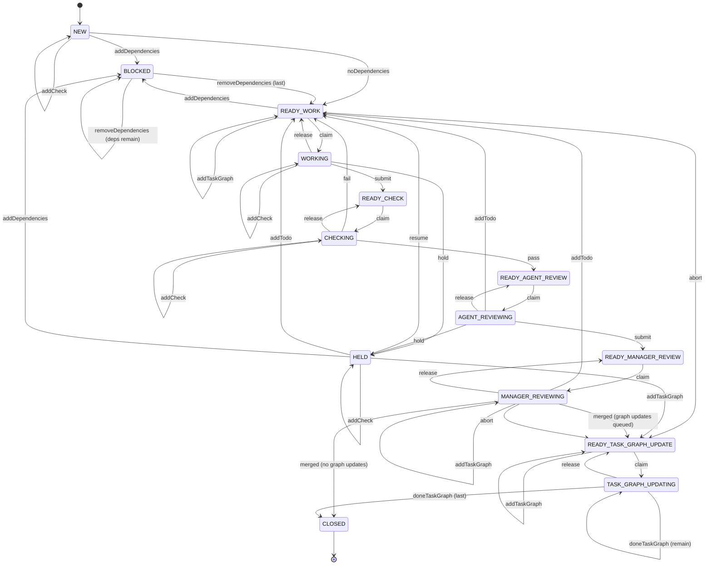
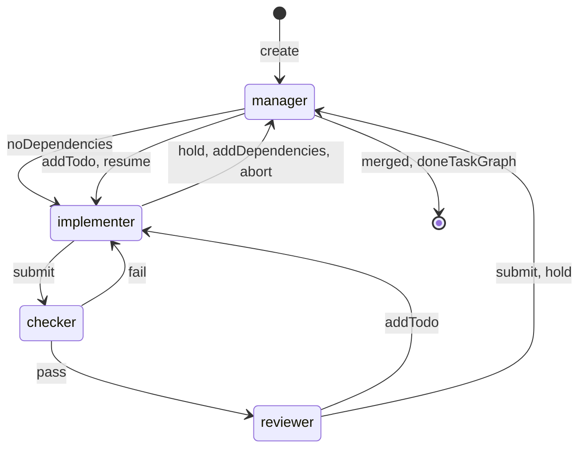
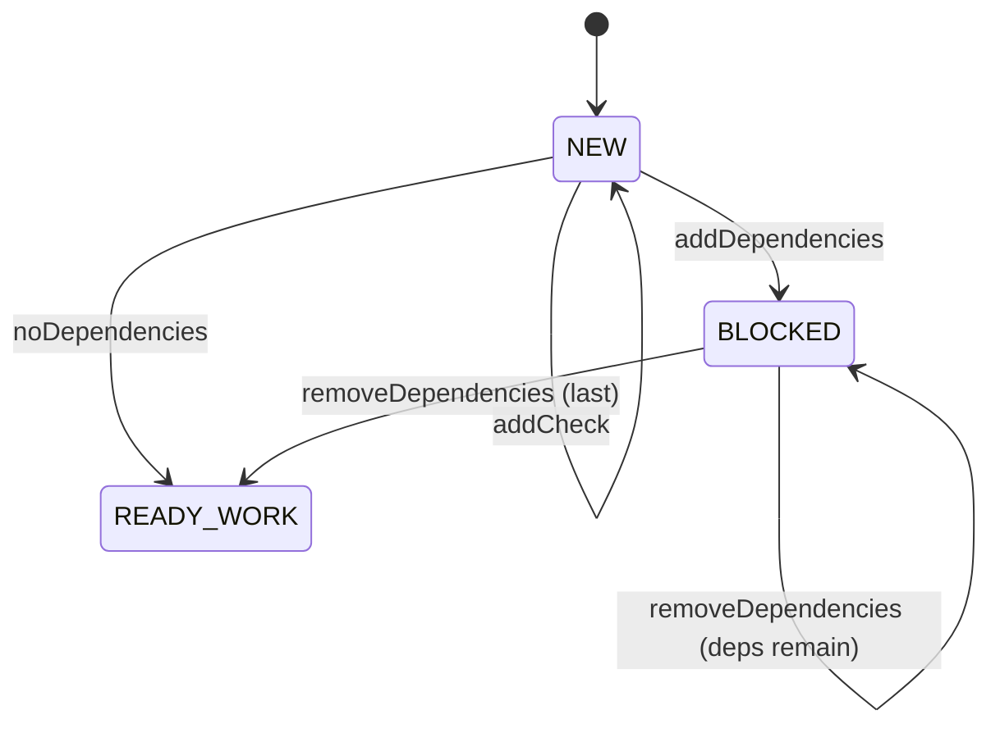
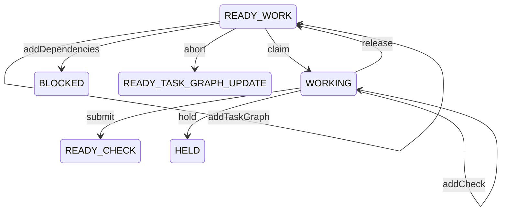
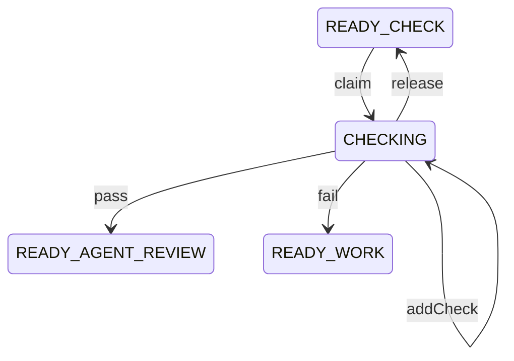
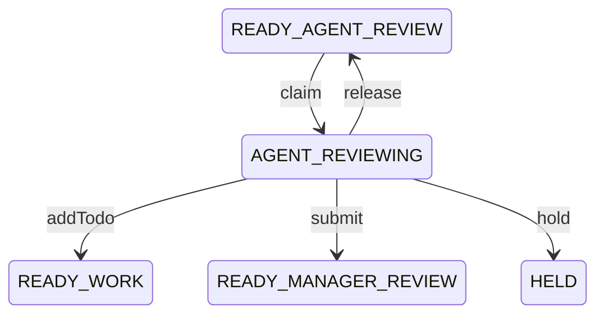
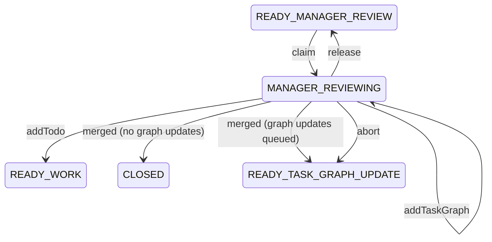
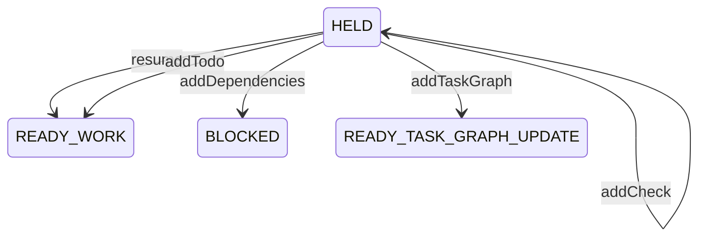
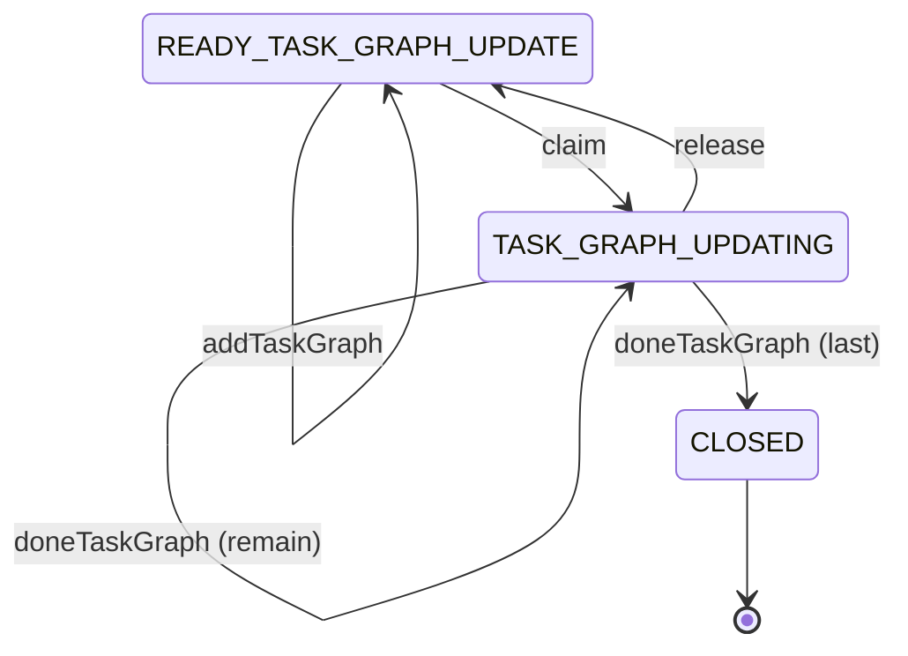

# Task Graph System

The task graph system is the execution framework for a software project.

Work is represented as individual task documents. Each task contains its definition, dependencies, todos, automated checks, recorded failures, and pending task graph updates.

The task documents are the source of truth. The current project state is generated by tooling.

## Directory Layout

```text
task-graph-template/
│
├── README.md
├── ORCHESTRATOR.md
├── agents.example.json
│
├── tasks/
│   ├── template.md
│   ├── next-task-id
│   │
│   ├── 000001.md
│   ├── 000002.md
│   ├── 000003.md
│   │
│   └── closed/
│       ├── 000004.md
│       └── 000005.md
│
└── orchestrator/
    ├── prompts/
    ├── templates/
    ├── task.ts
    ├── transition.ts
    ├── task-graph.test.ts
    └── *.ts
```

`tasks/` is data. It holds the task documents, the template every new one is copied from, and the counter that allocates their IDs — nothing executable.

The code that reads and writes them lives in `orchestrator/`: `task.ts` holds the schema, the YAML handling, the file lock and `createTask()`; `transition.ts` is the state machine. The whole task graph test suite lives in `orchestrator/task-graph.test.ts`.

The rest of `orchestrator/` is the MCP server that drives `pi` agents through the graph, described in [ORCHESTRATOR.md](ORCHESTRATOR.md). It is the only writer of `tasks/`: the manager creates tasks, edits bodies and applies judgement transitions through its tools, which keeps the lock meaningful and the transition log complete.

The tree above is this checkout. Only `tasks/` is copied into a project — the orchestrator stays here and is pointed at your repo from outside it.

## Setup

Clone this template beside the project you want it to drive, not inside it, and install its dependencies there. It needs `bun` and `git` on the path, plus `pi` for the agents themselves — the server drives them as `pi --mode rpc` subprocesses.

```bash
git clone <this-repo> task-graph-template
cd task-graph-template
bun install                                     # the MCP server and its test suite
bun test                                        # the whole suite, no network
```

Then, from the root of your own project — a git repository with a default branch, which is what the agents branch off and merge into:

```bash
cd ../my-project
cp -r ../task-graph-template/tasks .            # template.md and next-task-id
cp ../task-graph-template/agents.example.json agents.json
```

That is everything your repo gains:

```text
my-project/
├── agents.json          # the pool, gitignored
├── tasks/
│   ├── template.md
│   └── next-task-id
└── ...                  # your code
```

The task graph is your project's data and belongs in its history, so `tasks/` is committed. Nothing executable is copied: the orchestrator reads its prompts and templates from beside its own source, so it never has to be vendored into a repo it drives, and one checkout of it can drive several projects.

### The agent pool

`agents.json` is read from the directory the server is launched from — your project root — rather than from the repo it drives, so the same orchestrator can be run against one project with a big pool and another with one slot. It is gitignored; `agents.example.json` is the one to copy.

```json
{
  "agents": [
    {
      "type": "pi",
      "provider": "anthropic",
      "model": "claude-sonnet-4-5",
      "slots": 3,
      "write": ["~/.cache"]
    }
  ]
}
```

An entry is a model on a provider and how many of it may run at once. Slot names are derived rather than configured — `type-provider-model-slot`, numbered from 1 — so that pool is `pi-anthropic-claude-sonnet-4-5-1` through `-3`. A bad pool is rejected on load, not at the tenth dispatch: unknown keys, missing fields, a repeated `type`+`provider`+`model` triple and `slots < 1` all fail startup. See [Agents configuration](ORCHESTRATOR.md#agents-configuration).

### What an agent may write

Every agent and every check runs inside a `bwrap` sandbox where the whole filesystem is read-only. Two things are writable no matter what you configure: the task's own runtime directory — its worktree, `ASSIGNMENT.md` and session files — and `/tmp`, which is a private tmpfs that goes when the process does. The repo the worktree was cloned from stays read-only. `GIT_EDITOR`, `EDITOR` and `VISUAL` are forced to `true` inside it, so a `git commit` with no `-m` fails in a second instead of hanging forever on an editor nobody is typing into.

`write` is the list of paths outside that worktree the agent is allowed to write to. Each one is mounted as a throwaway overlay: the host's contents read normally, and every write lands in an upper layer that is discarded when the sandbox exits. A build gets its warm cache; nothing it does can change yours.

The default is `["~/.cache"]`, and its purpose is zig. `zig build` writes to `~/.cache/zig`, and a read-only cache there is not a slow build but a hard failure — it cannot compile `build.zig` and dies with `manifest_create ReadOnlyFileSystem`, which reads like a compile error and sends an agent hunting through its own diff. Cargo, go and npm keep their caches under the same root, so the default covers those too.

To grant more, list the full set, because declaring `write` replaces the default rather than adding to it:

```json
{
  "type": "pi",
  "provider": "anthropic",
  "model": "claude-sonnet-4-5",
  "slots": 3,
  "write": ["~/.cache", "~/.cargo", "~/.rustup", "/opt/toolchains/scratch"]
}
```

- `~` expands to your home; a relative path resolves against the directory the server was launched from.
- A path that does not exist on the host is dropped rather than failing the spawn — `bwrap` cannot overlay what is not there.
- `"write": []` is legal, and means the worktree and `/tmp` are the only writable things the agent has.
- An agent of type `pi` always gets `~/.pi` as well, whether it is listed or not. `pi` takes a lock under it at startup, and the overlay is what keeps one agent from editing the settings of the next one.
- Checks are not agents and get no `~/.pi`; they run with the union of the `write` paths of every entry in the pool, since a check runs the same build the agent just ran.

### What an agent may consume

`bwrap` bounds what a task can _reach_, not what it can _use_. Limits come from a cgroup scope wrapped around each spawn: 8G of memory, no swap, and 512 processes, per agent and per check. A task that runs away is killed inside its own scope while the other slots keep going, instead of the kernel picking victims across your machine — which is what happens without it, and which has already cost one host its desktop session. Agents run at `oom_score_adj` 300 and checks at 400, so the kernel takes a task apart long before it touches anything of yours. On a host without `systemd-run` or cgroup delegation the server warns at startup and runs unlimited.

### Register the server with Claude Code

Still from your project root:

```bash
claude mcp add task-graph -- bun ../task-graph-template/orchestrator/mcp.ts
```

Claude Code launches the server with the project directory as its cwd, which is where it reads `agents.json` and, absent an argument, which repository it drives — so the relative path above resolves and the server drives `my-project` while living outside it. The default `local` scope keeps the registration to this project and to you; `-s project` writes a `.mcp.json` that everyone who clones the repo picks up, which only works if they keep the template at the same relative path.

Start `claude` in the project root and confirm with `/mcp` that `task-graph` is connected. The manager now has one tool per judgement it can make — `task_create`, `task_done_create`, `task_claim`, `task_merge`, `task_abort` and the rest — plus `enable_scheduler`, which begins dispatching queued work to the pool. Everything the running server knows is published under `/tmp/task-graph-server/<repo>/` and readable as the `inbox`, `agents`, `checks`, `tasks` and `queue` resources.

Once the server is up, a second terminal in your project root can drive the pool:

```bash
bun ../task-graph-template/orchestrator/console.ts   # the pool, with switches
bun ../task-graph-template/orchestrator/monitor.ts   # the same view, read-only
```

The console is the queue and the slots, built from those same files: one line across the top for the tasks waiting on a slot, then one pane per slot. The scheduler and every agent have a switch you can click; the console writes the click to a file in the runtime directory and the server, which is watching it, applies it. `monitor.ts` is the same console with the switches rendered as labels and nothing to click. Like the server, both take the repo as an optional argument and otherwise use the cwd. They need a tty and a server that has already written its state.

## Rules

- All active tasks are stored directly in `tasks/`.
- Closed tasks are moved to `tasks/closed/`.
- `tasks/closed/` is archival. Closing a task removes its ID from its dependents, so nothing needs to read the archive.

## Task IDs

Task identifiers are fixed-width six-digit numbers (e.g., `000042`).

- IDs are zero-padded.
- IDs are monotonically increasing.
- IDs are never reused.
- Task filenames are always `<id>.md`.
- IDs are always quoted in YAML. Unquoted `000042` parses as the number `42`.

## Task Document Frontmatter

Tooling reads and writes the YAML frontmatter only. The document body is opaque to tooling and preserved byte-for-byte.

```yaml
---
id: "000042"
title: "Parse frontmatter with Bun.YAML"
state: WORKING
state_entered: "2026-07-27T13:00:00Z"
depends_on:
  - "000007"
claimed_by: agent-1
claimed_pid: 48213
held_reason: null
workspace:
  branch: "work/000042"
  worktree: "/tmp/task-graph-server/-home-user-project/000042/worktree"
  agent: "agent-1"
  session: "/tmp/task-graph-server/-home-user-project/000042/session/work/019f.jsonl"
todos:
  - at: "2026-07-27T12:30:00Z"
    message: "fix null handling in parser"
    done: true
checks:
  - "bun test"
failures:
  - type: check
    command: "bun test"
    exit_code: 1
    output: "1 test failed"
task_graph_updates:
  - op: add
    message: "split parser into lexer + parser"
    done: false
  - op: update
    task_id: "000007"
    message: "retarget onto new lexer task"
    done: true
---
```

| Field                | Type                              | Written by                                        |
| -------------------- | --------------------------------- | ------------------------------------------------- |
| `id`                 | quoted six-digit string           | `createTask()`                                    |
| `title`              | non-empty string                  | `createTask()`                                    |
| `state`              | one of the states below           | every transition                                  |
| `state_entered`      | ISO timestamp or null             | every transition, including self-loops            |
| `depends_on`         | list of quoted IDs                | `addDependencies`, `removeDependencies`, closing  |
| `claimed_by`         | string or null                    | `claim`, `release`, cleared on unclaimed states   |
| `claimed_pid`        | integer or null                   | `claim`, `release`, cleared on unclaimed states   |
| `held_reason`        | string or null                    | `hold`, cleared by every transition out of `HELD` |
| `workspace`          | mapping or null                   | `claim`, cleared on `CLOSED`                      |
| `todos`              | `{ at, message, done }`           | `addTodo`, `doneTodo`                             |
| `checks`             | list of command strings           | `addCheck`                                        |
| `failures`           | `{ type, ... }`                   | `fail`, cleared by `submit` and `hold`            |
| `task_graph_updates` | `{ op, task_id?, message, done }` | `addTaskGraph`, `doneTaskGraph`                   |

`claimed_by` and `claimed_pid` must both be set or both be null.

`held_reason` is non-null if and only if the task is `HELD`.

`workspace` is the execution context of a task: the `branch` and `worktree` the work happens in, the `agent` that was handed it, and the `session` file to resume, which is null when the claim carries no session. It is `null` before the first claim, so `workspace != null` is also the answer to "has this task been started". A `claim` that carries no workspace arguments leaves the recorded one alone, which is how a check or a review keeps the implementer's session reachable.

`checks` are commands, and nothing records that one has passed. Every entry to `CHECKING` runs all of them, so there is no stale result to carry forward and no field an agent can flip to claim a pass it did not get.

`failures` is what the last `fail` recorded, and it is what the resumed agent is told. Two shapes, discriminated on `type`:

| `type`   | Fields                           | Recorded when                                                     |
| -------- | -------------------------------- | ----------------------------------------------------------------- |
| `check`  | `command`, `exit_code`, `output` | a check exited non-zero in `CHECKING`                             |
| `result` | `message`                        | an agent's result could not be read; nothing records one any more |

`fail` is valid from `CHECKING` and nowhere else, so every failure in the graph is a check failure. A result that cannot be read is answered in the session that wrote it, while the claim is still held, and never becomes graph state.

Failures live only in `READY_WORK`, `WORKING`, `READY_AGENT_REVIEW` and `AGENT_REVIEWING` — the states where somebody is on their way to fixing them. A `submit` clears them, because the claim being made is that they are fixed; a `hold` clears them, because `held_reason` is the record then.

A task graph update is discriminated on `op`. `task_id` is required for `update` and `delete`, and forbidden for `add`. All three require a `message`.

Todos are append-only. Nothing clears them, so the full record of what was raised survives to close.

The schema is a zod schema in `orchestrator/task.ts`. `parseTaskMeta()` rejects unknown fields and reports every violation at once, each keyed by its path: `todos[0].done: Invalid input: expected boolean, received string`.

## Usage

Nothing shells out to the graph. `tasks/` is read and written by importing two modules, and in normal operation the orchestrator's MCP server is the only thing that does — the tool it exposes for each is named alongside the call below.

### Create a new task

```ts
import { createTask } from "./orchestrator/task.ts";

const { id, filePath } = createTask("tasks", "Task title");
```

A title is required. The document is copied from `tasks/template.md` and lands in `NEW`. MCP tool: `task_create`.

A body can be replaced wholesale under the same lock with `writeTaskBody(tasksDir, id, body)`, which is what a second writer needs in order not to lose a concurrent frontmatter write. MCP tool: `task_write_body`.

### Transition a task

```ts
import { applyTransition } from "./orchestrator/transition.ts";

applyTransition("tasks", "000001", "addTodo", { message: "fix null handling" });
```

`applyTransition()` asserts the current state of a task and performs a valid state transition, all of it under the graph lock. It only reads and writes the YAML frontmatter; agents may update the task document body before transitioning.

#### Available transitions

| Transition           | Args                                               | Description                                        |
| -------------------- | -------------------------------------------------- | -------------------------------------------------- |
| `addDependencies`    | `{ taskIds }`                                      | Add dependency tasks                               |
| `removeDependencies` | `{ taskIds }`                                      | Remove dependencies manually                       |
| `noDependencies`     | _(none)_                                           | Declare the task has no dependencies               |
| `claim`              | `{ agentName, pid, branch?, worktree?, session? }` | Claim a task for work, check, or review            |
| `release`            | _(none)_                                           | Release a claim whose process has died             |
| `submit`             | _(none)_                                           | Submit work for checks, or a review for its check  |
| `pass`               | _(none)_                                           | Checks or review passed                            |
| `fail`               | `{ failures }`                                     | A check failed; send the work back                 |
| `hold`               | `{ reason }`                                       | Park a task that cannot proceed                    |
| `resume`             | _(none)_                                           | Return a held task to `READY_WORK`                 |
| `addTodo`            | `{ message }`                                      | File something that must be fixed                  |
| `doneTodo`           | `{ index }`                                        | Mark a todo done                                   |
| `addCheck`           | `{ command }`                                      | Declare an automated check                         |
| `addTaskGraph`       | `{ op: "add", message }`                           | Queue a new task                                   |
| `addTaskGraph`       | `{ op: "update" \| "delete", taskId, message }`    | Queue a change to an existing task                 |
| `doneTaskGraph`      | `{ index }`                                        | Mark a task graph update done                      |
| `merged`             | _(none)_                                           | The branch landed on the base                      |
| `abort`              | _(none)_                                           | The task is being thrown away; the graph was wrong |

Indices are 0-based and refer to positions in the corresponding frontmatter list.

Every argument is validated before anything is written, so a rejected transition leaves the document byte-identical. Agent names, messages, reasons and commands must be non-empty; PIDs must be positive integers; indices must be non-negative integers. A `<taskId>` given to `addDependencies`, or to `addTaskGraph update|delete`, must name a task that currently exists and is not closed — `removeDependencies` is the exception, since clearing a reference to a task that is already gone is how such a reference gets repaired.

`claim` takes the workspace arguments as a group: `branch` and `worktree` are given together or not at all, and `session` may follow them. A claim that omits them keeps whatever workspace the task already carries.

`failures` is the whole list the checker produced, each entry carrying the output tail of one failing command.

`merged` and `abort` are the two ways out of `MANAGER_REVIEWING`, and the graph cannot tell them apart on its own — whether the branch landed is a fact about git. `applyTransition()` enforces the part it can see (`abort` requires queued task graph updates; `merged` requires no open todos) and the orchestrator proves the rest before it applies either: `merged` only after the branch is an ancestor of the base, `abort` only while it is not. `abort` is also allowed from `READY_WORK`, where the task is queued and unclaimed and the judgement is the same one made a state early.

#### Examples

```ts
const apply = (id: string, name: TransitionName, args: TransitionArgs = {}) =>
  applyTransition("tasks", id, name, args);

// A task with no dependencies (NEW → READY_WORK)
apply("000001", "noDependencies");

// Add dependencies (NEW → BLOCKED, or self-loop while already BLOCKED)
apply("000002", "addDependencies", { taskIds: ["000001"] });

// Declare the checks this task must pass
apply("000001", "addCheck", { command: "bun test" });

// Claim a task to work on it (READY_WORK → WORKING)
apply("000001", "claim", { agentName: "my-agent", pid: process.pid });

// Submit for automated checks (WORKING → READY_CHECK)
apply("000001", "submit");

// Claim and run checks (READY_CHECK → CHECKING)
apply("000001", "claim", { agentName: "checker", pid: process.pid });

// Checks pass (CHECKING → READY_AGENT_REVIEW)
apply("000001", "pass");

// Or one failed, which sends the work back with the reason (CHECKING → READY_WORK)
apply("000001", "fail", {
  failures: [
    {
      type: "check",
      command: "bun test",
      exit_code: 1,
      output: "1 test failed",
    },
  ],
});

// A finding sends the task back too (AGENT_REVIEWING or MANAGER_REVIEWING → READY_WORK)
apply("000001", "addTodo", { message: "fix null handling in parser" });

// The worker marks them off (self-loops in WORKING)
apply("000001", "doneTodo", { index: 0 });

// A peer reviews the diff, and what it found becomes todos or a submit
apply("000001", "claim", { agentName: "reviewer", pid: process.pid });
apply("000001", "addTodo", { message: "the null case is untested" });

// Nothing found, so the task moves up to the manager (AGENT_REVIEWING → READY_MANAGER_REVIEW)
apply("000001", "submit");

// The manager accepts the work and the branch lands (MANAGER_REVIEWING → CLOSED)
apply("000001", "claim", { agentName: "manager", pid: process.pid });
apply("000001", "merged");

// Park a task that has hit a wall, then let it go again
apply("000001", "hold", { reason: "the staging database is down" });
apply("000001", "resume");

// Recover a task whose agent died
apply("000001", "release");
```

#### Notes

- `pid` is the claiming process, which is what claim ownership and stale-process detection are read from.
- Self-loop transitions update `state_entered` without changing state.
- When a task reaches `CLOSED`, its file is moved to `tasks/closed/` and its ID is removed from every active dependent. A dependent whose last dependency was removed moves to `READY_WORK`.
- `release` only works once the claiming process is gone. A live claim cannot be taken from its owner.

## Task State Machine

<details>
<summary>The whole state machine, every state and every transition</summary>



</details>

### Roles

Every state belongs to exactly one role. A transition between two states of the same role is that role at work; a transition that leaves them is a handoff, and the diagram below is only the handoffs.



The manager is at both ends: it defines the task before anyone can work on it, and it is the only role that can close one. An `addTodo` from the reviewer or the manager is a finding, and it always sends the task back to the implementer; a `submit` from the reviewer means it found nothing.

| Role          | States                                                                                           | Job                                                                    |
| ------------- | ------------------------------------------------------------------------------------------------ | ---------------------------------------------------------------------- |
| `manager`     | `NEW`, `BLOCKED`, `READY_MANAGER_REVIEW`, `MANAGER_REVIEWING`, `HELD`, the two task graph states | Defines the task, judges finished work, closes it, rewrites the graph. |
| `implementer` | `READY_WORK`, `WORKING`                                                                          | Writes the commits and marks off todos.                                |
| `checker`     | `READY_CHECK`, `CHECKING`                                                                        | Runs every declared check and reports the exit codes.                  |
| `reviewer`    | `READY_AGENT_REVIEW`, `AGENT_REVIEWING`                                                          | Reads the commits and files what it found, or nothing.                 |

Roles are a way to read the state machine; the state machine does not know about them. Under the orchestrator the manager is a Claude Code session, the implementer and the reviewer are dispatched agents, and the checker is the server itself — see [ORCHESTRATOR.md](ORCHESTRATOR.md).

Each role that holds a claim has the same shape: a `READY_*` state nothing owns yet, a claimed state entered by `claim`, and a `release` back to the ready state when the claiming process dies.

#### manager: definition

A task is authored here. Todos and checks may be declared before any work starts, and they carry forward unchanged.



`BLOCKED` is the one state with no actor: it clears itself when the last dependency is removed, which happens automatically when that dependency closes. A task also arrives in `BLOCKED` from `READY_WORK` or `HELD`, via `addDependencies`, when it turns out to be waiting on another one.

#### implementer: the work



Everything that sends work back lands in `READY_WORK`: a failed check, a finding from either review, a resumed hold. `submit` is the claim that no todo is open, and it is refused while one is.

`READY_WORK` is also the last state a task can be called off in, by the same `abort` that ends a manager review: nothing holds it yet, so the manager can throw away a task it has decided was the wrong shape instead of spending a slot proving it. Like every abort it requires at least one queued task graph update to say what should replace it.

#### checker: the checks



The only mechanical role. Every check runs on every entry, `pass` if they all exited zero and `fail` otherwise, and `fail` is the only transition in the graph that records a failure.

#### reviewer: the peer review



A peer reading the commits. What it found becomes todos that send the task back; a `submit` means it found nothing and moves the task up. It cannot close anything, so a typo-level finding never costs a manager round trip.

#### manager: the review



Only work that survived both the checks and the peer arrives here, and this is the only state a task can close from. `merged` means the branch is on the base; `abort` means the work is being thrown away and the graph rewritten instead, so it requires at least one queued update.

#### manager: held

`HELD` is where a task waits on a person. It is a state rather than a flag so that a dispatcher pulling from `READY_WORK` cannot pick it up by forgetting to check something.



Every exit is a judgement: `resume` if the wall is gone, `addTodo` if work was missing, `addDependencies` if it was waiting on another task, `addTaskGraph` if the graph itself was wrong.

#### manager: the task graph update



A task that queued changes to the graph does them before it closes, whether it got here from a `merged`, an `abort` or a hold. The last `doneTaskGraph` closes it.

### Queues

Todos, failures and task graph updates all work the same way: something adds to the queue, something clears it, and a gate blocks progress while entries remain.

|       | Todos                                                                                                                                                    | Failures                             | Task graph updates                                                                                   |
| ----- | -------------------------------------------------------------------------------------------------------------------------------------------------------- | ------------------------------------ | ---------------------------------------------------------------------------------------------------- |
| Add   | `addTodo` — from `AGENT_REVIEWING`, `MANAGER_REVIEWING` and `HELD` it moves the task to `READY_WORK`; in `NEW`, `READY_WORK` and `WORKING` it self-loops | `fail` — from `CHECKING`             | `addTaskGraph` — from `HELD` it moves the task to `READY_TASK_GRAPH_UPDATE`; elsewhere it self-loops |
| Clear | `doneTodo` in `WORKING`                                                                                                                                  | `submit` and `hold`, wholesale       | `doneTaskGraph` in `TASK_GRAPH_UPDATING`                                                             |
| Gate  | `submit`, `pass` and `merged` refuse while open                                                                                                          | none; they are a message, not a gate | `CLOSED` only when all are done                                                                      |

Checks are not a queue. They are a list of commands, run in full every time the task reaches `CHECKING`.

### Transition Rules

- Verification criteria are usually known at authoring time, so todos and checks declared in `NEW` carry forward unchanged when the task leaves it.
- A `submit` is the claim that nothing is outstanding, whoever makes it: `WORKING → READY_CHECK` and `AGENT_REVIEWING → READY_MANAGER_REVIEW` are both refused while a todo is open.
- `fail` returns the task to `READY_WORK`, where the same agent picks it up again in the session it just left. Nothing about a failing check is a todo, because nobody needs to decide anything about it.
- A review whose result cannot be read never leaves `AGENT_REVIEWING`. Nothing it found is guessed at: the server says so in the session it is already holding and the reviewer writes the result again.
- `merged` closes the task unless the review queued task graph updates, in which case those are done first. `abort` always goes to `READY_TASK_GRAPH_UPDATE`, and `TASK_GRAPH_UPDATING → CLOSED` only when the last pending update is marked done.
- Agents may update the task document body before transitioning; `applyTransition()` only asserts and mutates the YAML frontmatter. A body can also be replaced wholesale under the lock with `writeTaskBody()`, which is what a second writer needs in order not to lose a concurrent frontmatter write.

## Running Tests

```bash
bun test          # the whole suite
bun run typecheck # tsc --noEmit
bun run fmt       # prettier --write .
```

The task graph suite lives entirely in `orchestrator/task-graph.test.ts` and runs against real files in temporary directories. It includes a table of the whole state machine: every legal `(state, transition)` pair is applied and its landing state asserted, and every illegal pair is asserted to be refused with the document left byte-identical.

The orchestrator adds `orchestrator/orchestrator.test.ts` for the parts that are pure logic, `orchestrator/server.test.ts`, which drives the real server against real git clones, real `bwrap` sandboxes and a stand-in `pi` that speaks the rpc protocol, and `orchestrator/console.test.ts`, which renders the queue header and the panes from views written to a temporary runtime directory.

## Invariants

- Every task is exactly one six-digit Markdown file.
- Active tasks live directly under `tasks/`.
- Closed tasks live under `tasks/closed/`.
- Task IDs are allocated only by `createTask()`, under a lock, so concurrent agents never collide.
- Tooling reads and writes frontmatter only. The document body is opaque and preserved byte-for-byte; its sections are agent-authored prose.
- State is stored only in task documents.

The project is complete when every task has reached `CLOSED`.
