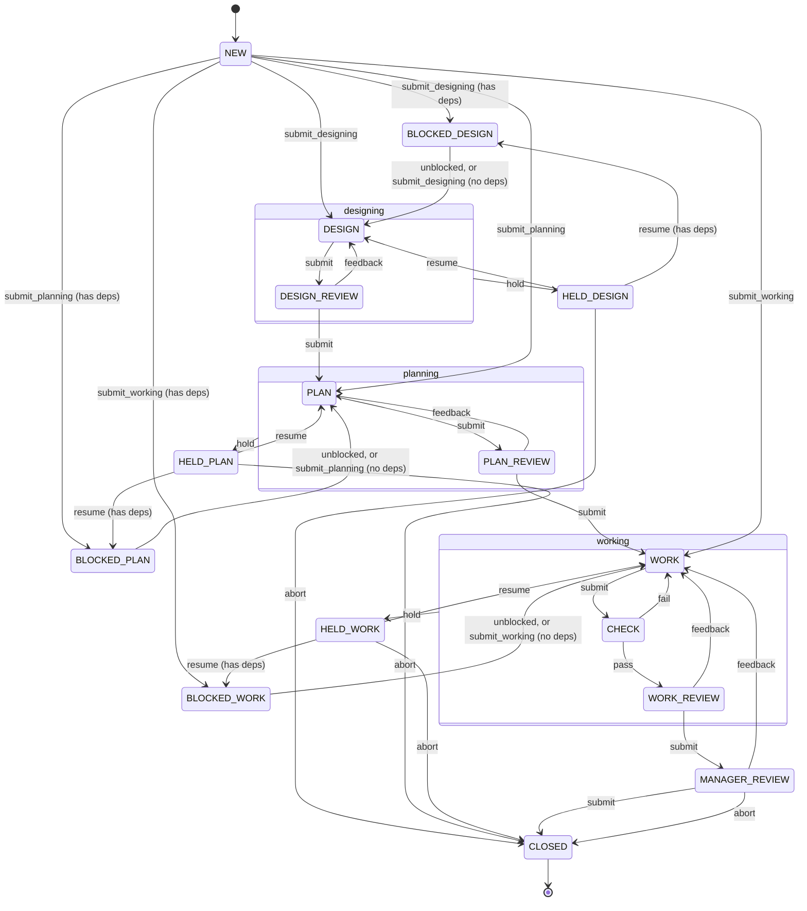

# Task Graph System

A smart coding agent (the manager) drives a team of `pi` agents through the design, planning, implementation and review of coding tasks.



Reviews send work back to their author state; a failed check sends `CHECK` back to `WORK`; anything blocked parks in `HELD_DESIGN`/`HELD_PLAN`/`HELD_WORK` until the manager resumes or aborts it. The manager is at both ends: it says which phase a task enters at, and it is the only role that can close one. `submit_planning` and `submit_working` are the manager saying the design, or the design and the plan, are already in the body — nothing checks that they are. See [States](docs/states.md).

## The manager inbox

Everything waiting on the manager, most nearly closed first:

- `MANAGER_REVIEW` — `task_submit` lands the branch, `task_feedback` sends it back with findings, `task_abort` throws it away
- `HELD_*` — read `held_reason`, edit the task, then `task_resume` or `task_abort`
- `NEW` — author the task: edit the file (body, checks, dependencies), then `task_submit_designing`, or `task_submit_planning`/`task_submit_working` to skip the phases the body already carries

## Setup

Clone this template **beside** the project it drives, not inside it. Needs `bun`, `git` and `pi` on the path.

```bash
git clone https://github.com/Pyrolistical/task-graph-template.git task-graph-template
cd task-graph-template
bun install
cd ../my-project
claude mcp add task-graph -- bun ../task-graph-template/mcp.ts
```

The server drives the directory `claude` was started in, so run it from the project root. The first start seeds `~/task-graph/<key>/` — the key derives from the repository path — from the template's `tasks/`. Fill in `agents.json` there, then restart the `task-graph` MCP server inside `claude`.

```json
{
  "agents": [
    {
      "type": "pi",
      "provider": "anthropic",
      "model": "claude-sonnet-4-5",
      "slots": 3
    }
  ]
}
```

It is seeded with one disabled placeholder: give it a real provider and model, set `enabled`, add slots. A provider that is not always up — a local inference server — takes `"healthCheck": true`. A local model bills no tokens, so give it `"wattage"` and `"costPerKwh"` and its sessions are priced by the power they drew. See [Agents](docs/agents.md).

Link the manager's skills in, so they stay the template's copy: `task-graph-inbox` clears the inbox once, `task-graph-monitor` clears it and keeps watching.

```bash
mkdir -p ~/my-project/.claude/skills
ln -s ../../../task-graph-template/.claude/skills/task-graph-inbox ~/my-project/.claude/skills/task-graph-inbox
ln -s ../../../task-graph-template/.claude/skills/task-graph-monitor ~/my-project/.claude/skills/task-graph-monitor
```

Confirm with `/mcp` that `task-graph` is connected. A second terminal can watch the pool with `bun ../task-graph-template/console.ts`.

## Design documentation

[`docs/`](docs/) is how the orchestrator works and why: start with [the dictionary](docs/dictionary.md), [authority](docs/authority.md), [states](docs/states.md) and [ASSIGNMENT.md](docs/assignment.md).
