# Task Graph System

Have your smart coding agent manage a team of pi agents to implement the design, planning, implementation, review of coding tasks.

## Setup

Clone this template beside the project you want it to drive, not inside it, and install its dependencies there. It needs `bun` and `git` on the path, plus `pi` for the agents themselves — the server drives them as `pi --mode rpc` subprocesses.

```bash
git clone https://github.com/Pyrolistical/task-graph-template.git task-graph-template
cd task-graph-template
bun install                                     # the MCP server and its test suite
```

Then, from the root of your own project — a git repository with a default branch, which is what the agents branch off and merge into:

```bash
cd ~/my-project
mkdir -p ~/task-graph/my-project
cp ../task-graph-template/agents.example.json ~/task-graph/my-project/agents.json
claude mcp add task-graph -- bun ../task-graph-template/orchestrator/mcp.ts
```

```text
~/task-graph/<key>/
├── agents.json          # the pool
├── template.md          # seeded on first start
├── next-task-id         # seeded on first start
└── 000001.md ...        # the task documents, as they are created
```

### The agent pool

`agents.json` is read from the task directory — `~/task-graph/my-project/agents.json`.

```json
{
  "agents": [
    {
      "type": "pi",
      "provider": "anthropic",
      "model": "claude-sonnet-4-5",
      "slots": 3,
      "write": ["~/.cache"]
    }
  ]
}
```

Start `claude` in the project root and confirm with `/mcp` that `task-graph` is connected.

Once the server is up, a second terminal in your project root can monitor the pool:

```bash
bun ../task-graph-template/orchestrator/console.ts
```

## Task State Machine

<details>
<summary>The whole state machine, every state and every transition</summary>

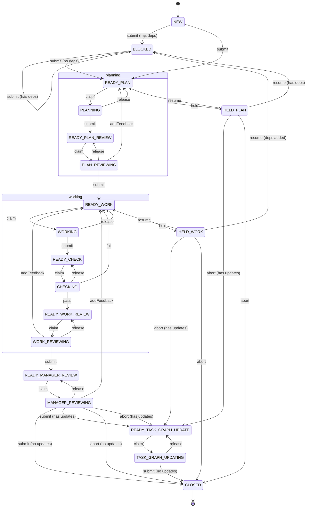

</details>

### Roles

Every state belongs to exactly one role. A transition between two states of the same role is that role at work; a transition that leaves them is a handoff, and the diagram below is only the handoffs.

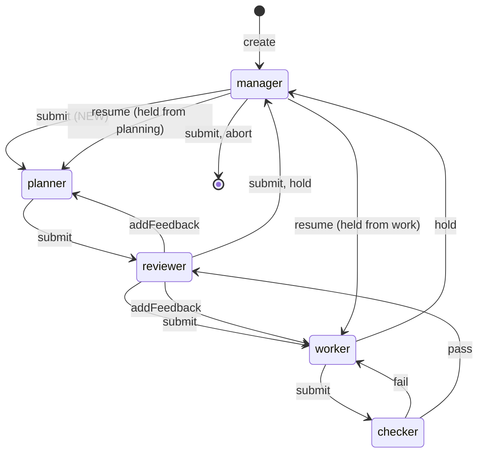

The manager is at both ends: it defines the task before anyone can work on it, and it is the only role that can close one. A task is planned before it is worked: the planner appends the numbered todo list, the plan reviewer checks it against the acceptance criteria, and only a reviewed plan reaches the worker. An `addFeedback` from the work reviewer appends its findings to the task body under `# Review findings` and sends the task back to the worker; from the plan reviewer it goes to the planner's prompt queue and sends the task back to the planner. The manager's `addFeedback` does the same as the work reviewer's. A held task is resolved by editing the task directly and resuming it, or by aborting it.

| Role       | States                                                                                                             | Job                                                                    |
| ---------- | ------------------------------------------------------------------------------------------------------------------ | ---------------------------------------------------------------------- |
| `manager`  | `NEW`, `BLOCKED`, `READY_MANAGER_REVIEW`, `MANAGER_REVIEWING`, `HELD_PLAN`, `HELD_WORK`, the two task graph states | Defines the task, judges finished work, closes it, rewrites the graph. |
| `planner`  | `READY_PLAN`, `PLANNING`                                                                                           | Decomposes the task into executable todos.                             |
| `reviewer` | `READY_PLAN_REVIEW`, `PLAN_REVIEWING`, `READY_WORK_REVIEW`, `WORK_REVIEWING`                                       | Checks the plan and reads the work, filing what it found or nothing.   |
| `worker`   | `READY_WORK`, `WORKING`                                                                                            | Writes the commits and marks off todos.                                |
| `checker`  | `READY_CHECK`, `CHECKING`                                                                                          | Runs every declared check and reports the exit codes.                  |

Roles are a way to read the state machine; the state machine does not know about them. Under the orchestrator the manager is a Claude Code session, the planner, the worker and the reviewer are dispatched agents, and the checker is the server itself — see [ORCHESTRATOR.md](ORCHESTRATOR.md). The plan review and the work review are the same `reviewer` role in the pool — the states differ, not the role.

Each role that holds a claim has the same shape: a `READY_*` state nothing owns yet, a claimed state entered by `claim`, and a `release` back to the ready state when the claiming process dies.

#### manager: definition

A task is authored here. Todos and checks may be declared before any work starts, and they carry forward unchanged.

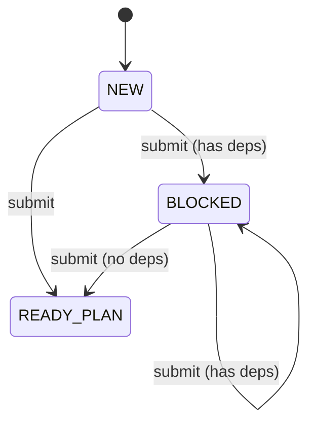

Authoring is editing the document, and `submit` is the handoff: the manager writes the body, the checks and the `depends_on` list straight into the file, then `submit` routes the task by what is in it. `BLOCKED` is the one state with no actor: it clears itself when the last dependency is removed, which happens automatically when that dependency closes, and `submit` from `BLOCKED` re-routes a task whose dependencies the manager edited away by hand. A task also arrives in `BLOCKED` from `NEW` (submitted with dependencies) or from either held state, when it turns out to be waiting on another one.

#### planner: the plan

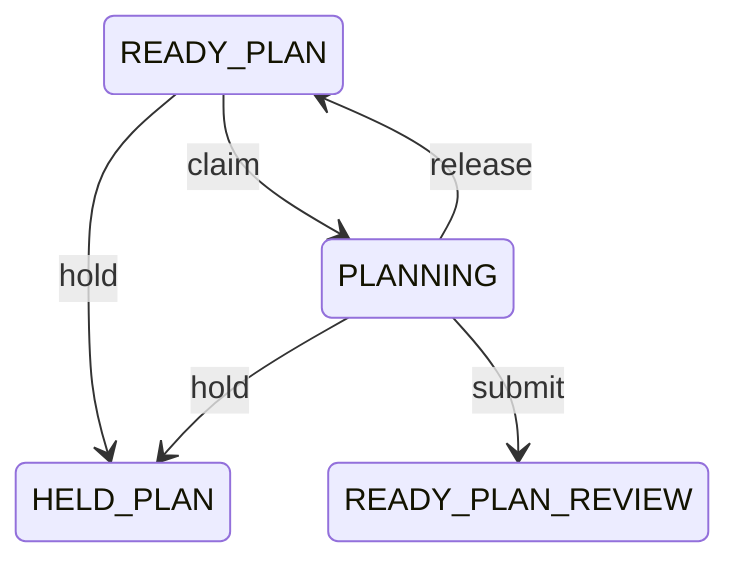

A task is planned before it is worked. The planner reads the goal and the acceptance criteria and appends a `## Todos` section to `ASSIGNMENT.md` — a numbered list (`1.` to `n.`, consecutively), each entry specific and verifiable enough for a worker to execute without the planner present. The section becomes part of the task body verbatim when the plan is accepted; a submit that appends nothing is refused. The planner writes nothing else and commits nothing — the server verifies the worktree is untouched and the assignment unchanged above the appended section at every settle. It ends by calling the `submit` tool (or `blocked`, with a message naming the wall).

`READY_PLAN` is the state a task can be called off in before a slot is spent on it: `hold` parks it in `HELD_PLAN` and `abort` throws it away, with any task graph updates the manager edited in sent to the update state first.

#### reviewer: the plan review

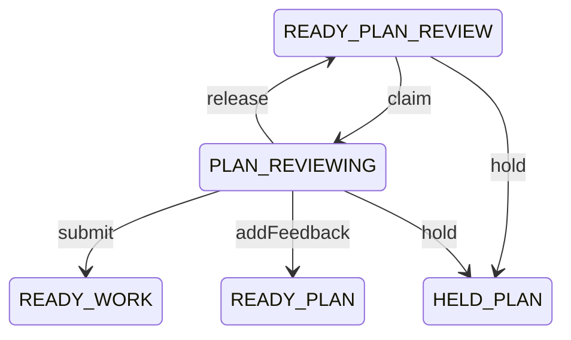

A peer reading the plan, not the code. It checks that the todo list is present and numbered `1.` to `n.` consecutively, and that the todos cover the acceptance criteria. Its `findings` go back to the planner through the prompt queue, verbatim, and an empty list approves the plan — the assignment becomes the task body and the task opens `READY_WORK`. The reviewer changes nothing in the assignment and touches nothing in the worktree; it is the same dispatched role as the work review, in a different state.

#### worker: the work

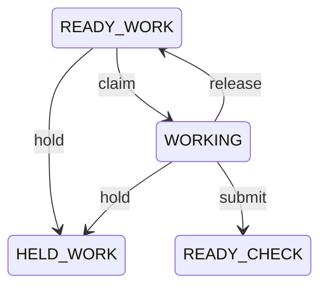

Everything that sends work back lands in `READY_WORK`: a failed check, a finding from either review, a resumed hold. The worker appends `## Implementation Notes` to `ASSIGNMENT.md`, addressing every todo by number; `submit` is the claim that every todo is addressed in the notes, every check passes and the work is committed. The notes become part of the task body at submit.

`READY_WORK` and `READY_PLAN` are also the states a task can be called off in: `hold` parks the task in `HELD_WORK` / `HELD_PLAN`, where the manager can throw away a task it has decided was the wrong shape with `abort` instead of spending a slot proving it.

#### checker: the checks

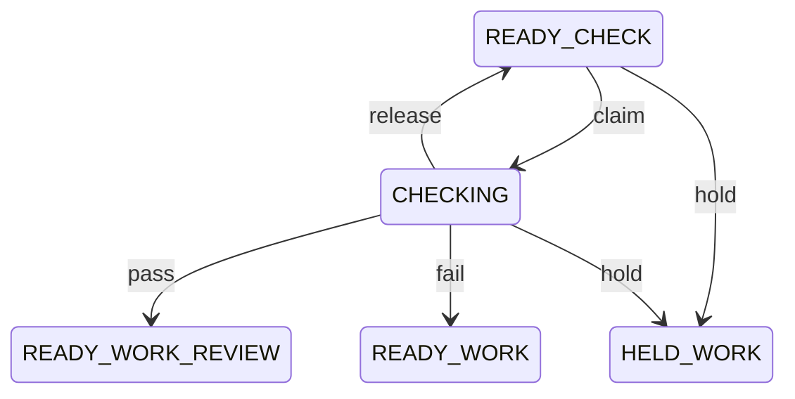

The only mechanical role. Every check runs on every entry, `pass` if they all exited zero and `fail` otherwise. A failing check is not recorded in the graph: its command, exit code and output tail go to the worker's prompt queue, and the task returns to `READY_WORK` to be resumed.

#### reviewer: the peer review

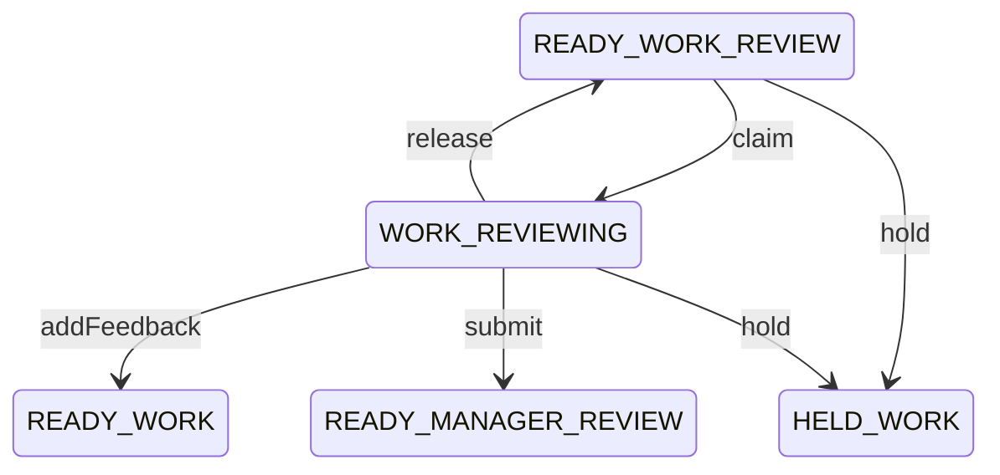

A peer reading the commits and the worker's notes, checking each todo against them. What it found is appended to the task body under `# Review findings`, verbatim, with a fresh `## Implementation Notes` heading for the next round, and the worker is reminded of the findings at dispatch; a `submit` means it found nothing and moves the task up. It cannot close anything, so a typo-level finding never costs a manager round trip.

#### manager: the review

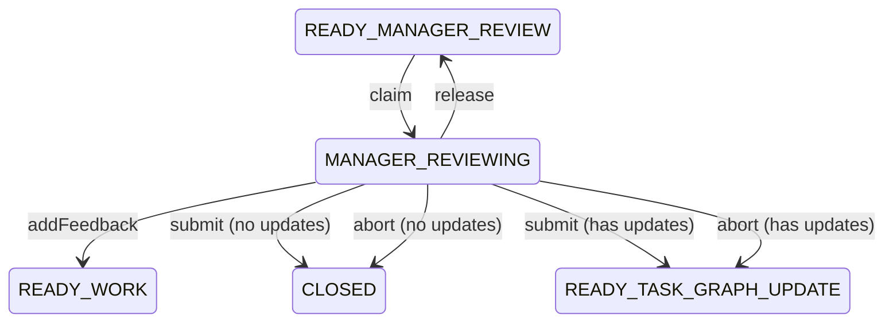

Only work that survived both the checks and the peer arrives here, and this is the only state a task can close from. `submit` (`task_submit`) means the branch is on the base and the work is accepted; `abort` means the work is being thrown away. Either closes the task, or sends it to the update state first when the manager edited task graph updates into the document. `addFeedback` (the `task_add_feedback` tool) sends the task back to `READY_WORK` with the findings appended under `# Review findings`, exactly like the peer review.

#### manager: held

`HELD_PLAN` and `HELD_WORK` are where a task waits on the manager. They are states rather than a flag, so that a dispatcher pulling from `READY_WORK` or `READY_PLAN` cannot pick a held task up by forgetting to check something. The split is the flag: a task held while it had no plan lands in `HELD_PLAN` and returns to `READY_PLAN`; one held during the work lands in `HELD_WORK` and returns to `READY_WORK`.

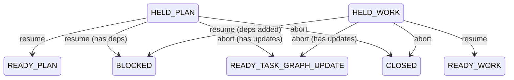

Every exit is a judgement: `resume` if the wall is gone — into `BLOCKED` when the manager added dependencies while it was held — and `abort` if the task was the wrong shape, closing it, or sending it to the update state first when task graph updates were edited in. To resolve a hold the manager **updates the task directly** — edit the task document, or `task_write_body` to fix the acceptance criteria or append guidance, adding checks, dependencies and task graph updates the same way — then `resume` or `abort`. There is no todo-adding; the todo list is the planner's to write.

#### manager: the task graph update

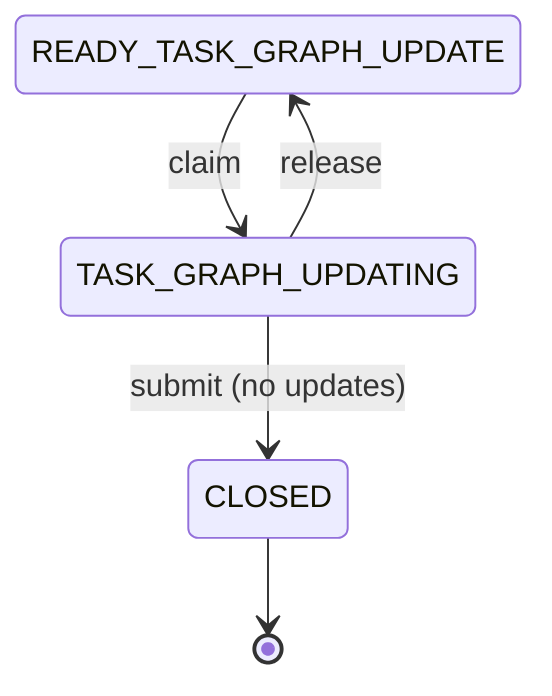

A task that queued changes to the graph does them before it closes, whether it got here from a `submit` at the manager review, an `abort`, or a hold. The manager holds `TASK_GRAPH_UPDATING`, applies each update to the graph, marks it done in the document, and `submit` closes the task — refused while any update remains open.

### The manager inbox

The `inbox` resource is everything waiting on the manager:

- `READY_MANAGER_REVIEW` — ready for final review. If complete use `task_submit` to merge it to master, otherwise `task_add_feedback` with findings sends it back; `task_abort` throws it away.
- `READY_TASK_GRAPH_UPDATE` — queued graph updates to be applied by you. Apply them by editing the graph, mark each update done in the task document, then `task_submit` to close the task.
- `HELD_PLAN` / `HELD_WORK` — an agent was blocked with `held_reason`. Resolve by directly updating the task document, then `task_resume`, or `task_abort` to close it.
- `NEW` — author the task: edit the file directly — body, checks, dependencies — then `task_submit` to dispatch it.
