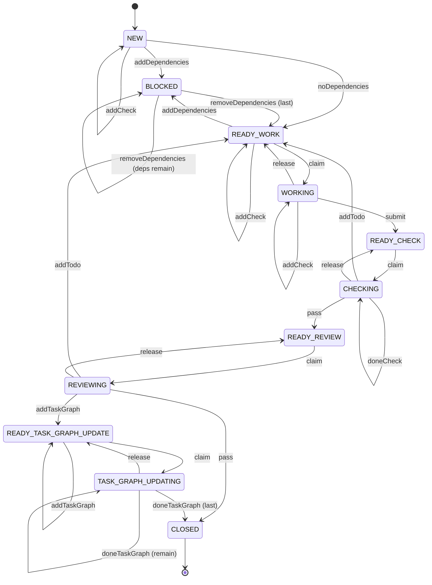

# Task Graph System

The task graph system is the execution framework for a software project.

Work is represented as individual task documents. Each task contains its definition, dependencies, todos, automated checks, and pending task graph updates.

The task documents are the source of truth. The current project state is generated by tooling.

## Directory Layout

```text
project-root/
│
├── README.md
│
└── tasks/
    ├── template.md
    ├── next-task-id
    ├── task.ts
    ├── create.ts
    ├── state.ts
    ├── transition.ts
    ├── task-graph.test.ts
    │
    ├── 000001.md
    ├── 000002.md
    ├── 000003.md
    │
    └── closed/
        ├── 000004.md
        └── 000005.md
```

`task.ts` holds the shared schema, YAML handling, and file helpers. The whole test suite lives in `task-graph.test.ts`, so it can be deleted in one step when using this repository as a template.

## Rules

- All active tasks are stored directly in `tasks/`.
- Closed tasks are moved to `tasks/closed/`.
- `state.ts` only reads active tasks directly under `tasks/`.
- `tasks/closed/` is archival. Closing a task removes its ID from its dependents, so nothing needs to read the archive.

## Task IDs

Task identifiers are fixed-width six-digit numbers (e.g., `000042`).

- IDs are zero-padded.
- IDs are monotonically increasing.
- IDs are never reused.
- Task filenames are always `<id>.md`.
- IDs are always quoted in YAML. Unquoted `000042` parses as the number `42`.

## Task Document Frontmatter

Tooling reads and writes the YAML frontmatter only. The document body is opaque to tooling and preserved byte-for-byte.

```yaml
---
id: "000042"
title: "Parse frontmatter with Bun.YAML"
state: WORKING
state_entered: "2026-07-27T13:00:00Z"
depends_on:
  - "000007"
claimed_by: agent-1
claimed_pid: 48213
todos:
  - at: "2026-07-27T12:30:00Z"
    message: "fix null handling in parser"
    done: true
checks:
  - command: "bun test"
    done: false
task_graph_updates:
  - op: add
    message: "split parser into lexer + parser"
    done: false
  - op: update
    task_id: "000007"
    message: "retarget onto new lexer task"
    done: true
---
```

| Field                | Type                              | Written by                                       |
| -------------------- | --------------------------------- | ------------------------------------------------ |
| `id`                 | quoted six-digit string           | `create.ts`                                      |
| `title`              | non-empty string                  | `create.ts`                                      |
| `state`              | one of the states below           | every transition                                 |
| `state_entered`      | ISO timestamp or null             | every transition, including self-loops           |
| `depends_on`         | list of quoted IDs                | `addDependencies`, `removeDependencies`, closing |
| `claimed_by`         | string or null                    | `claim`, `release`, cleared on unclaimed states  |
| `claimed_pid`        | integer or null                   | `claim`, `release`, cleared on unclaimed states  |
| `todos`              | `{ at, message, done }`           | `addTodo`, `doneTodo`                            |
| `checks`             | `{ command, done }`               | `addCheck`, `doneCheck`, reset on `READY_WORK`   |
| `task_graph_updates` | `{ op, task_id?, message, done }` | `addTaskGraph`, `doneTaskGraph`                  |

`claimed_by` and `claimed_pid` must both be set or both be null.

A task graph update is discriminated on `op`. `task_id` is required for `update` and `delete`, and forbidden for `add`. All three require a `message`.

Todos are append-only. Nothing clears them, so the full record of what was raised survives to close.

The schema is enforced by `parseTaskMeta()` in `task.ts`, which rejects unknown fields and reports every violation at once.

## Usage

### Create a new task

```bash
bun tasks/create.ts "Task title"
```

A title is required.

### View project state

```bash
bun tasks/state.ts
```

Outputs JSON to stdout with tasks grouped by state, open counts per task, and any detected problems.

#### JSON Output Schema

| Key        | Type                         | Description                                                                    |
| ---------- | ---------------------------- | ------------------------------------------------------------------------------ |
| `tasks`    | `Record<State, TaskId[]>`    | Tasks grouped by state. Every state is present, even if empty. IDs are sorted. |
| `open`     | `Record<TaskId, OpenCounts>` | Per task: `open_todos`, `open_checks`, `open_task_graph_updates`.              |
| `problems` | `Problem[]`                  | Detected issues, empty if none.                                                |

**Valid states** (keys in `tasks`):
`NEW`, `BLOCKED`, `READY_WORK`, `WORKING`, `READY_CHECK`, `CHECKING`,
`READY_REVIEW`, `REVIEWING`, `READY_TASK_GRAPH_UPDATE`, `TASK_GRAPH_UPDATING`

**Problem object:**

| Field     | Type     | Description                                                           |
| --------- | -------- | --------------------------------------------------------------------- |
| `type`    | `string` | One of the problem types below.                                       |
| `task_id` | `string` | The affected task. Omitted entirely for global issues such as cycles. |
| `message` | `string` | Human-readable description.                                           |

**Problem types:**

| Type                     | When reported                                                                                                                                   |
| ------------------------ | ----------------------------------------------------------------------------------------------------------------------------------------------- |
| `MalformedTaskDocument`  | A `.md` file has no frontmatter, a duplicate ID, or an ID disagreeing with its filename.                                                        |
| `InvalidMetadata`        | Frontmatter fails schema validation, or a task violates an invariant the transitions maintain — see below.                                      |
| `MissingDependency`      | A task depends on an ID that does not exist. Closing a dependency removes the reference, so it does not trigger this.                           |
| `DependencyCycle`        | Circular dependency detected among one or more tasks.                                                                                           |
| `InvalidStateTransition` | A claimed state has no claim, or an unclaimed state holds one.                                                                                  |
| `MissingClaimProcess`    | A task's claimed PID no longer exists. Recover with `release`.                                                                                  |
| `StuckTask`              | A task has exceeded its threshold (`WORKING`: 12h, `CHECKING`: 1h, `REVIEWING`: 12h, `TASK_GRAPH_UPDATING`: 1h).                                |
| `ToolingBlocked`         | The tooling itself cannot run: a stale lock, or a `next-task-id` that is missing, unparseable, or no longer ahead of the highest existing task. |

`InvalidMetadata` covers everything the transitions guarantee but nothing re-checks, so it is
almost always the result of hand-editing a document:

- a `BLOCKED` task with no dependencies, or a non-`BLOCKED` task that still has some
- a `CLOSED` document sitting in the active directory
- an open todo in `READY_CHECK`, `CHECKING`, `READY_REVIEW`, or `REVIEWING`, which `submit` forbids
- an unrun check in `READY_REVIEW` or `REVIEWING`, which `pass` forbids
- open task graph updates outside the two update states, or an update state with nothing queued
- a `state_entered` that is null in a stuck-tracked state, or set in the future — either one
  silently disables stuck detection for that task

`ToolingBlocked` problems are project-wide and carry no `task_id`. They are worth acting on
first: while one is present, every transition and every create fails.

**Example output:**

```json
{
  "tasks": {
    "NEW": [],
    "BLOCKED": ["000003"],
    "READY_WORK": ["000001"],
    "WORKING": ["000002"],
    "READY_CHECK": [],
    "CHECKING": [],
    "READY_REVIEW": [],
    "REVIEWING": [],
    "READY_TASK_GRAPH_UPDATE": [],
    "TASK_GRAPH_UPDATING": []
  },
  "open": {
    "000001": {
      "open_todos": 0,
      "open_checks": 2,
      "open_task_graph_updates": 0
    },
    "000002": {
      "open_todos": 1,
      "open_checks": 0,
      "open_task_graph_updates": 0
    },
    "000003": {
      "open_todos": 0,
      "open_checks": 0,
      "open_task_graph_updates": 0
    }
  },
  "problems": [
    {
      "type": "StuckTask",
      "task_id": "000002",
      "message": "Task \"000002\" has been in \"WORKING\" for 15.3 hours (threshold: 12h)"
    }
  ]
}
```

### Transition a task

```bash
bun tasks/transition.ts <task-id> <transition> [args...]
```

`transition.ts` asserts the current state of a task and performs a valid state transition. It only reads and writes the YAML frontmatter; agents may update the task document body before transitioning.

#### Available transitions

| Transition           | Args                            | Description                             |
| -------------------- | ------------------------------- | --------------------------------------- |
| `addDependencies`    | `<taskId1> [taskId2 ...]`       | Add dependency tasks                    |
| `removeDependencies` | `<taskId1> [taskId2 ...]`       | Remove dependencies manually            |
| `noDependencies`     | _(none)_                        | Declare the task has no dependencies    |
| `claim`              | `<agentName> <pid>`             | Claim a task for work, check, or review |
| `release`            | _(none)_                        | Release a claim whose process has died  |
| `submit`             | _(none)_                        | Submit work for automated checks        |
| `pass`               | _(none)_                        | Checks or review passed                 |
| `addTodo`            | `<message>`                     | File something that must be fixed       |
| `doneTodo`           | `<index>`                       | Mark a todo done                        |
| `addCheck`           | `<command>`                     | Declare an automated check              |
| `doneCheck`          | `<index>`                       | Mark a check as run and passing         |
| `addTaskGraph`       | `add <message>`                 | Queue a new task                        |
| `addTaskGraph`       | `update\|delete <taskId> <msg>` | Queue a change to an existing task      |
| `doneTaskGraph`      | `<index>`                       | Mark a task graph update done           |

Indices are 0-based and refer to positions in the corresponding frontmatter list.

Every argument is validated before anything is written, so a rejected transition leaves the document byte-identical. Agent names, messages and commands must be non-empty; PIDs must be positive integers; indices must be non-negative integers. A `<taskId>` given to `addDependencies`, or to `addTaskGraph update|delete`, must name a task that currently exists and is not closed — `removeDependencies` is the exception, since clearing a reference to a task that is already gone is how such a reference gets repaired.

#### Examples

```bash
# A task with no dependencies (NEW → READY_WORK)
bun tasks/transition.ts 000001 noDependencies

# Add dependencies (NEW → BLOCKED, or self-loop while already BLOCKED)
bun tasks/transition.ts 000002 addDependencies 000001

# Declare the checks this task must pass
bun tasks/transition.ts 000001 addCheck "bun test"

# Claim a task to work on it (READY_WORK → WORKING)
bun tasks/transition.ts 000001 claim my-agent $$

# Submit for automated checks (WORKING → READY_CHECK)
bun tasks/transition.ts 000001 submit

# Claim and run checks (READY_CHECK → CHECKING)
bun tasks/transition.ts 000001 claim checker $$
bun tasks/transition.ts 000001 doneCheck 0

# Checks pass (CHECKING → READY_REVIEW)
bun tasks/transition.ts 000001 pass

# A finding sends the task back (CHECKING or REVIEWING → READY_WORK)
bun tasks/transition.ts 000001 addTodo "fix null handling in parser"
bun tasks/transition.ts 000001 addTodo "add a bounds check"

# The worker marks them off (self-loops in WORKING)
bun tasks/transition.ts 000001 doneTodo 0

# Review passes and closes the task
bun tasks/transition.ts 000001 claim reviewer $$
bun tasks/transition.ts 000001 pass

# Recover a task whose agent died
bun tasks/transition.ts 000001 release
```

#### Notes

- `$$` expands to the current shell PID, which is used for claim ownership and stale-process detection.
- Self-loop transitions update `state_entered` without changing state.
- When a task reaches `CLOSED`, its file is moved to `tasks/closed/` and its ID is removed from every active dependent. A dependent whose last dependency was removed moves to `READY_WORK`.
- `release` only works once the claiming process is gone. A live claim cannot be taken from its owner.

## Task State Machine



### Queues

Todos, checks, and task graph updates all work the same way: something adds to the queue, something marks entries off, and a gate blocks progress while entries remain open.

|                   | Todos                                 | Checks                                     | Task graph updates                               |
| ----------------- | ------------------------------------- | ------------------------------------------ | ------------------------------------------------ |
| Add (transitions) | `CHECKING`/`REVIEWING` → `READY_WORK` | —                                          | `REVIEWING` → `READY_TASK_GRAPH_UPDATE`          |
| Add (self-loops)  | `NEW`, `READY_WORK`, `WORKING`        | `NEW`, `READY_WORK`, `WORKING`, `CHECKING` | `READY_TASK_GRAPH_UPDATE`, `TASK_GRAPH_UPDATING` |
| Mark off          | `doneTodo` in `WORKING`               | `doneCheck` in `CHECKING`                  | `doneTaskGraph` in `TASK_GRAPH_UPDATING`         |
| Gate              | `submit` refuses while open           | `pass` from `CHECKING` refuses while open  | `CLOSED` only when all are done                  |
| Reset             | never                                 | on every entry to `READY_WORK`             | never                                            |

A queue-adder moves state on the first call from the examining state, then self-loops in the downstream states so more entries can be added.

### Transition Rules

- `NEW` is where a task is filled in. Todos and checks may be declared there — verification criteria are usually known at authoring time — and they carry forward unchanged when the task leaves `NEW`.
- `BLOCKED → READY_WORK` only when the last dependency is removed, either manually via `removeDependencies` or automatically when the dependency closes.
- `WORKING → READY_CHECK` only when no todo is open.
- `CHECKING → READY_REVIEW` only when every check is done.
- `TASK_GRAPH_UPDATING → CLOSED` only when the last pending task graph update is marked done.
- Check results reset on every entry to `READY_WORK`, because the code has changed and prior results are void.
- Agents may update the task document body before transitioning; `transition.ts` only asserts and mutates the YAML frontmatter.

## Running Tests

```bash
bun test          # the whole suite
bun run typecheck # tsc --noEmit
bun run fmt       # prettier --write .
```

The suite lives entirely in `tasks/task-graph.test.ts` and runs against real files in temporary directories.

## Invariants

- Every task is exactly one six-digit Markdown file.
- Active tasks live directly under `tasks/`.
- Closed tasks live under `tasks/closed/`.
- Closed tasks are not read by `state.ts`.
- Task IDs are allocated only by `create.ts`, under a lock, so concurrent agents never collide.
- Tooling reads and writes frontmatter only. The document body is opaque and preserved byte-for-byte; its sections are agent-authored prose.
- State is stored only in task documents.
- `state.ts` only reports state; it does not mutate tasks.
- Problems are reported, never silently repaired.

The project is complete when all tasks have reached `CLOSED` and `state.ts` reports no unresolved problems.
