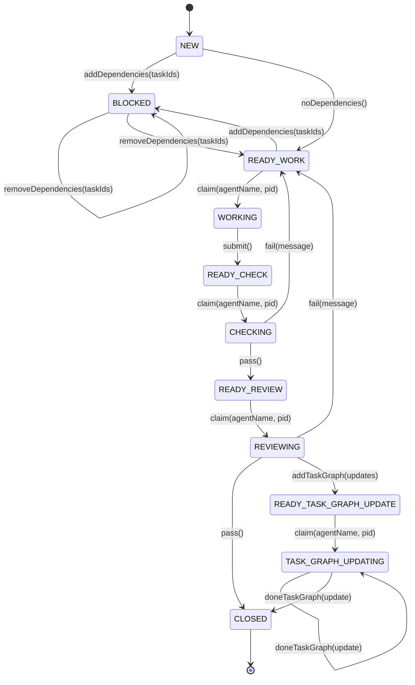

# Task Graph System

The task graph system is the execution framework for a software project.

Work is represented as individual task documents. Each task contains its definition, dependencies, implementation history, automated checks, reviews, and task graph updates.

The task documents are the source of truth. The current project state is generated by tooling.

## Directory Layout

```text
project-root/
│
├── README.md
│
└── tasks/
    ├── template.md
    ├── next-task-id
    ├── new-task.ts
    ├── task-state.ts
    │
    ├── 000001.md
    ├── 000002.md
    ├── 000003.md
    │
    └── closed/
        ├── 000004.md
        └── 000005.md
```

## Rules

- All active tasks are stored directly in `tasks/`.
- Closed tasks are moved to `tasks/closed/`.
- `task-state.ts` only reads active tasks directly under `tasks/`.
- `tasks/closed/` is archival and is never included in state calculations.

## Task IDs

Task identifiers are fixed-width six-digit numbers (e.g., `000042`).

- IDs are zero-padded.
- IDs are monotonically increasing.
- IDs are never reused.
- Task filenames are always `<id>.md`.

## Usage

### Create a new task

```bash
bun tasks/new-task.ts "Task title"
```

Without a title, the template is populated with an empty title field.

### View project state

```bash
bun tasks/task-state.ts
```

Outputs JSON to stdout with tasks grouped by state and any detected problems.

#### JSON Output Schema

The output is a single JSON object with two top-level keys:

| Key | Type | Description |
|---|---|---|
| `tasks` | `Record<State, TaskId[]>` | Tasks grouped by their current state. Keys are always the valid states listed below, even if empty. Values are sorted arrays of task IDs. |
| `problems` | `Problem[]` | Array of detected issues (empty if none). |

**Valid states** (keys in `tasks`):
`NEW`, `BLOCKED`, `READY_WORK`, `WORKING`, `READY_CHECK`, `CHECKING`,
`READY_REVIEW`, `REVIEWING`, `READY_TASK_GRAPH_UPDATE`, `TASK_GRAPH_UPDATING`

**Problem object:**

| Field | Type | Description |
|---|---|---|
| `type` | `string` | One of the problem types listed below. |
| `task_id` | `string \| null` | The affected task ID (present for task-specific problems, omitted for global issues like dependency cycles). |
| `message` | `string` | Human-readable description of the problem. |

**Problem types:**

| Type | When reported |
|---|---|
| `MalformedTaskDocument` | A `.md` file has an invalid/missing task ID or a duplicate ID. |
| `InvalidMetadata` | A task has an invalid state value, malformed dependency IDs, or `claimed_by` without `claimed_pid`. |
| `MissingDependency` | A task depends on an ID that does not exist among active tasks. |
| `DependencyCycle` | Circular dependency detected among one or more tasks. |
| `InvalidStateTransition` | A task is in `WORKING`, `CHECKING`, `REVIEWING`, or `TASK_GRAPH_UPDATING` without a claim. |
| `MissingClaimProcess` | A task's claimed PID no longer exists (stale claim). |
| `StuckTask` | A task has been in the same state longer than its threshold (`WORKING`: 12h, `CHECKING`: 1h, `REVIEWING`: 12h, `TASK_GRAPH_UPDATING`: 1h). |

**Example output:**

```json
{
  "tasks": {
    "NEW": [],
    "BLOCKED": ["000003"],
    "READY_WORK": ["000001"],
    "WORKING": ["000002"],
    "READY_CHECK": [],
    "CHECKING": [],
    "READY_REVIEW": [],
    "REVIEWING": [],
    "READY_TASK_GRAPH_UPDATE": [],
    "TASK_GRAPH_UPDATING": []
  },
  "problems": [
    {
      "type": "StuckTask",
      "task_id": "000002",
      "message": "Task \"000002\" has been in \"WORKING\" for 15.3 hours (threshold: 12h)"
    }
  ]
}
```

### Transition a task

```bash
bun tasks/transition.js <task-id> <transition-name> [args...]
```

`transition.js` asserts the current state of a task and performs a valid state transition. It only mutates the YAML frontmatter; agents may update the task document body before transitioning.

#### Available transitions

| Transition | Args | Description |
|---|---|---|
| `addDependencies` | `<taskId1> [taskId2 ...]` | Add dependency tasks |
| `removeDependencies` | `<taskId1> [taskId2 ...]` | Remove completed dependencies |
| `noDependencies` | *(none)* | Declare the task has no dependencies |
| `claim` | `<agentName> <pid>` | Claim a task for work/check/review |
| `submit` | *(none)* | Submit work for automated checks |
| `pass` | *(none)* | Mark checks or review as passed |
| `fail` | `<message>` | Fail checks or review with a message |
| `addTaskGraph` | `<update1> [update2 ...]` | Declare pending task graph updates |
| `doneTaskGraph` | `<update>` | Mark a task graph update as done |

#### Examples

```bash
# A task with no dependencies (NEW → READY_WORK)
bun tasks/transition.js 000001 noDependencies

# Add dependencies (NEW → BLOCKED or self-loop)
bun tasks/transition.js 000002 addDependencies 000001

# Claim a task to work on it (READY_WORK → WORKING)
bun tasks/transition.js 000001 claim my-agent $$

# Submit for automated checks (WORKING → READY_CHECK)
bun tasks/transition.js 000001 submit

# Claim and run checks (READY_CHECK → CHECKING)
bun tasks/transition.js 000001 claim checker $$

# Checks pass (CHECKING → READY_REVIEW)
bun tasks/transition.js 000001 pass

# Claim for review (READY_REVIEW → REVIEWING)
bun tasks/transition.js 000001 claim reviewer $$

# Review passes — closes task or moves to task graph update
bun tasks/transition.js 000001 pass

# If checks/review fail, send back to READY_WORK
bun tasks/transition.js 000001 fail "Fix null handling in parser"
```

#### Notes

- `$$` expands to the current shell PID, which is used for claim ownership and stale-process detection.
- Self-loop transitions (`removeDependencies` when deps remain, `doneTaskGraph` when updates remain) update the `state_entered` timestamp without changing state.
- When a task reaches `CLOSED`, its file is automatically moved to `tasks/closed/`.

## Task State Machine



### Transition Rules

- `BLOCKED → READY_WORK` only when the last dependency has been removed via `removeDependencies(taskIds)`.
- `TASK_GRAPH_UPDATING → CLOSED` only when the last pending task graph update is marked done via `doneTaskGraph(update)`.
- Self-loop transitions (`BLOCKED → BLOCKED`, `TASK_GRAPH_UPDATING → TASK_GRAPH_UPDATING`) update the `state_entered` timestamp without changing state.
- Agents may update the task document body before transitioning; `transition.js` only asserts and mutates the YAML frontmatter.

## Invariants

- Every task is exactly one six-digit Markdown file.
- Active tasks live directly under `tasks/`.
- Closed tasks live under `tasks/closed/`.
- Closed tasks are not read by `task-state.ts`.
- Task IDs are allocated only by `new-task.ts`.
- Reviews are appended to the task document.
- State is stored only in task documents.
- `task-state.ts` only reports state; it does not mutate tasks.
- Problems are reported, never silently repaired.

The project is complete when all tasks have reached `CLOSED` and `task-state.ts` reports no unresolved problems.
