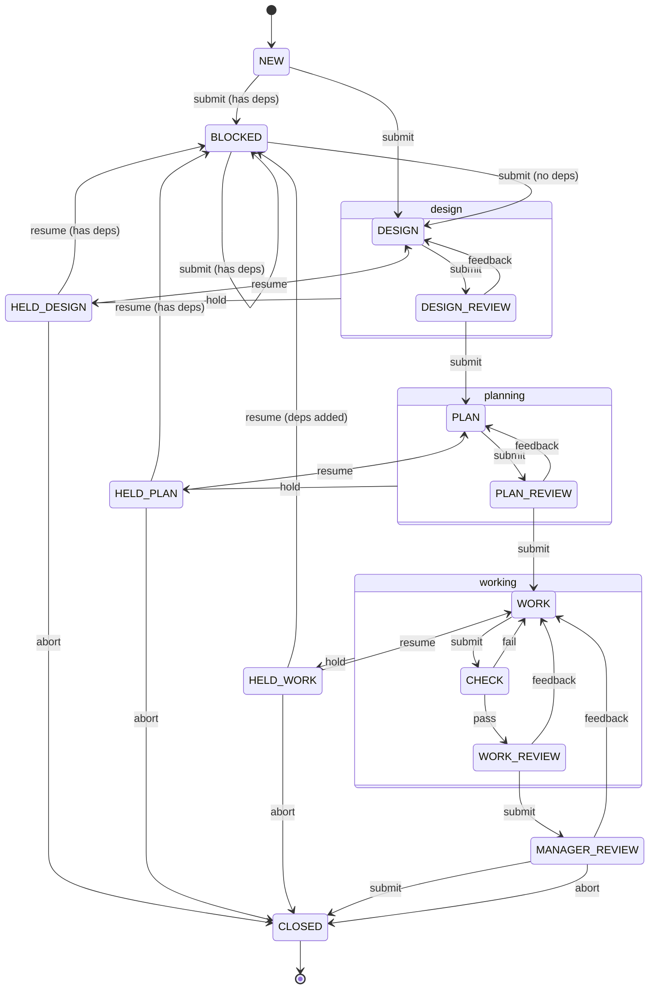
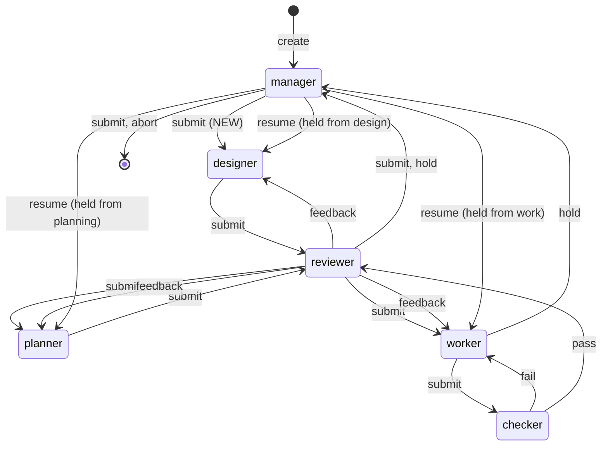

# Task Graph System

Have your smart coding agent manage a team of pi agents to implement the design, planning, implementation, review of coding tasks.

## Task State Machine



There is one state per stage, and `claimed_by` names the slot that is on it: `WORK` with no claim is a task waiting for a worker slot, `WORK` claimed by `pi-fake-2` is that slot working on it. A claim is refused when the field is already set, and that refusal — under the graph lock, on one field — is what makes a task exactly one slot's.

</details>

### Roles

Every state belongs to exactly one role. A transition between two states of the same role is that role at work; a transition that leaves them is a handoff, and the diagram below is only the handoffs.



A second rejection of the same review holds the task instead of bouncing it: `DESIGN_REVIEW → HELD_DESIGN`, `PLAN_REVIEW → HELD_PLAN`, `WORK_REVIEW → HELD_WORK`, with the findings in `held_reason`.

The manager is at both ends: it defines the task before anyone can work on it, and it is the only role that can close one.

### The manager inbox

The `inbox` resource is everything waiting on the manager:

- `MANAGER_REVIEW` — ready for final review. If complete use `task_submit` to merge it to master, otherwise `task_feedback` with findings sends it back; `task_abort` throws it away.
- `HELD_DESIGN` / `HELD_PLAN` / `HELD_WORK` — an agent was blocked with `held_reason`. Resolve by directly updating the task document, then `task_resume`, or `task_abort` to close it.
- `NEW` — author the task: edit the file directly — body, checks, dependencies — then `task_submit` to dispatch it.

## Setup

Clone this template beside the project you want it to drive, not inside it, and install its dependencies there. It needs `bun` and `git` on the path, plus `pi` for the agents themselves — the server drives them as `pi --mode rpc` subprocesses.

```bash
git clone https://github.com/Pyrolistical/task-graph-template.git task-graph-template
cd task-graph-template
bun install
cd ../my-project
claude mcp add task-graph -- bun ../task-graph-template/mcp.ts
```

Restart `claude`. Starting the server seeds `~/task-graph/<key>/` — the key is derived from the repository's path — with the contents of the template's `tasks/`. Fill in the pool it left there:

```bash
edit ~/task-graph/my-project/agents.json
```

Then restart the `task-graph` MCP server inside `claude`.

The repository the server drives is the directory it is started in, so `claude` must be run from the project root.

```text
~/task-graph/<key>/
├── agents.json          # the pool, seeded disabled
├── next-task-id         # seeded on first start
├── template.md          # optional; overrides orchestrator/template.md
└── 000001.md ...        # the task documents, as they are created
```

### The agent pool

`agents.json` is read from the task directory — `~/task-graph/my-project/agents.json`. It is seeded with one disabled placeholder; give it a real provider and model, set `enabled` to true, and add as many slots as the pool should run.

```json
{
  "agents": [
    {
      "type": "pi",
      "provider": "anthropic",
      "model": "claude-sonnet-4-5",
      "slots": 3,
      "write": ["~/.cache"]
    }
  ]
}
```

### The manager skill

[`task-graph-inbox`](.claude/skills/task-graph-inbox/SKILL.md) is the manager's loop written down: drain the inbox head first, by rank, then watch `inbox.json` for the next arrival. Link it into the project the manager runs in, so it stays the template's copy:

```bash
mkdir -p ~/my-project/.claude/skills
ln -s ../../../task-graph-template/.claude/skills/task-graph-inbox ~/my-project/.claude/skills/task-graph-inbox
```

Start `claude` in the project root and confirm with `/mcp` that `task-graph` is connected.

Once the server is up, a second terminal in your project root can monitor the pool:

```bash
bun ../task-graph-template/console.ts
```

## Design documentation

[`docs/`](docs/) is how the orchestrator works and why — start with [The dictionary](docs/dictionary.md), [Authority](docs/authority.md), [States](docs/states.md) and [ASSIGNMENT.md](docs/assignment.md).
