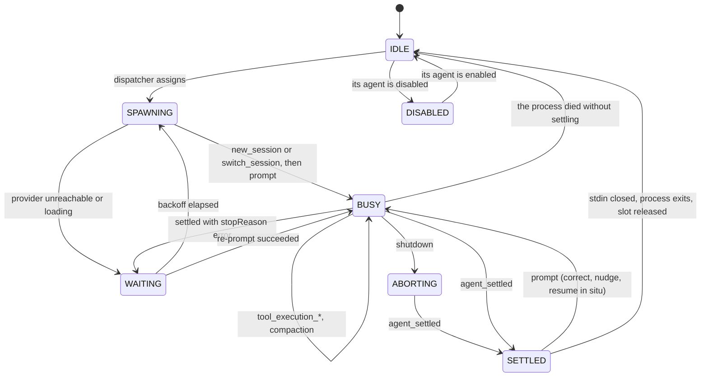

# Agents configuration

`agents.json` declares the pool.

- read from the task directory — `~/task-graph/<key>/agents.json`
- never a file inside the orchestrator's own checkout, so one orchestrator can drive several projects with different pools
- seeded there on first start from `tasks/agents.json` in this checkout: one disabled placeholder to fill in
- there is no checker or manager agent: those roles belong to the server and the manager

```json
{
  "agents": [
    {
      "type": "pi",
      "provider": "anthropic",
      "model": "claude-sonnet-4-5",
      "slots": 3,
      "write": ["~/.cache"]
    },
    {
      "type": "pi",
      "provider": "llama.cpp-rocm",
      "model": "rocm",
      "slots": 1,
      "roles": ["worker"],
      "enabled": false
    }
  ]
}
```

Seven keys, and no more. An entry is:

- a model on a provider
- how many of it may run at once
- whether it may run at all
- what it may write outside its worktree
- which roles it may take

Names are derived, not configured:

- `type-provider-model-slot`, slots numbered from 1
- so that config produces `pi-anthropic-claude-sonnet-4-5-1`, `-2`, `-3` and `pi-llama.cpp-rocm-rocm-1`
- the name goes into `claimed_by` and `workspace.agent`, so a claim in the graph says exactly which model on which provider is holding the task

Rejected on load, not at spawn time:

- an unknown key
- a missing field
- a duplicate `type`+`provider`+`model` triple
- `slots < 1`
- an unknown role

A config that would fail on the tenth dispatch should fail on startup.

## Which roles an agent may take

- `roles` defaults to all four — `worker`, `reviewer`, `planner`, `designer` — and is the only knob on what a slot may be handed
- a task's state decides the role it needs: designing takes a `designer`, planning takes a `planner`, working takes a `worker`, and the review states take a `reviewer`
- a slot whose `roles` do not include the one a task needs is skipped by the dispatcher
- so a pool can say which model is which: the cheap local model only works, the expensive one only reviews
- nothing else about the entry changes — a restricted slot is still offered for every task whose role it does allow, and the role of a claim is still derived from the task's state, never from the slot

Restricting does not promise capacity:

- a pool whose only slots take `worker` leaves every planner and reviewer waiting
- the queue view shows the work and the slots pane shows idle slots
- the mismatch is the config, not a scheduler bug

## What an agent may write

- `write` defaults to `["~/.cache"]` and is the only knob on the sandbox
- declaring it **replaces** the default rather than extending it
  - a pool that needs a rust toolchain writes the whole list: `["~/.cache", "~/.cargo", "~/.rustup"]`
  - a pool that should have nothing but its worktree writes `[]`
- `~` expands to the home of the user running the server
- a relative path resolves against the launch directory
- a path that does not exist on the host is dropped, because `bwrap` cannot overlay what is not there
- the paths are resolved at spawn, not at load, so a cache created after startup is picked up
- see [The sandbox](sandbox.md) for what the array actually buys and why every entry is an overlay rather than a bind

## Turning an agent off

- `enabled` defaults to true and is a property of the agent, not of one slot
- an entry is a model on a provider, and there is no case where slot 2 of a model should be dispatchable while slot 1 is not
- setting it false in `agents.json` starts that agent parked
- `disable_agent` and `enable_agent` move it at runtime, keyed by the agent name (`type-provider-model`, no slot number), and so does the switch on that agent's pane in [the console](console.md)

Disabling never interrupts work:

- a slot mid-task keeps it, settles it, and runs its checks; it is simply not offered as capacity again
- that is visible rather than implied: `enabled` is false on every row of the agent from the moment it is disabled, while `state` still reads `BUSY` or `SETTLED` for as long as the task is in flight, and becomes `DISABLED` when the slot is released
- an agent being drained and an agent already idle are different situations, and the view says which one you are looking at

The runtime toggle is not written back to `agents.json`:

- the file is the declared pool and survives a restart
- the toggle is an operational override for a provider that has gone bad mid-run
- a restart is exactly when you want the declared pool back

- nothing here bounds retries, and nothing needs to
- a task that keeps bouncing shows up as repeated `fail` and `feedback` lines against the same `task_id` in the transition log, and the manager is the thing watching

## Aborting one tool call

- `agent_abort` targets a single slot by its full `type-provider-model-slot` name — the one case where a slot, not an agent, is the unit
- it is refused if the slot has no live process, and refused unless that process is inside a `bash` tool call: `bash` is the only tool that runs long enough to be stuck, and `abort_bash` is the only kill the rpc channel offers that is narrower than the whole turn
- it calls `abort_bash`, not `abort`. The command dies, its tool result comes back as an error, and the agent goes on with the turn it was in — the session, the claim and the slot are all untouched
- **the agent is the one that reacts.** A wedged `zig build` becomes a failed tool call in the transcript, which is a thing an agent already knows how to read; ending the turn instead would throw away the context that produced it
- the console's `[abort]` button is the only thing that raises it, and it appears only on a pane whose agent is inside a `bash` call
- this is the escape hatch for one command that will never return. An agent stuck in a way that survives killing its command is what `looping` and the held states are for

## When an agent compacts

`compaction_start` means the context overflowed: the agent is about to lose the middle of its own transcript and keep working from a summary. Two things follow it.

- for every role but `worker`, the worktree is reset to the commit it was dispatched at — `reset --hard` and `clean -fd`. A designer, a planner or a reviewer is told to change nothing; anything in the tree at that point is a scribble, and a scribble that outlives the context that explains it is worse than no scribble at all. The `untouched` guard would catch it at settle, but only after the agent has spent a whole turn on top of it
- the worker keeps its tree, because commits and edits are its job
- then the dispatch fragment is sent as a **steering message**, not a prompt: it joins the turn already in flight rather than starting a new one, and pi delivers it as soon as the compaction finishes
- the fragment is one line pointing at `../ASSIGNMENT.md`, which is exactly what an agent that just lost its context needs — the file is still there, and it is the one part of the assignment compaction cannot eat

## The agent state machine



- a slot in `WAITING` is **not free**. Backpressure on a provider outage has to show up as reduced capacity, not as a queue of dispatches into a wall.
- `DISABLED` is only entered from `IDLE`, which is what makes disabling safe to do at any moment: the transition is "this slot will not be offered again", never "drop what you are holding". A slot disabled mid-task takes the `→ IDLE` edge it would have taken anyway and lands in `DISABLED` from there.
- `BUSY → IDLE` is the death of a `pi` process without `agent_settled` — an OOM kill, a segfault, a runaway tool filling the disk. The stream fails when stdout closes, the worker stops rather than trying to prompt a corpse, and the slot is released; the reaper releases the claim on the next tick, since the task is still `WORK` under a pid that no longer exists.

## When the provider is down

- `pi` retries inside a turn on its own; the server sees that as `auto_retry_start` and does nothing
- what the server handles is `pi` giving up and settling with `stopReason: error`, and a local inference server not answering at all

| Condition                        | Server behaviour                                                   |
| -------------------------------- | ------------------------------------------------------------------ |
| connection refused, timeout, 5xx | re-`prompt` the same session after 1s, 2s, 4s … capped at 64s      |
| `503` with a model-loading body  | re-`prompt` every 5s, indefinitely, without escalating the backoff |
| any success                      | backoff resets to 1s                                               |

The distinction matters because they are different events:

- a refused connection means the provider is broken and every retry costs something; the exponential decay keeps a dead endpoint from being hammered while still recovering within a minute of it coming back
- a 503 during model load means the provider is working — a large model on a cold ROCm box takes minutes to map weights — so the server waits rather than backing off, and the attempt counter never advances

Neither ever exhausts:

- there is no retry limit, because the failure is not the task's fault
- dropping the assignment would lose a live worktree and a session for a reason that will resolve on its own
- the slot sits in `WAITING`, `agents.json` shows the reason and the next `retry_at`, and the manager can see at a glance that its capacity is halved and why
