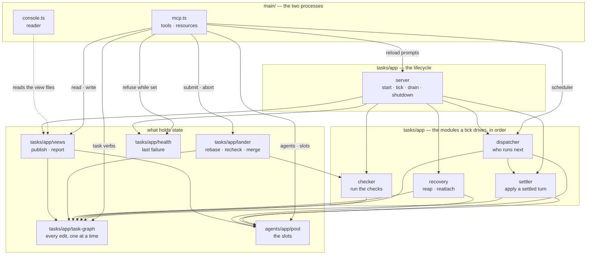

# The slices

Eleven slices, each an onion of its own, ordered so that every dependency points inward.

```text
main/        composition root — mcp.ts · console.ts      builds adapters, wires the app
console/     the reader: panes · frame · keys · tty      a whole second process
tasks/       the graph, the tick, and what a turn meant  the pipeline
checks/      run a task's checks, sandboxed              one port, one runner
agents/      what an agent is, how many, who runs next   pool · scheduler · pi · bwrap
runtime/     the runtime directory and the files in it   views · messages · commands
workspaces/  worktrees, branches and their guards        git
prompting/   fragments, issues and the files they load   the prompt library
views/       the five published schemas                  the wire the console reads
vocabulary/  state machine · task document · costs       the words every slice says
kernel/      lookup · latch · queue · files · processes  no domain in it at all
```

A slice may import a slice above it in that list and never one below.
`architecture.test.ts` fails on the first module that tries, so the slices form
a line, which is a graph with no cycle in it.

## Inside a slice

Each slice lays out the same five layers, creating only the ones it needs:

```text
domain/    the rules and the vocabulary of this slice, no I/O
policy/    decisions over that model, still no I/O
ports/     what the slice needs of the world, one file per need
app/       the use cases that hold state and drive the ports
adapters/  the one implementation of a port that touches the world
```

- the same rule applies inside a slice as between them: `domain/` cannot see `policy/`, `policy/` cannot see `ports/`, and nothing points at `adapters/`
- `domain/`, `policy/` and `ports/` name no filesystem, subprocess or environment, in any slice
- their tests name no effect either — they run over the fakes in `testing/ports.ts`
- `main/compose.ts` is the only module that knows both halves of every slice

## Why this shape

The pipeline is mostly **decisions**: what to dispatch, what a settled turn meant, where findings go, whether a worktree broke its guard. Inside one server they could only be reached by starting a subprocess, cloning a repo and driving a fake `pi`. As pure functions with the observations passed in, each is a table test.

`main/` drives the real adapters, so a port buys a seam, not a faster suite.

Slicing on top of that buys something the layers alone did not: **the console is a separate program and now looks like one**. It is a quarter of the code and was spread through all five layer directories, so nothing stopped it reaching into a scheduler's ranking or an inbox's row shape for a type it wanted to draw. It now names four slices and no decision of the server's — the test asserts exactly that list.

## The three shared tiers

`kernel/`, `vocabulary/` and `views/` are what every slice is allowed to say. They are shared on purpose, and each has a rule about what may go in:

- **`kernel/`** — no domain at all. A latch, a lock, a queue, a rate window, a schema helper, and the five adapters over files and processes that everything else is built from. If it mentions a task or an agent it does not belong here.
- **`vocabulary/`** — the words: the state machine, the task document, what a task costs, what blocks what. No slice owns these because every slice says them.
- **`views/`** — the wire contract: the five published schemas the server writes and the console reads, and the pure functions over those rows. Nothing else may declare a `*View`; `architecture.test.ts` checks that every schema the console parses is declared here.

That last one is the boundary the split was really about. `SlotsView` lived beside the pool's parsing, `QueueView` inside the scheduler's ranking, `InboxRow` inside the inbox's sort — so the console, another process, reached into the server's `policy/` for a JSON shape.

## Structure



`main/compose.ts` constructs them in dependency order and hands each port to the module that names it — no dependency bag. It returns the modules as an `App`, which is what `mcp.ts` holds: there is no interface restating the application for the protocol to talk through, so a verb is added to the module that owns the state and nowhere else. Every adapter is a class declaring `implements`, so it is checked where it is written.

`tasks/app/server.ts` owns only what a process owns — the locks, the tick order, the console channel, the shutdown — and nothing else in `tasks/` imports it back. The scheduler's on switch lives on the `dispatcher` it gates, the failure on `health`, the five view files on `views`.

[The import graph](import-graph.md) is the same picture drawn from the modules themselves, generated rather than kept by hand.

## What the slices are not

- `Tasks` is one coarse port over whole documents: the document's point is that a person can edit it, and a repository-per-aggregate over that is `fs` with extra steps
- `tasks/app/task-graph.ts` is the only module that holds that port, and the only door onto the graph. A whole-document rewrite is a read and a write with an `await` between them, so two of them running at once lose one; the queue that stops it lives **inside** the graph, not at the call sites. Dispatch, settle, checks, reap and every MCP tool all go through the same methods, and `architecture.test.ts` fails if a second module names either `Tasks` or the queue
- `Messages`, `Reviews` and `Assignments` share one adapter over the runtime directory, because it is one place with one convention; a file per verb only spreads the layout
- the pool and the scheduler are in `agents/`, not a slice of their own: how many run at once is not separable from what a slot is, and a three-file slice that imports one other slice entirely is a directory, not a boundary
- `checks/`, `workspaces/` and `prompting/` are four or five files each. They are slices because they are genuinely independent — each names only `kernel/` and the shared tiers — not because they are large
- `orchestrator/prompts/` is the prompt markdown, not the `prompting/` slice. It keeps that name because the manager's overrides sit in `<task dir>/prompts/` and the two are searched by the same convention
- no `Clock` port: `kernel/domain/rates.ts` takes `nowMs` as a defaulted parameter
