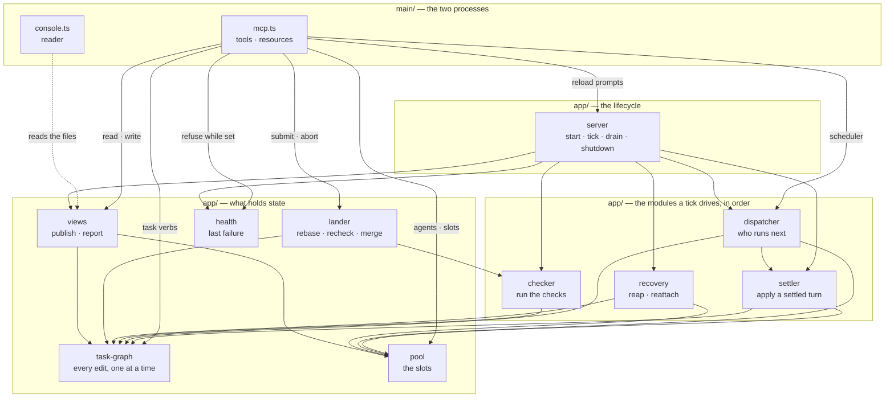

# The layers

Five layers, every dependency pointing inward.

```text
main/      composition root — mcp.ts · console.ts    builds adapters, wires the app
adapters/  git · pi · bwrap · runtime dir · MCP · tty   every effect the system has
app/       use cases over ports                      orchestration
policy/    scheduler · settle · inbox · console       decisions over the model
domain/    state machine · task document · text       vocabulary and rules, no I/O
```

- `domain/` and `policy/` name no filesystem, subprocess or environment; `app/` knows only `app/ports/`; `main/compose.ts` is the only module that knows both halves
- tests in `domain/`, `policy/` and `app/` name no effect either — they run over the fakes in `testing/ports.ts`
- [`architecture.test.ts`](../orchestrator/architecture.test.ts) enforces all of it

## Why this shape

The pipeline is mostly **decisions**: what to dispatch, what a settled turn meant, where findings go, whether a worktree broke its guard. Inside one server they could only be reached by starting a subprocess, cloning a repo and driving a fake `pi`. As pure functions with the observations passed in, each is a table test.

`main/` drives the real adapters, so a port buys a seam, not a faster suite.

## Structure



`main/compose.ts` constructs them in dependency order and hands each port to the module that names it — no dependency bag. It returns the modules as an `App`, which is what `mcp.ts` holds: there is no interface restating the application for the protocol to talk through, so a verb is added to the module that owns the state and nowhere else. Every adapter is a class declaring `implements`, so it is checked where it is written.

`app/server.ts` owns only what a process owns — the locks, the tick order, the console channel, the shutdown — and nothing in `app/` imports it back. The scheduler's on switch lives on the `dispatcher` it gates, the failure on `health`, the five view files on `views`.

[The import graph](import-graph.md) is the same picture drawn from the modules themselves, generated rather than kept by hand.

## What the layers are not

- `Tasks` is one coarse port over whole documents: the document's point is that a person can edit it, and a repository-per-aggregate over that is `fs` with extra steps
- `app/task-graph.ts` is the only module that holds that port, and the only door onto the graph. A whole-document rewrite is a read and a write with an `await` between them, so two of them running at once lose one; the queue that stops it lives **inside** the graph, not at the call sites. Dispatch, settle, checks, reap and every MCP tool all go through the same methods, and `architecture.test.ts` fails if a second module names either `Tasks` or the queue
- `Messages`, `Reviews` and `Assignments` share one adapter over the runtime directory, because it is one place with one convention; a file per verb only spreads the layout
- no `Clock` port: `rates.ts` takes `nowMs` as a defaulted parameter
