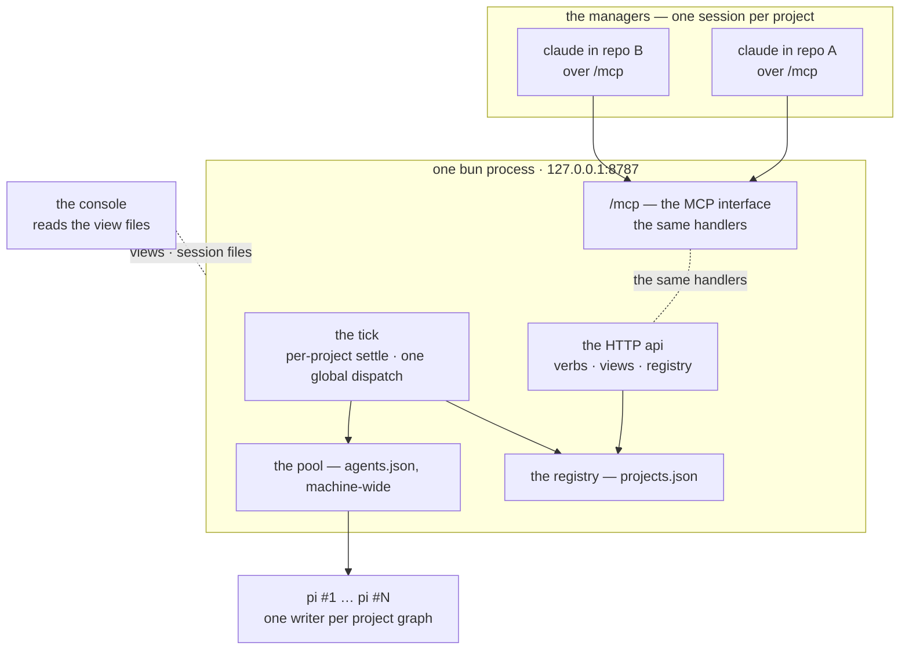

# The HTTP server

One long-running `bun` process, started by a person, outliving every manager. It owns the shared agent pool and every registered project's graph, and serves them over one stateless HTTP API. This first phase serves one kind of manager — a Claude Code session on the MCP interface, a thin client of that API, not where the verbs live; the pi extension, a second thin client, is the next phase in [its own document](http-server-pi-ext.md).



Three things move compared to the stdio server:

- **ownership** — the server is no longer spawned by the manager. A person starts it, managers connect, and it outlives every manager: work continues while a manager is away
- **scope** — one server, one pool, many graphs. Managers register their repositories; the pool serves every registered project
- **the wire** — stdio MCP becomes a stateless HTTP API, with the MCP interface as a wrapper on top, the manager reaching it as claude over /mcp

What does not move is [listed at the end](#what-the-move-does-not-touch).

## Setup

```bash
bun install
bun server.ts                # once per machine: the long-running server
cd ~/my-project
claude                       # the manager: a Claude Code session over /mcp
```

`TASK_GRAPH_SERVER_URL` points the client at the server, defaulting to `http://127.0.0.1:8787`; the server binds loopback by default, because it is the machine's own control surface and a tunnel is how it becomes anything else.

## The project registry

A **project** is one registered task graph: a repository, its [task directory](task-document.md), its runtime directory, and the base it lands onto. The registry is `projects.json` at the server root, written atomically on register and read back on every start:

```text
/tmp/task-graph-server/
  projects.json · slots.json · queue.json · console-command · lock · server.log
  -home-model-my-project/
    transitions.jsonl · inbox.json · tasks.json · checks.json
    000042/  ASSIGNMENT.md · worktree/ · session/ …
```

```json
{
  "projects": [
    {
      "key": "-home-model-my-project",
      "path": "/home/model/my-project",
      "tasks_dir": "/home/model/task-graph/my-project",
      "base": "master",
      "registered_at": "2025-06-01T12:00:00Z"
    }
  ]
}
```

- **the key** is the repository path with `/` → `-`, absolute — the server is run by systemd and serves repositories under different users, so the key encodes the user and is unique across the machine: the runtime directory is `<server root>/<key>/`. The task directory takes the home-relative form of the path, `/` → `-` — `~/model/my-project` becomes `~/task-graph/model-my-project` — because it lives in the owner's `~/task-graph/`, where the home already names the user; outside home it falls back to the absolute path, as [today](task-document.md)
- the per-project layout is what the [runtime directory](runtime-directory.md) is today, minus what moved up with the pool: `queue.json` and `console-command`, its own `lock` (one server, one lock, at the root) and its own `server.log` (one log at the root, lines tagged with the key). The graph's [.tasks.lock](task-document.md#ids-and-the-lock) stays where it is
- `POST /project` takes a `path`, refuses anything that is not a git repository by name, and is **idempotent**: a key already in the registry returns the project it already is, so two managers in one clone register the same project, and two clones of the same upstream are two projects that share the pool
- registering seeds the task directory from the template when it is absent, takes the project's graph lock, resolves `base` from the repository's default branch — re-read on every server start, so a changed default branch needs no re-registration — and writes the project's views once, so a manager attaching immediately sees whole documents

## The HTTP api

The api is the only wire between a manager and the server, and it is **stateless**: every request is named in full by method, path and body — no cookies, no per-connection state, no client identity — so a manager that dies mid-call leaves nothing behind, and a dead client is a connection error and nothing more. That is the shape the verbs already had: today an [MCP tool call](mcp.md) applies its edit and writes the views before it answers, so a stateless HTTP verb is the same contract on a transport a person can curl and an MCP client already speaks.

```text
GET  /health                           { ok: true } — or the server's error, if one stands
GET  /project                          the registry, with each project's error
GET  /project/:key                     the paths report: what `paths` used to be
POST /project                          { path } — register, idempotent
POST /project/:key/prompt/reload
POST /project/:key/scheduler/enable
POST /project/:key/scheduler/disable

POST /project/:key/task                    { title }
PUT  /project/:key/task/:id/body           { body }
POST /project/:key/task/:id/enter/:entry   submit_designing | submit_planning | submit_working
POST /project/:key/task/:id/feedback       { findings: [ … ] }
POST /project/:key/task/:id/resume
POST /project/:key/task/:id/hold           { reason }
POST /project/:key/task/:id/submit
POST /project/:key/task/:id/abort

POST /agent/:agent/enable
POST /agent/:agent/disable
PUT  /agent/:agent/slot      { slots }
POST /slot/:slot/abort

GET  /project/:key/inbox
GET  /project/:key/task
GET  /project/:key/check
GET  /slot
GET  /queue
```

- a mutation returns once its edit has been applied **and the views it affects have been written** — the `applied()` tail of the [MCP surface](mcp.md) becomes the last line of every mutating handler — so what a manager reads next, by tool or by file, is what its call just did
- a success body is the value the MCP tool returned, so the two clients see one payload; a refused verb answers 4xx with `{ error }` — bad state, unknown id, slots above `maxSlots`, an unregistered project, a non-git path — and the text is what the model reads, verbatim: a refusal is a fact, not a failure
- while the server's, or a project's, held [failure](server.md#when-a-tick-fails) stands, the endpoints answer 503 with `{ error }` — the project's verbs and views while a project's stands, every endpoint while the server's does — and `GET /health` is where the server's error shows, in the body, because it is how a person finds what broke. The first clean tick segment clears the project's, a clean tick the server's: a full disk that gets emptied needs no restart
- the clients do not retry. A refused verb is not transient, and a manager that re-reads and re-decides is what a 4xx is for
- the task verbs are the judgement verbs, one URL per judgement, exactly as [authority](authority.md) drew the line: a generic transition URL would put a manager one typo from a transition it did not mean

## The MCP interface

`/mcp` is streamable HTTP in the same process, and it is a wrapper, not a second api: `build()` takes the route table instead of an `App`, each tool calls the same handler the HTTP route does, and each resource reads the same view the `GET` serves. The tool and resource names do not change, so a manager prompt written for the [MCP surface](mcp.md) runs unchanged, and [who may call what](authority.md) is untouched.

The degraded startup surface goes with stdio: there is no client to keep the process alive, so a wiring failure is a process that exits with the reason in `server.log`, and a manager that connects where no server is gets `the server is not reachable at <url>` from the mcp client and points a human at the log. Register-time failures — a non-git path, an unresolvable base — come back in the response instead.

In this phase MCP is where the manager sits, and where an inspector or a test can. It adds no authority and no verb the HTTP api does not have.

## The shared pool

The pool leaves the projects. `agents.json` moves out of the task directory to `~/task-graph/agents.json` — one file, the machine's pool — and the task directory keeps what is a project's: documents, `next-task-id`, `template.md`, `prompts/`.

- the [pool](agents.md), the [slot state machine](agents.md#the-agent-state-machine), the [outage backoff](agents.md#when-the-provider-is-down), the [health checks](agents.md#healthcheck), the [schedules](agents.md#schedule) and the [speed window](scheduler.md#which-free-slot) are unchanged in logic and now server-global: none of them looks at a project, which is why the sharing is a move, not a redesign
- the slot row gains `project` — the key, absent when idle — and that is the whole of the pool's change. The console draws it, the [reattach](server.md#detaching) reads it, and the cost still lands in the right project's document, because a slot is released by the project whose task it held
- the tick walks the registry — reap the dead claims, settle the finished turns, run the checks, re-prompt the backoffs — then does **one dispatch over the union of every project's queue**, then writes the views: three per project, two global
- the [rank](scheduler.md#dispatch-order) is untouched — closest to `CLOSED`, then `blocking`, then id — and it orders the union the same way, so a `WORK` resume in one project still outranks a fresh design in another: the right-to-left rule holds board-wide
- a project whose queue keeps outranking the other's takes the capacity, and that is the rank, not a bug: the levers are the same as today — hold the tasks, or pause the project's scheduler
- the [scheduler switch](scheduler.md#dispatch-order) is per project, because pausing one manager's dispatch is not an act on another's: `enable_scheduler` and `disable_scheduler` bind to the calling manager's project, and the queue view carries one switch per project. A paused project still settles, runs checks and reaps, as before, and a restart re-enables every project, the flag being memory as it always was
- the claim itself changes nothing: `claimed_by` still names the slot, and the project is the document's own directory. A `slots.json` written before the move sits in a per-repository directory the new layout no longer reads, so a restart across the move reaps those live rows rather than guessing which graph a slot belongs to

## The console

`bun console.ts [server-root]` — the root defaulting to `/tmp/task-graph-server/` and the argument to it, replacing the repository argument: the console reads the registry, the two global views and every project's three, and it draws every slot of the shared pool on one screen.

```text
[─●] my-project [─●] other │ my-project 000042 WORK · other 000017 PLAN 2 queued
────────────────────────────────────┬────────────────────────────────────┬────────────────────────────────────
[─●] pi anthro… slot 1 / 2 [-][+] 1s│[─●] pi anthro… slot 2 / 2 [-][+] 5s│[●─] pi llama.cpp-r… slot 1 [+] idle
my-project 000042 worker WORK pid…  │other 000017 planner PLAN pi…       │no task
tool: bash — bun test (12s)  [abort]│thinking (12s)                      │
3.4k tok/s ctx 30% $1.20            │820 tok/s ctx 8% x2 $0.31           │
────────────────────────────────────┼────────────────────────────────────┼────────────────────────────────────
01:58:02 bash: bun test             │02:09:44 read: src/app.ts           │
```

- the pane's second header line — where the task id and role live — gains the project first: the basename of the project's path in the registry, the path itself being what `GET /project` shows. An idle pane reads `no task` as before, with no project, because an idle slot serves no project yet
- the top line carries one scheduler switch per registered project — the [queue view](#the-shared-pool) does — and the queue rows name the project beside the task; the total spans projects
- the panes stay grouped by pool order, not by project: the pool is one, and the project is a label on the pane, not a division of the screen. A machine with two projects reads as one pool wearing names
- a project whose views fail to read draws its failure centred over its own rows, and the other projects draw on: the [whole-screen failure](console.md#scrolling) scopes to the project that broke
- transcript tailing, scrolling, clicking and the [two-view optimistic reset](console.md#clicking) are unchanged — the reset is against the global views, and a click that lands twice still leaves the same pool
- the command channel moves up with the pool: one `console-command` file at the server root, read and deleted in one step as before, and the four-arm union gains the project on the scheduler arm only — `{ scheduler: { project, enabled } }` — because the agent and slot arms name pool things that are already global. The console still adds no [authority](authority.md)

## Lifecycle and failure

- **the server outlives the managers.** That is the deliberate change from the stdio server, which died with its manager and stopped the world with it: a manager that exits leaves the pool running, dispatch continues, reviews land in `MANAGER_REVIEW`, and the [inbox](scheduler.md#the-manager-inbox) is what the returning manager finds. A task graph is now a service its manager checks in on, not a process its manager owns
- **starting** — take the root lock (a second server is refused the port and the lock, and exits with the reason in `server.log`), load `agents.json` at the task-graph root, read the registry, re-resolve the bases, reclone the lost worktrees, reattach the live claims — the rows carry the project now — and write every view once
- **stopping** — the server has a hook watching for SIGINT and SIGTERM, and the signal detaches: the tick stops, the root lock clears, the process exits, and the agents keep running, everything they need to be picked up being a file. A killed server leaves the same nothing, the lock taking over on a dead pid
- **a restart is a reattach, not a re-register**: the registry persists, the task directories persist, and the only things a restart costs are the [speed window](scheduler.md#which-free-slot) and the scheduler flags, both memory, both as today
- **failure is two-tier.** The server holds one error for itself — wiring, the pool — and each project holds one for its tick segment. A project's failure holds its verbs and views and skips it in the dispatch, and the other projects tick on; the server's 503s everything. `GET /health` shows the server's error in its body and `GET /project` carries each project's, both still answering while either stands, because they are how a person finds what broke

## What the move does not touch

- **one writer per graph.** Every mutation still goes through its project's task graph, one at a time, under its [.tasks.lock](task-document.md#ids-and-the-lock). The HTTP verbs are the new door onto it; the queue is still inside the graph, and dispatch, settle, checks, reap and every verb go through the same methods
- **the documents.** A task is still a markdown file the manager edits directly wherever it owns the state — the manager is now a claude session with file tools, so the edit path is unchanged in kind — and [serialization](task-document.md#serialization-is-hand-written) is still hand-written for the three writers it serves
- **the views are files.** The console still reads files and opens no channel to the server, and the readers still watch mtimes rather than polling
- **the agents.** They still never see the graph; `ASSIGNMENT.md` is still their whole interface, and the [sandbox](sandbox.md), the [checks](checks.md), the [workspaces](workspace.md) and the [sessions](sessions.md) are what they were
- **the line of authority.** The server states facts, the manager states opinions — the opinions now travel through the MCP tools, with the same names and the same one-verb-per-judgement

## The core refactoring

Today the process is the project. `wire()` in `main/compose.ts` builds one `App` against one checkout, and everything in it — the graph, the pool, the dispatcher, the held error, the views, the console channel — is per-project by construction; the project is held in a closure, so no request ever names one. The core refactoring dissolves that one-to-one: the process becomes a machine that owns a registry of projects and one pool, and a project becomes an entry in the registry.

Four structural moves:

- **the project stops being the process.** The `App` becomes a project: a graph, its paths, its base, its scheduler flag, its error. `Server` stops being a project's server and becomes the machine — the owner of the registry, the pool and the tick loop — and `wire()` becomes the per-project wiring, called once for every registered project under one server
- **the pool stops being per-project.** One `Pool`, built against `~/task-graph/agents.json`, is handed to every project's dispatcher instead of each project loading its own file; `project` lands on the slot row and the queue row, and the cost a slot records lands in the project its task names
- **the tick walks the projects and dispatches once.** Today's `tick()` is one project's tick — settle, reap, checks, retry, dispatch, views. The machine's tick runs each project's segment — settle, reap, checks, retry, held when it fails — then does one dispatch over the union of every project's queue, then writes the views: three per project, two at the root
- **the verbs stop being closures.** The MCP tools today close over the single `App`, which is why no request names a project. Their bodies become one route table of handlers that take a key and an argument, and the HTTP routes and the `/mcp` tools are two doors onto it. That is what makes the api stateless: the project no longer lives in the process, so a request names everything it needs in the path and the body, and a dead connection leaves nothing behind

Two splits ride with the pool: the views — `inbox`, `tasks` and `checks` stay per project, `slots` and `queue` move to the server root, because the pool they snapshot is no longer a project's — and the held error, one for the machine and one per project's tick segment. The [plan](#the-plan) lands the moves in order — 1 the verbs and their wire, 2 the project, 3 the pool and the tick, 4 the views split, 5 the manager's door, 7 the error split — and the first three change nothing the manager sees. None of them touches what [does not move](#what-the-move-does-not-touch).

## The plan

This first phase lands [the core refactoring](#the-core-refactoring) in seven changes that land one at a time — each is a branch, a green suite, a merge — in dependency order, not design order. The first three leave the manager's surface untouched — same tools, same payloads, same stdio, the port being the process's own — so from the manager's perspective nothing has changed; the surface moves with the registry at 4, the manager's door with the mcp interface at 5, then 6 the console and 7 the edges. The pi extension is the next phase, in [its own document](http-server-pi-ext.md). House rules apply throughout: no code comments, `bun test` and `bun run typecheck` green, `bun run bdd` regenerated when behaviour tests change.

| Step                      | Needs first | Touches                                                                                                                   |
| ------------------------- | ----------- | ------------------------------------------------------------------------------------------------------------------------- |
| 1 · the http server       | —           | `main/http.ts`, `main/mcp.ts`, `main/serve.ts`                                                                            |
| 2 · the project           | 1           | `tasks/app/server.ts`, `main/compose.ts`, `main/serve.ts`                                                                 |
| 3 · the shared pool       | 2           | `agents/adapters/agent-pool.ts`, `agents/app/pool.ts`, `tasks/app/dispatcher.ts`, `tasks/app/server.ts`                   |
| 4 · the registry          | 3           | `main/registry.ts`, `main/http.ts`, `views/slots.ts`, `views/queue.ts`, `runtime/adapters/view-files.ts`, `main/serve.ts` |
| 5 · the mcp interface     | 4           | `main/mcp.ts`, `main/serve.ts`, `server.ts`                                                                               |
| 6 · the console           | 3, 4        | `console.ts`, `console/policy/panes.ts`, `runtime/adapters/command.ts`                                                    |
| 7 · lifecycle and failure | 1, 4        | `tasks/app/recovery.ts`, `tasks/app/health.ts`, `tasks/app/server.ts`, `main/serve.ts`                                    |

### 1 · the http server

The stdio process serves the route table on loopback, and the tools and resources become clients of it — one fetch per verb, carrying the call's `signal`, no retry. The port is the process's own: in this phase only its own tools use it, and one manager runs stdio at a time, so the bind is uncontended. From the manager's perspective nothing has changed — same tools, same names, same payloads, same stdio.

**Needs first:** nothing.

**The change**

- `main/http.ts` — the route table: one route per verb, the verbs of [the api](#the-http-api) minus the registry's, the key still pinned to the process's one, every noun in a path singular; a mutation applies the edit and writes the views it affects before it answers, a refusal a 4xx with `{ error }`, a held failure a 503, and `GET /health` the error in the body
- `main/mcp.ts` — the tools and resources become thin fetches to the table; the `applied()` tail moves into the mutating handlers
- `main/serve.ts` — bind loopback, the `TASK_GRAPH_SERVER_URL` default `http://127.0.0.1:8787`, the listener up before the session answers tools; a bind failure is an exit with the reason in `server.log`

**Tests** — every tool returns what it returned before the change, one assertion per verb, over the wire; a mutation's answer arrives only after the views it affects are written, so a manager reading back sees what its call did; a refusal is a 4xx with the text verbatim — bad state, unknown id, slots above `maxSlots`.

**Done when** — a manager's whole loop — read the inbox, act, re-read — runs unchanged over stdio with the tools over http, and the suite is green.

**Not this step** — the project, the shared pool, the registry's verbs and persistence: still one project in process, with its own pool; the manager's door is still stdio.

### 2 · the project

The process stops being the project: `Server` becomes the machine — the owner of the registry, the pool and the tick loop — and the project is what the machine ticks. The registry is in memory, one entry: the project the server started in. From the manager's perspective nothing has changed.

**Needs first:** 1.

**The change**

- `tasks/app/server.ts` — `Server` stops owning one graph and becomes the machine: the registry and the tick loop that walks it
- `main/compose.ts` — `wire` wires one project into one server; the project carries the graph, its paths, its base, its scheduler flag and its error
- `main/serve.ts` — the server starts from the checkout it started in, with its one project

**Tests** — the started server hosts its project the way it did before; the tick walks the registry and ticks the project; the manager's tools return what they returned before.

**Done when** — the server hosts its project under the machine, and the suite is green.

**Not this step** — the persisted registry, the second project, the shared pool: the registry holds one in-memory entry, and the project loads its own `agents.json`.

### 3 · the shared pool

One pool from `~/task-graph/agents.json` serving every project, and the tick becomes two-tier: each project's segment — settle, reap, checks, retry, held when it fails — then one dispatch over the union of every project's queue. With one project the union is its own queue, so from the manager's perspective nothing has changed; `project` on the rows and the views split land with the registry.

**Needs first:** 2.

**The change**

- `agents/adapters/agent-pool.ts` — `loadAgents` reads `~/task-graph/agents.json`; a per-project `agents.json` is no longer read
- `agents/app/pool.ts` — one `Pool` for the server, handed to every project's dispatcher; the cost lands in the project the task names
- `tasks/app/dispatcher.ts` — the union: the rank within a project as today, one `run` over every project's queue; the `scheduling` flag per project
- `tasks/app/server.ts` — the machine's tick: each project's segment — settle, reap, checks, retry, held when it fails — then one dispatch over the union
- `main/compose.ts` — the one pool wired into every project instead of each project's own

**Tests** — the one project settles and reaps under the machine's tick; a slot's cost lands in the project its task named; the manager's slot view reads the rows it read before.

**Done when** — one `agents.json`, one dispatch over the union, and the suite is green.

**Not this step** — `project` on the rows, the views split, the persisted registry: the rows keep their shape and the views keep their place until 4.

### 4 · the registry

`projects.json` at the server root, and the server owns every project in it. The pool's rows gain `project` — the key, absent when idle — because the rows are the machine's, and the views split with them: `slots` and `queue` at the server root, because the pool they snapshot is no longer a project's. One root lock, one root log with lines tagged by the key; the per-project runtime gives up its own `lock` and `server.log` for the root's, and keeps the graph's [.tasks.lock](task-document.md#ids-and-the-lock) where it is.

**Needs first:** 3.

**The change**

- `main/registry.ts` — the registry: the `projects` array in registration order, written atomically on register and read back on every start; the register semantics — the git-repository check by name, idempotent by key, the task directory — the home-relative path with `/` → `-` under the owner's `~/task-graph/`, the absolute path outside home — seeded from the template when absent, `base` resolved from the default branch
- `main/http.ts` — the registry's verbs — `project_register`, the two reads — onto the route table, wiring a registered project into the running server
- `views/slots.ts`, `views/queue.ts` — `project` on `SlotRow` and `Candidate`; the queue view carries one switch per project
- `runtime/adapters/view-files.ts` — the views split: three per project, `slots.json` and `queue.json` at the server root
- `main/serve.ts` — the root lock, load `projects.json`, wire every project
- `tasks/app/server.ts` — `start()` gives up the per-project runtime lock for the root's, and logs to the root log tagged with the key; a project that fails its tick segment is held, the next one ticks on

**Tests** — two repositories registered make two projects with two graphs under one ticker; registering a key that is already registered returns the project it already is; a restart reads the registry back and puts each live claim on the project its row names; a project that fails its tick segment is held while the next one ticks.

**Done when** — every project in `projects.json` is wired and ticked, and the console reads `projects.json` and each project's views until 6 redraws it.

**Not this step** — the manager's door (stdio until 5), the console's one screen, the two-tier failure.

### 5 · the mcp interface

`/mcp` in the same process: streamable HTTP, the manager's door — each tool the fetch the stdio tools already are, each resource reading the same view its `GET` serves. The manager's setup moves to it: the person starts the long-running server, the manager connects, and stdio goes. The tool and resource names do not change.

**Needs first:** 4.

**The change**

- `main/mcp.ts` — the `/mcp` door: streamable HTTP beside the raw api, one client for both
- `main/serve.ts` — serve `/mcp`; a root `server.ts` entry takes the server role from the `mcp` bin — the person starts the long-running server and the manager's setup points at it; `serveStdio` goes; the degraded startup surface goes with stdio — a wiring failure is a process that exits with the reason in `server.log`

**Tests** — every tool returns the payload its HTTP route returns, and every resource reads the view the `GET` serves; a manager prompt written for the [MCP surface](mcp.md) runs unchanged over `/mcp`; a wiring failure is an exit, not a server that answers.

**Done when** — a Claude Code session over `/mcp` and a curl over the api see one payload, and the suite is green.

**Not this step** — the pi extension ([the next phase](http-server-pi-ext.md)), and [authority](authority.md), which is untouched.

### 6 · the console

One screen for the machine: the registry, the two global views, every project's three — the shared pool drawn with the project as a label on the pane, not a division of the screen.

**Needs first:** 3, 4.

**The change**

- `console.ts` — the argument is the server root, defaulting to `/tmp/task-graph-server/`, replacing the repository; the console reads `projects.json`
- `console/policy/panes.ts` — the pane's second header line gains the project first, the basename of the registry's path; an idle pane reads `no task` with no project
- `console/policy/screen.ts` — the top line's scheduler switch per project, the queue rows naming the project beside the task, the panes grouped by pool order
- `runtime/adapters/command.ts` — the `console-command` file at the server root; the scheduler arm is `{ project, enabled }`, the agent and slot arms naming pool things that are already global

**Tests** — two projects on one screen, grouped by pool order with the project as a label; an idle pane reads `no task` with no project; a project whose views fail to read draws its failure over its own rows and the other projects draw on; the scheduler command names the project and the other arms do not.

**Done when** — the console reads the registry and no channel to the server, and the suite is green.

### 7 · lifecycle and failure

The server outlives the managers: the startup reattach, the two-tier failure, the signal hook.

**Needs first:** 1, 4.

**The change**

- `tasks/app/recovery.ts` — the reattach reads `project` off the live rows and puts each claim back on its own graph
- `tasks/app/health.ts` — two tiers: the server's error for itself — wiring, the pool — and each project's error for its tick segment
- `tasks/app/server.ts`, `main/serve.ts` — startup: the root lock, load the pool, read the registry, re-resolve the bases, reclone the lost worktrees, reattach the live claims, write every view once; a hook on SIGINT and SIGTERM that detaches, the agents left running

**Tests** — a restart reattaches a live claim to the right graph and re-resolves the base; a project's failure skips it in dispatch, 503s its verbs and views, and clears on its first clean segment while the neighbour ticks on; the server's failure 503s every endpoint, `GET /health` carries it, and a clean tick clears it without a restart; a detach leaves the agents running and the views on disk, and a killed server leaves the same nothing.

**Done when** — a kill and a restart cost only the speed window and the scheduler flags, both memory, and the suite is green.

## Testing

The jigs stand up the real server, and the seam moves with it: `server-jig.ts` registers two repositories against one pool, and the fixture's `Plan` runs a verb over HTTP instead of a tool call in process. The new behaviours are written here in the form [the suite takes them](bdd-tests.md), one per test:

### Feature: naming the project

#### a repository is keyed from its absolute path

- **Given** a repository checked out at `/home/model/my-project`
- **When** it is registered as a project
- **Then** its key is `-home-model-my-project`

#### the task directory is home-relative under home

- **Given** a git repository checked out at `~/model/my-project`
- **When** it is registered as a project
- **Then** its task directory is `~/task-graph/model-my-project`

#### the task directory is absolute outside home

- **Given** a git repository checked out at `/srv/model/my-project`
- **When** it is registered as a project
- **Then** its task directory is `~/task-graph/-srv-model-my-project`

#### the runtime directory is the key under the server root

- **Given** a git repository checked out at `/home/model/my-project`
- **When** it is registered as a project
- **Then** its runtime directory is `-home-model-my-project` under the server root

### Feature: registering a project

#### a path that is not a git repository is refused

- **Given** a directory on the machine that is not a git repository
- **When** it is registered as a project
- **Then** the registration is refused, naming that it is not a git repository

#### registering a path twice returns the project it already is

- **Given** a project registered from `~/model/my-project`
- **When** the same path is registered again
- **Then** the registry holds one project
- **Then** the answer is the project it already is

#### a registered repository without a task directory is seeded from the template

- **Given** a git repository whose task directory is absent
- **When** it is registered as a project
- **Then** its task directory is seeded from the template
- **Then** its views are written once, so a manager attaching immediately sees whole documents

#### a project that fails its tick is held, and its neighbour ticks on

- **Given** two registered projects, the first failing its tick segment
- **When** the tick walks the registry
- **Then** the first project's failure is held for the next tick
- **Then** the second project's tick runs to the end

#### a restart reads the registry back

- **Given** two registered projects
- **When** the server starts again
- **Then** the registry holds both projects

### Feature: the shared pool

#### one pool serves every registered project

- **Given** two registered projects
- **Given** the machine's pool at `~/task-graph/agents.json`
- **When** the server loads the pool
- **Then** both projects dispatch from the same slots

#### a running slot carries the project it serves

- **Given** a slot running a task of the project `-home-model-my-project`
- **When** the pool's view is written
- **Then** the slot's row carries `-home-model-my-project` as its project

#### an idle slot carries no project

- **Given** a pool with one idle slot
- **When** the pool's view is written
- **Then** the slot's row carries no project

#### a paused project settles while its neighbour dispatches

- **Given** two projects, the first paused at its scheduler
- **Given** a finished turn in the first and a ready task in the second
- **When** the tick runs
- **Then** the first project's turn settles, and it starts nothing
- **Then** the second project's task is claimed

#### a slot's cost lands in the project its task named

- **Given** a slot of the shared pool running a task of the project `-home-model-my-project`
- **When** the turn ends
- **Then** the cost is written to `-home-model-my-project`'s document

### Feature: the stateless verbs

#### a mutation answers once its views are written

- **Given** a registered project with a task the manager holds
- **When** the task is held over the api
- **Then** the api's answer carries the value the verb applied
- **Then** the views the verb affects are written before the answer

#### a verb that names an unknown task is refused

- **Given** a registered project that holds no task `000001`
- **When** a verb of it names `000001`
- **Then** the verb is refused with a 4xx, naming the id

#### a verb that names an unregistered project is refused

- **Given** a repository that was never registered
- **When** a verb names it as a project
- **Then** the verb is refused with a 4xx, naming the project

#### a verb in the wrong state is refused

- **Given** a task in `HELD_WORK`
- **When** it is submitted over the api
- **Then** the submit is refused with a 4xx, naming the state it found

#### slots above the ceiling are refused

- **Given** an agent whose pool entry declares a ceiling of two slots
- **When** its slots are set to three over the api
- **Then** the change is refused with a 4xx, naming the ceiling

#### a project's failure holds its own verbs and views

- **Given** a project whose tick failed, and the failure standing
- **When** one of its verbs is called
- **Then** the verb answers 503, carrying the failure's text

#### a project's failure leaves its neighbours answering

- **Given** a project whose tick failed, and the failure standing
- **Given** a second registered project
- **When** a verb of the second project is called
- **Then** the verb answers, because the standing failure is the other project's

#### the server's failure holds every endpoint

- **Given** the server holding a failure of its own
- **When** the registry is read over the api
- **Then** it answers 503, carrying the failure's text

#### the health check carries the server's failure

- **Given** the server holding a failure of its own
- **When** the health is read
- **Then** it answers 503, and the body is `{ ok: false }` with the failure's text

#### the health check answers while the server is clean

- **Given** a server whose last tick came round cleanly
- **When** the health is read
- **Then** it answers `{ ok: true }`

#### a held failure clears on the first clean tick

- **Given** a project whose tick failed, and the failure standing
- **When** its next tick comes round cleanly
- **Then** its verbs answer as they did before the failure

### Feature: the mcp interface

#### a mcp tool and its route answer one payload

- **Given** a registered project with a task the manager holds
- **When** the task is held through the mcp tool
- **Then** the tool's answer is the value the hold route answers for the same task

#### a mcp resource reads the view its route serves

- **Given** a registered project
- **When** its inbox is read as a mcp resource
- **Then** it is the same rows the inbox route serves

#### a manager prompt written for the mcp surface runs over the interface

- **Given** a manager prompt written for the mcp surface
- **When** the manager runs it against the interface
- **Then** every tool it calls answers, because the tool names did not change

#### a wiring failure is an exit, not a server that answers

- **Given** a server whose wiring fails on start
- **When** it is started
- **Then** the process exits
- **Then** the reason is in `server.log`

#### a manager that finds no server is told the url

- **Given** a manager pointing at a url where no server listens
- **When** it makes its first call
- **Then** it is told the server is not reachable at the url

### Feature: the console's one screen

#### two projects read as one pool

- **Given** two registered projects, each holding a running task
- **When** the console draws
- **Then** both tasks are on one screen, each pane wearing its project's name
- **Then** the panes are grouped by the pool's order, not by project

#### an idle pane carries no project

- **Given** a pool with one idle slot
- **When** the console draws
- **Then** the pane reads `no task`, with no project

#### a broken project draws its failure on its own rows

- **Given** a project whose views fail to read
- **Given** a second project whose views read cleanly
- **When** the console draws
- **Then** the broken project's failure is drawn over its own rows
- **Then** the other project draws on

#### the scheduler's command names its project

- **Given** two registered projects
- **When** the console pauses the scheduler of one
- **Then** the command it writes names the project it paused
- **Then** the other project keeps dispatching

### Feature: the server outlives its managers

#### a manager that exits leaves the review in the inbox

- **Given** a project with a task in work, and its manager exiting
- **When** the task's turn ends while the manager is gone
- **Then** the review lands in the project's inbox, where the returning manager finds it

#### a second server is refused

- **Given** a server already holding the root lock and the port
- **When** a second server starts
- **Then** it is refused, and the reason is in `server.log`

#### a killed server loses nothing on the way back

- **Given** a server killed while a slot is running a task of a registered project
- **When** the server starts again
- **Then** the running slot is reattached to its task
- **Then** the views are written once, before any dispatch
- **Then** the agents kept running, because everything they need is a file

#### a signal detaches the server

- **Given** a running server
- **When** it gets SIGTERM
- **Then** the tick stops and the process exits, and the agents keep running
- **Then** the views stay on disk, because everything that must be picked up is a file

#### a paused project dispatches again after a restart

- **Given** a running server whose manager paused one project's scheduler
- **When** the server starts again
- **Then** the paused project dispatches, because the flag was memory

#### a base that changes between starts is re-read

- **Given** a registered project whose repository's default branch changed
- **When** the server starts again
- **Then** the project carries the new base, with no re-registration

#### the server's failure clears on the first clean tick

- **Given** the server holding a failure of its own
- **When** its next tick comes round cleanly
- **Then** every endpoint answers as it did before the failure

## New words

| term        | is                                                                                                                                                                                                           |
| ----------- | ------------------------------------------------------------------------------------------------------------------------------------------------------------------------------------------------------------ |
| project     | one registered task graph: a repository, its task directory, its runtime directory, a base                                                                                                                   |
| key         | the project's name: the repository path absolute, `/` → `-` — the server is machine-wide, so the key encodes the user; the task directory takes the home-relative path with `/` → `-`, absolute outside home |
| registry    | `projects.json` at the server root: who is registered                                                                                                                                                        |
| api         | the stateless HTTP surface — the only wire a manager has to the server                                                                                                                                       |
| server root | `/tmp/task-graph-server/` — the registry, the pool's views, the lock, the command channel                                                                                                                    |

Redefined: **manager** — a Claude Code session in one project's checkout, driving it over /mcp · **server** — the one long-running process: the api, the registry, the shared pool, every project's graph · **pool** — every slot of the machine, serving every registered project · **view** — one of five JSON snapshots: three per project (inbox, tasks, checks), two global (slots, queue) · **command channel** — the one file at the server root the console writes back on.
