# The import graph

One graph per program. `A --> B` means `A.ts` imports something from `B.ts`
that survives to runtime; a type-only import is left out, because it binds no
module to another. So are the test suites, the test rig in
`orchestrator/testing/` and the pi extensions — neither program is built from
them.

Generated by `bun run import-graph` from
`orchestrator/testing/import-graph.ts`; the slicing it should show is
[The slices](architecture.md).

## The server

`mcp.ts` enters `main/serve.ts`, which wires the app through `compose.ts`, ticks it, and serves the manager over stdio the tools and resources `main/mcp.ts` registers. It is the only program that holds a running piece of more than one slice.

71 modules, 166 imports.

```mermaid
flowchart LR
  mcp_ts["mcp.ts"]
  orchestrator_main_compose_ts["compose.ts"]
  orchestrator_main_mcp_ts["mcp.ts"]
  orchestrator_main_serve_ts["serve.ts"]
  subgraph tasks["tasks"]
    orchestrator_tasks_adapters_task_documents_ts["adapters/task-documents"]
    orchestrator_tasks_adapters_task_store_ts["adapters/task-store"]
    orchestrator_tasks_app_checker_ts["app/checker"]
    orchestrator_tasks_app_dispatcher_ts["app/dispatcher"]
    orchestrator_tasks_app_health_ts["app/health"]
    orchestrator_tasks_app_lander_ts["app/lander"]
    orchestrator_tasks_app_recovery_ts["app/recovery"]
    orchestrator_tasks_app_reports_ts["app/reports"]
    orchestrator_tasks_app_server_ts["app/server"]
    orchestrator_tasks_app_settler_ts["app/settler"]
    orchestrator_tasks_app_task_graph_ts["app/task-graph"]
    orchestrator_tasks_domain_rows_ts["domain/rows"]
    orchestrator_tasks_policy_inbox_ts["policy/inbox"]
    orchestrator_tasks_policy_settle_ts["policy/settle"]
  end
  subgraph runtime["runtime"]
    orchestrator_runtime_adapters_command_ts["adapters/command"]
    orchestrator_runtime_adapters_runtime_ts["adapters/runtime"]
    orchestrator_runtime_adapters_task_files_ts["adapters/task-files"]
    orchestrator_runtime_adapters_transition_log_ts["adapters/transition-log"]
    orchestrator_runtime_adapters_view_files_ts["adapters/view-files"]
    orchestrator_runtime_domain_command_ts["domain/command"]
    orchestrator_runtime_ports_transitions_ts["ports/transitions"]
  end
  subgraph checks["checks"]
    orchestrator_checks_adapters_check_runner_ts["adapters/check-runner"]
    orchestrator_checks_adapters_sandboxed_checks_ts["adapters/sandboxed-checks"]
    orchestrator_checks_domain_checks_ts["domain/checks"]
  end
  subgraph agents["agents"]
    orchestrator_agents_adapters_agent_pool_ts["adapters/agent-pool"]
    orchestrator_agents_adapters_pi_agents_ts["adapters/pi-agents"]
    orchestrator_agents_adapters_pi_process_ts["adapters/pi-process"]
    orchestrator_agents_app_pool_ts["app/pool"]
    orchestrator_agents_domain_backoff_ts["domain/backoff"]
    orchestrator_agents_domain_health_ts["domain/health"]
    orchestrator_agents_domain_protocol_ts["domain/protocol"]
    orchestrator_agents_domain_results_ts["domain/results"]
    orchestrator_agents_domain_schedule_ts["domain/schedule"]
    orchestrator_agents_domain_slots_ts["domain/slots"]
    orchestrator_agents_policy_scheduler_ts["policy/scheduler"]
    orchestrator_agents_policy_sizing_ts["policy/sizing"]
  end
  subgraph prompting["prompting"]
    orchestrator_prompting_adapters_prompt_files_ts["adapters/prompt-files"]
    orchestrator_prompting_domain_fragment_ts["domain/fragment"]
    orchestrator_prompting_domain_issues_ts["domain/issues"]
  end
  subgraph workspaces["workspaces"]
    orchestrator_workspaces_adapters_git_workspaces_ts["adapters/git-workspaces"]
    orchestrator_workspaces_adapters_git_ts["adapters/git"]
    orchestrator_workspaces_domain_guard_ts["domain/guard"]
    orchestrator_workspaces_domain_workspace_ts["domain/workspace"]
  end
  subgraph views["views"]
    orchestrator_views_activity_ts["activity"]
    orchestrator_views_inbox_ts["inbox"]
    orchestrator_views_queue_ts["queue"]
    orchestrator_views_slots_ts["slots"]
  end
  subgraph vocabulary["vocabulary"]
    orchestrator_vocabulary_assignment_ts["assignment"]
    orchestrator_vocabulary_blocking_ts["blocking"]
    orchestrator_vocabulary_costs_ts["costs"]
    orchestrator_vocabulary_state_machine_ts["state-machine"]
    orchestrator_vocabulary_task_ts["task"]
  end
  subgraph kernel["kernel"]
    orchestrator_kernel_adapters_appendable_ts["adapters/appendable"]
    orchestrator_kernel_adapters_files_ts["adapters/files"]
    orchestrator_kernel_adapters_paced_ts["adapters/paced"]
    orchestrator_kernel_adapters_pid_lock_ts["adapters/pid-lock"]
    orchestrator_kernel_adapters_processes_ts["adapters/processes"]
    orchestrator_kernel_adapters_sandbox_ts["adapters/sandbox"]
    orchestrator_kernel_domain_awaitable_ts["domain/awaitable"]
    orchestrator_kernel_domain_errors_ts["domain/errors"]
    orchestrator_kernel_domain_exclusive_lock_ts["domain/exclusive-lock"]
    orchestrator_kernel_domain_latch_ts["domain/latch"]
    orchestrator_kernel_domain_lookup_ts["domain/lookup"]
    orchestrator_kernel_domain_pattern_ts["domain/pattern"]
    orchestrator_kernel_domain_queue_ts["domain/queue"]
    orchestrator_kernel_domain_rates_ts["domain/rates"]
    orchestrator_kernel_domain_schema_ts["domain/schema"]
  end
  mcp_ts --> orchestrator_main_serve_ts
  orchestrator_agents_adapters_agent_pool_ts --> orchestrator_kernel_adapters_sandbox_ts
  orchestrator_agents_adapters_agent_pool_ts --> orchestrator_agents_domain_slots_ts
  orchestrator_agents_adapters_pi_agents_ts --> orchestrator_agents_domain_health_ts
  orchestrator_agents_adapters_pi_agents_ts --> orchestrator_vocabulary_state_machine_ts
  orchestrator_agents_adapters_pi_agents_ts --> orchestrator_agents_adapters_agent_pool_ts
  orchestrator_agents_adapters_pi_agents_ts --> orchestrator_kernel_adapters_files_ts
  orchestrator_agents_adapters_pi_agents_ts --> orchestrator_kernel_domain_errors_ts
  orchestrator_agents_adapters_pi_agents_ts --> orchestrator_agents_adapters_pi_process_ts
  orchestrator_agents_adapters_pi_agents_ts --> orchestrator_kernel_adapters_sandbox_ts
  orchestrator_agents_adapters_pi_process_ts --> orchestrator_kernel_domain_errors_ts
  orchestrator_agents_adapters_pi_process_ts --> orchestrator_agents_domain_protocol_ts
  orchestrator_agents_app_pool_ts --> orchestrator_agents_domain_slots_ts
  orchestrator_agents_app_pool_ts --> orchestrator_kernel_domain_awaitable_ts
  orchestrator_agents_app_pool_ts --> orchestrator_views_activity_ts
  orchestrator_agents_app_pool_ts --> orchestrator_agents_domain_backoff_ts
  orchestrator_agents_app_pool_ts --> orchestrator_vocabulary_costs_ts
  orchestrator_agents_app_pool_ts --> orchestrator_kernel_domain_errors_ts
  orchestrator_agents_app_pool_ts --> orchestrator_kernel_domain_rates_ts
  orchestrator_agents_app_pool_ts --> orchestrator_agents_domain_schedule_ts
  orchestrator_agents_app_pool_ts --> orchestrator_agents_policy_sizing_ts
  orchestrator_agents_domain_protocol_ts --> orchestrator_kernel_domain_schema_ts
  orchestrator_agents_domain_protocol_ts --> orchestrator_views_activity_ts
  orchestrator_agents_domain_protocol_ts --> orchestrator_agents_domain_results_ts
  orchestrator_agents_domain_results_ts --> orchestrator_kernel_domain_lookup_ts
  orchestrator_agents_domain_results_ts --> orchestrator_vocabulary_state_machine_ts
  orchestrator_agents_domain_slots_ts --> orchestrator_kernel_domain_schema_ts
  orchestrator_agents_domain_slots_ts --> orchestrator_vocabulary_state_machine_ts
  orchestrator_agents_domain_slots_ts --> orchestrator_agents_domain_schedule_ts
  orchestrator_agents_policy_scheduler_ts --> orchestrator_vocabulary_state_machine_ts
  orchestrator_agents_policy_scheduler_ts --> orchestrator_views_queue_ts
  orchestrator_agents_policy_scheduler_ts --> orchestrator_agents_domain_slots_ts
  orchestrator_checks_adapters_check_runner_ts --> orchestrator_checks_domain_checks_ts
  orchestrator_checks_adapters_sandboxed_checks_ts --> orchestrator_kernel_adapters_sandbox_ts
  orchestrator_checks_adapters_sandboxed_checks_ts --> orchestrator_checks_adapters_check_runner_ts
  orchestrator_kernel_adapters_appendable_ts --> orchestrator_kernel_domain_exclusive_lock_ts
  orchestrator_kernel_adapters_paced_ts --> orchestrator_kernel_domain_latch_ts
  orchestrator_kernel_adapters_pid_lock_ts --> orchestrator_kernel_domain_errors_ts
  orchestrator_kernel_adapters_pid_lock_ts --> orchestrator_kernel_adapters_processes_ts
  orchestrator_main_compose_ts --> orchestrator_tasks_app_dispatcher_ts
  orchestrator_main_compose_ts --> orchestrator_tasks_app_lander_ts
  orchestrator_main_compose_ts --> orchestrator_agents_app_pool_ts
  orchestrator_main_compose_ts --> orchestrator_tasks_app_recovery_ts
  orchestrator_main_compose_ts --> orchestrator_tasks_app_checker_ts
  orchestrator_main_compose_ts --> orchestrator_tasks_app_server_ts
  orchestrator_main_compose_ts --> orchestrator_tasks_app_health_ts
  orchestrator_main_compose_ts --> orchestrator_tasks_app_reports_ts
  orchestrator_main_compose_ts --> orchestrator_tasks_app_settler_ts
  orchestrator_main_compose_ts --> orchestrator_tasks_app_task_graph_ts
  orchestrator_main_compose_ts --> orchestrator_kernel_domain_latch_ts
  orchestrator_main_compose_ts --> orchestrator_workspaces_domain_workspace_ts
  orchestrator_main_compose_ts --> orchestrator_agents_adapters_agent_pool_ts
  orchestrator_main_compose_ts --> orchestrator_runtime_adapters_command_ts
  orchestrator_main_compose_ts --> orchestrator_kernel_adapters_files_ts
  orchestrator_main_compose_ts --> orchestrator_workspaces_adapters_git_ts
  orchestrator_main_compose_ts --> orchestrator_workspaces_adapters_git_workspaces_ts
  orchestrator_main_compose_ts --> orchestrator_agents_adapters_pi_agents_ts
  orchestrator_main_compose_ts --> orchestrator_prompting_adapters_prompt_files_ts
  orchestrator_main_compose_ts --> orchestrator_runtime_adapters_runtime_ts
  orchestrator_main_compose_ts --> orchestrator_kernel_adapters_sandbox_ts
  orchestrator_main_compose_ts --> orchestrator_checks_adapters_sandboxed_checks_ts
  orchestrator_main_compose_ts --> orchestrator_kernel_adapters_processes_ts
  orchestrator_main_compose_ts --> orchestrator_tasks_adapters_task_documents_ts
  orchestrator_main_compose_ts --> orchestrator_runtime_adapters_task_files_ts
  orchestrator_main_compose_ts --> orchestrator_runtime_adapters_transition_log_ts
  orchestrator_main_compose_ts --> orchestrator_runtime_adapters_view_files_ts
  orchestrator_main_mcp_ts --> orchestrator_vocabulary_task_ts
  orchestrator_main_serve_ts --> orchestrator_kernel_domain_errors_ts
  orchestrator_main_serve_ts --> orchestrator_kernel_adapters_paced_ts
  orchestrator_main_serve_ts --> orchestrator_runtime_adapters_runtime_ts
  orchestrator_main_serve_ts --> orchestrator_main_compose_ts
  orchestrator_main_serve_ts --> orchestrator_main_mcp_ts
  orchestrator_prompting_adapters_prompt_files_ts --> orchestrator_kernel_domain_errors_ts
  orchestrator_prompting_adapters_prompt_files_ts --> orchestrator_prompting_domain_issues_ts
  orchestrator_prompting_adapters_prompt_files_ts --> orchestrator_prompting_domain_fragment_ts
  orchestrator_prompting_domain_fragment_ts --> orchestrator_kernel_domain_pattern_ts
  orchestrator_runtime_adapters_command_ts --> orchestrator_runtime_domain_command_ts
  orchestrator_runtime_adapters_command_ts --> orchestrator_kernel_domain_errors_ts
  orchestrator_runtime_adapters_command_ts --> orchestrator_kernel_adapters_files_ts
  orchestrator_runtime_adapters_runtime_ts --> orchestrator_vocabulary_state_machine_ts
  orchestrator_runtime_adapters_runtime_ts --> orchestrator_kernel_adapters_appendable_ts
  orchestrator_runtime_adapters_runtime_ts --> orchestrator_kernel_adapters_pid_lock_ts
  orchestrator_runtime_adapters_task_files_ts --> orchestrator_kernel_domain_schema_ts
  orchestrator_runtime_adapters_task_files_ts --> orchestrator_kernel_adapters_files_ts
  orchestrator_runtime_adapters_task_files_ts --> orchestrator_runtime_adapters_runtime_ts
  orchestrator_runtime_adapters_transition_log_ts --> orchestrator_kernel_domain_schema_ts
  orchestrator_runtime_adapters_transition_log_ts --> orchestrator_runtime_ports_transitions_ts
  orchestrator_runtime_adapters_transition_log_ts --> orchestrator_kernel_adapters_appendable_ts
  orchestrator_runtime_adapters_view_files_ts --> orchestrator_views_slots_ts
  orchestrator_runtime_adapters_view_files_ts --> orchestrator_kernel_domain_schema_ts
  orchestrator_runtime_adapters_view_files_ts --> orchestrator_kernel_adapters_files_ts
  orchestrator_runtime_adapters_view_files_ts --> orchestrator_runtime_adapters_runtime_ts
  orchestrator_runtime_ports_transitions_ts --> orchestrator_vocabulary_state_machine_ts
  orchestrator_tasks_adapters_task_documents_ts --> orchestrator_vocabulary_costs_ts
  orchestrator_tasks_adapters_task_documents_ts --> orchestrator_kernel_domain_errors_ts
  orchestrator_tasks_adapters_task_documents_ts --> orchestrator_vocabulary_task_ts
  orchestrator_tasks_adapters_task_documents_ts --> orchestrator_vocabulary_state_machine_ts
  orchestrator_tasks_adapters_task_documents_ts --> orchestrator_kernel_adapters_files_ts
  orchestrator_tasks_adapters_task_documents_ts --> orchestrator_kernel_adapters_processes_ts
  orchestrator_tasks_adapters_task_documents_ts --> orchestrator_tasks_adapters_task_store_ts
  orchestrator_tasks_adapters_task_store_ts --> orchestrator_kernel_adapters_files_ts
  orchestrator_tasks_adapters_task_store_ts --> orchestrator_kernel_adapters_pid_lock_ts
  orchestrator_tasks_adapters_task_store_ts --> orchestrator_vocabulary_task_ts
  orchestrator_tasks_app_checker_ts --> orchestrator_tasks_app_task_graph_ts
  orchestrator_tasks_app_checker_ts --> orchestrator_kernel_domain_errors_ts
  orchestrator_tasks_app_dispatcher_ts --> orchestrator_tasks_app_settler_ts
  orchestrator_tasks_app_dispatcher_ts --> orchestrator_tasks_app_task_graph_ts
  orchestrator_tasks_app_dispatcher_ts --> orchestrator_vocabulary_costs_ts
  orchestrator_tasks_app_dispatcher_ts --> orchestrator_kernel_domain_errors_ts
  orchestrator_tasks_app_dispatcher_ts --> orchestrator_vocabulary_task_ts
  orchestrator_tasks_app_dispatcher_ts --> orchestrator_vocabulary_state_machine_ts
  orchestrator_tasks_app_dispatcher_ts --> orchestrator_workspaces_domain_workspace_ts
  orchestrator_tasks_app_dispatcher_ts --> orchestrator_agents_policy_scheduler_ts
  orchestrator_tasks_app_lander_ts --> orchestrator_tasks_app_checker_ts
  orchestrator_tasks_app_lander_ts --> orchestrator_tasks_app_task_graph_ts
  orchestrator_tasks_app_lander_ts --> orchestrator_vocabulary_state_machine_ts
  orchestrator_tasks_app_lander_ts --> orchestrator_vocabulary_task_ts
  orchestrator_tasks_app_recovery_ts --> orchestrator_tasks_app_task_graph_ts
  orchestrator_tasks_app_recovery_ts --> orchestrator_vocabulary_state_machine_ts
  orchestrator_tasks_app_reports_ts --> orchestrator_tasks_app_checker_ts
  orchestrator_tasks_app_reports_ts --> orchestrator_tasks_app_dispatcher_ts
  orchestrator_tasks_app_reports_ts --> orchestrator_tasks_app_task_graph_ts
  orchestrator_tasks_app_reports_ts --> orchestrator_tasks_policy_inbox_ts
  orchestrator_tasks_app_reports_ts --> orchestrator_agents_policy_scheduler_ts
  orchestrator_tasks_app_server_ts --> orchestrator_kernel_domain_errors_ts
  orchestrator_tasks_app_server_ts --> orchestrator_tasks_app_dispatcher_ts
  orchestrator_tasks_app_server_ts --> orchestrator_tasks_app_health_ts
  orchestrator_tasks_app_server_ts --> orchestrator_tasks_app_settler_ts
  orchestrator_tasks_app_server_ts --> orchestrator_tasks_app_recovery_ts
  orchestrator_tasks_app_server_ts --> orchestrator_tasks_app_checker_ts
  orchestrator_tasks_app_server_ts --> orchestrator_tasks_app_task_graph_ts
  orchestrator_tasks_app_server_ts --> orchestrator_tasks_app_reports_ts
  orchestrator_tasks_app_server_ts --> orchestrator_kernel_domain_latch_ts
  orchestrator_tasks_app_settler_ts --> orchestrator_tasks_app_task_graph_ts
  orchestrator_tasks_app_settler_ts --> orchestrator_kernel_domain_awaitable_ts
  orchestrator_tasks_app_settler_ts --> orchestrator_agents_domain_backoff_ts
  orchestrator_tasks_app_settler_ts --> orchestrator_vocabulary_assignment_ts
  orchestrator_tasks_app_settler_ts --> orchestrator_prompting_domain_issues_ts
  orchestrator_tasks_app_settler_ts --> orchestrator_vocabulary_state_machine_ts
  orchestrator_tasks_app_settler_ts --> orchestrator_tasks_policy_settle_ts
  orchestrator_tasks_app_task_graph_ts --> orchestrator_kernel_domain_latch_ts
  orchestrator_tasks_app_task_graph_ts --> orchestrator_kernel_domain_queue_ts
  orchestrator_tasks_app_task_graph_ts --> orchestrator_tasks_domain_rows_ts
  orchestrator_tasks_app_task_graph_ts --> orchestrator_vocabulary_blocking_ts
  orchestrator_tasks_app_task_graph_ts --> orchestrator_vocabulary_task_ts
  orchestrator_tasks_app_task_graph_ts --> orchestrator_vocabulary_state_machine_ts
  orchestrator_tasks_policy_inbox_ts --> orchestrator_views_inbox_ts
  orchestrator_tasks_policy_settle_ts --> orchestrator_workspaces_domain_guard_ts
  orchestrator_tasks_policy_settle_ts --> orchestrator_agents_domain_protocol_ts
  orchestrator_tasks_policy_settle_ts --> orchestrator_agents_domain_results_ts
  orchestrator_tasks_policy_settle_ts --> orchestrator_vocabulary_state_machine_ts
  orchestrator_views_inbox_ts --> orchestrator_kernel_domain_lookup_ts
  orchestrator_views_queue_ts --> orchestrator_kernel_domain_lookup_ts
  orchestrator_views_queue_ts --> orchestrator_kernel_domain_schema_ts
  orchestrator_views_queue_ts --> orchestrator_vocabulary_state_machine_ts
  orchestrator_views_slots_ts --> orchestrator_kernel_domain_schema_ts
  orchestrator_views_slots_ts --> orchestrator_vocabulary_state_machine_ts
  orchestrator_views_slots_ts --> orchestrator_views_activity_ts
  orchestrator_vocabulary_costs_ts --> orchestrator_vocabulary_state_machine_ts
  orchestrator_vocabulary_state_machine_ts --> orchestrator_kernel_domain_lookup_ts
  orchestrator_vocabulary_task_ts --> orchestrator_vocabulary_costs_ts
  orchestrator_vocabulary_task_ts --> orchestrator_kernel_domain_lookup_ts
  orchestrator_vocabulary_task_ts --> orchestrator_kernel_domain_schema_ts
  orchestrator_vocabulary_task_ts --> orchestrator_vocabulary_state_machine_ts
  orchestrator_workspaces_adapters_git_workspaces_ts --> orchestrator_kernel_adapters_files_ts
  orchestrator_workspaces_adapters_git_workspaces_ts --> orchestrator_workspaces_adapters_git_ts
```

## The console

`console.ts` opens the runtime directory and draws what it finds. It shares the kernel, the wire contract and the runtime directory with the server, and reaches for nothing else of it.

30 modules, 46 imports.

```mermaid
flowchart LR
  console_ts["console.ts"]
  subgraph console["console"]
    orchestrator_console_adapters_tui_ts["adapters/tui"]
    orchestrator_console_domain_session_ts["domain/session"]
    orchestrator_console_domain_text_ts["domain/text"]
    orchestrator_console_policy_keys_ts["policy/keys"]
    orchestrator_console_policy_panes_ts["policy/panes"]
    orchestrator_console_policy_screen_ts["policy/screen"]
    orchestrator_console_policy_scroll_ts["policy/scroll"]
    orchestrator_console_policy_toggles_ts["policy/toggles"]
  end
  subgraph runtime["runtime"]
    orchestrator_runtime_adapters_command_ts["adapters/command"]
    orchestrator_runtime_adapters_runtime_ts["adapters/runtime"]
    orchestrator_runtime_domain_command_ts["domain/command"]
  end
  subgraph views["views"]
    orchestrator_views_activity_ts["activity"]
    orchestrator_views_checks_ts["checks"]
    orchestrator_views_queue_ts["queue"]
    orchestrator_views_slots_ts["slots"]
    orchestrator_views_tasks_ts["tasks"]
  end
  subgraph vocabulary["vocabulary"]
    orchestrator_vocabulary_state_machine_ts["state-machine"]
  end
  subgraph kernel["kernel"]
    orchestrator_kernel_adapters_appendable_ts["adapters/appendable"]
    orchestrator_kernel_adapters_files_ts["adapters/files"]
    orchestrator_kernel_adapters_paced_ts["adapters/paced"]
    orchestrator_kernel_adapters_pid_lock_ts["adapters/pid-lock"]
    orchestrator_kernel_adapters_processes_ts["adapters/processes"]
    orchestrator_kernel_domain_errors_ts["domain/errors"]
    orchestrator_kernel_domain_exclusive_lock_ts["domain/exclusive-lock"]
    orchestrator_kernel_domain_latch_ts["domain/latch"]
    orchestrator_kernel_domain_lookup_ts["domain/lookup"]
    orchestrator_kernel_domain_pattern_ts["domain/pattern"]
    orchestrator_kernel_domain_rates_ts["domain/rates"]
    orchestrator_kernel_domain_schema_ts["domain/schema"]
  end
  console_ts --> orchestrator_console_adapters_tui_ts
  orchestrator_console_adapters_tui_ts --> orchestrator_views_slots_ts
  orchestrator_console_adapters_tui_ts --> orchestrator_views_checks_ts
  orchestrator_console_adapters_tui_ts --> orchestrator_kernel_domain_errors_ts
  orchestrator_console_adapters_tui_ts --> orchestrator_views_tasks_ts
  orchestrator_console_adapters_tui_ts --> orchestrator_kernel_domain_schema_ts
  orchestrator_console_adapters_tui_ts --> orchestrator_kernel_domain_rates_ts
  orchestrator_console_adapters_tui_ts --> orchestrator_console_domain_session_ts
  orchestrator_console_adapters_tui_ts --> orchestrator_console_policy_panes_ts
  orchestrator_console_adapters_tui_ts --> orchestrator_console_policy_screen_ts
  orchestrator_console_adapters_tui_ts --> orchestrator_console_policy_scroll_ts
  orchestrator_console_adapters_tui_ts --> orchestrator_console_policy_keys_ts
  orchestrator_console_adapters_tui_ts --> orchestrator_console_policy_toggles_ts
  orchestrator_console_adapters_tui_ts --> orchestrator_views_queue_ts
  orchestrator_console_adapters_tui_ts --> orchestrator_runtime_adapters_command_ts
  orchestrator_console_adapters_tui_ts --> orchestrator_kernel_domain_exclusive_lock_ts
  orchestrator_console_adapters_tui_ts --> orchestrator_kernel_adapters_paced_ts
  orchestrator_console_adapters_tui_ts --> orchestrator_kernel_adapters_files_ts
  orchestrator_console_adapters_tui_ts --> orchestrator_runtime_adapters_runtime_ts
  orchestrator_console_domain_session_ts --> orchestrator_console_domain_text_ts
  orchestrator_console_policy_keys_ts --> orchestrator_kernel_domain_pattern_ts
  orchestrator_console_policy_panes_ts --> orchestrator_views_activity_ts
  orchestrator_console_policy_panes_ts --> orchestrator_console_domain_text_ts
  orchestrator_console_policy_screen_ts --> orchestrator_console_policy_panes_ts
  orchestrator_console_policy_screen_ts --> orchestrator_console_policy_scroll_ts
  orchestrator_console_policy_screen_ts --> orchestrator_console_domain_text_ts
  orchestrator_console_policy_screen_ts --> orchestrator_views_queue_ts
  orchestrator_console_policy_toggles_ts --> orchestrator_views_slots_ts
  orchestrator_kernel_adapters_appendable_ts --> orchestrator_kernel_domain_exclusive_lock_ts
  orchestrator_kernel_adapters_paced_ts --> orchestrator_kernel_domain_latch_ts
  orchestrator_kernel_adapters_pid_lock_ts --> orchestrator_kernel_domain_errors_ts
  orchestrator_kernel_adapters_pid_lock_ts --> orchestrator_kernel_adapters_processes_ts
  orchestrator_runtime_adapters_command_ts --> orchestrator_runtime_domain_command_ts
  orchestrator_runtime_adapters_command_ts --> orchestrator_kernel_domain_errors_ts
  orchestrator_runtime_adapters_command_ts --> orchestrator_kernel_adapters_files_ts
  orchestrator_runtime_adapters_runtime_ts --> orchestrator_vocabulary_state_machine_ts
  orchestrator_runtime_adapters_runtime_ts --> orchestrator_kernel_adapters_appendable_ts
  orchestrator_runtime_adapters_runtime_ts --> orchestrator_kernel_adapters_pid_lock_ts
  orchestrator_views_queue_ts --> orchestrator_kernel_domain_lookup_ts
  orchestrator_views_queue_ts --> orchestrator_kernel_domain_schema_ts
  orchestrator_views_queue_ts --> orchestrator_vocabulary_state_machine_ts
  orchestrator_views_slots_ts --> orchestrator_kernel_domain_schema_ts
  orchestrator_views_slots_ts --> orchestrator_vocabulary_state_machine_ts
  orchestrator_views_slots_ts --> orchestrator_views_activity_ts
  orchestrator_views_tasks_ts --> orchestrator_kernel_domain_schema_ts
  orchestrator_vocabulary_state_machine_ts --> orchestrator_kernel_domain_lookup_ts
```



## Named but never bound

In neither graph, because nothing imports them as a value: a port is an
interface, so it is erased before either program runs. They are the API all
the same — see [The slices](architecture.md).

- `orchestrator/agents/ports/agents.ts`
- `orchestrator/checks/ports/checks.ts`
- `orchestrator/console/domain/hits.ts`
- `orchestrator/prompting/ports/prompts.ts`
- `orchestrator/runtime/ports/assignments.ts`
- `orchestrator/runtime/ports/command-channel.ts`
- `orchestrator/runtime/ports/messages.ts`
- `orchestrator/runtime/ports/paths.ts`
- `orchestrator/runtime/ports/publisher.ts`
- `orchestrator/runtime/ports/reviews.ts`
- `orchestrator/tasks/app/config.ts`
- `orchestrator/tasks/ports/tasks.ts`
- `orchestrator/workspaces/ports/workspaces.ts`
