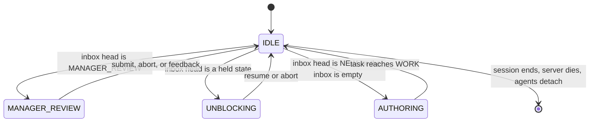

# The MCP tool surface

One stdio server, calling `task.ts` and `transition.ts` in process.

- there is no command-line path into the graph for the manager to reach for
- a single writer is what keeps the lock meaningful and the transition log complete

## Authoring

| Tool                        | Effect                                 |
| --------------------------- | -------------------------------------- |
| `task_create(title)`        | a new document in `NEW`, path returned |
| `task_write_body(id, body)` | replaces the body under the lock       |

- checks and dependencies are not tools: they are frontmatter fields in the document
- authoring is editing the file directly — see [The task document](task-document.md)

## Judgement

| Tool                          | Effect                                                                                                                                                                                   |
| ----------------------------- | ---------------------------------------------------------------------------------------------------------------------------------------------------------------------------------------- |
| `task_submit(id)`             | `NEW` → `DESIGN` or `BLOCKED`; `BLOCKED` → `DESIGN` once the dependencies are gone; from `MANAGER_REVIEW` the branch is landed first (rebase, recheck, fast-forward) and the task closes |
| `task_feedback(id, findings)` | `MANAGER_REVIEW` → `WORK`, findings appended under `# Review findings`                                                                                                                   |
| `task_hold(id, reason)`       | design states → `HELD_DESIGN`, planning states → `HELD_PLAN`, work states → `HELD_WORK`                                                                                                  |
| `task_resume(id)`             | `HELD_DESIGN` → `DESIGN`, `HELD_PLAN` → `PLAN`, `HELD_WORK` → `WORK`, or `BLOCKED` if dependencies were added while held                                                                 |
| `task_abort(id)`              | `abort` from `MANAGER_REVIEW` or any held state, refusing a branch that landed                                                                                                           |

- `task_submit` from `MANAGER_REVIEW` and `task_abort` are the two that do work before they touch the graph, and the two whose failures come straight back to the caller rather than into the task — see [Integration](workspace.md#integration)
- rewriting the graph is not a state: the manager creates, edits and deletes tasks whenever it decides to, and a task does not wait in a queue for that to happen

## Dispatch

| Tool                   | Behaviour                                                             |
| ---------------------- | --------------------------------------------------------------------- |
| `enable_scheduler()`   | begin dispatching; returns immediately                                |
| `disable_scheduler()`  | start nothing new; running processes are still settled and released   |
| `disable_agent(agent)` | stop dispatching to every slot of one agent; running slots drain      |
| `enable_agent(agent)`  | offer that agent's slots again                                        |
| `reload_prompts()`     | re-read every prompt and template from disk; returns each cached path |

- `disable_scheduler` and `disable_agent` are the same verb at different scopes: the first parks the whole pool, the second parks one model on one provider when it is the thing misbehaving
- both return the slots they affected, so the caller can see what is still draining
- `agent` is `type-provider-model` with no slot number — there is no way to disable a single slot, because a slot is a concurrency unit and not something you can have an opinion about
- prompts and templates are cached when the server starts, so an edit to the project's overrides does not take effect until the next start; `reload_prompts` is the same re-read without the restart, and returns the absolute paths so the caller can see what a broken override resolved to or that an override it deleted is gone

## Resources

| Resource         | Contents                                                       |
| ---------------- | -------------------------------------------------------------- |
| `inbox`          | `inbox.json` — what is waiting on the manager, in order        |
| `agents`         | `agents.json`                                                  |
| `checks`         | `checks.json`                                                  |
| `tasks`          | `tasks.json`                                                   |
| `queue`          | `queue.json` — what the scheduler would dispatch next          |
| `workspace_path` | the path to `/tmp/task-graph-server/<repo>`, for file watchers |

All six are the [views](runtime-directory.md#the-views), served as they sit on disk.

## The manager owns what it holds

`task_create` returns a path, and the document at that path is the manager's to edit with ordinary file writes until it transitions out of `NEW`.

- the checks, the `depends_on` list and the body are all just fields in that file, so authoring never goes through a tool
- the same applies wherever the manager owns the state:
  - a held task is edited in place before `resume` or `abort`
  - a task in `MANAGER_REVIEW` is edited in place before `submit` — folding the assignment history into the Implementation History section is exactly the kind of prose work that should not go through a tool

This is safe because ownership follows the state:

- the manager states are the end of the pipeline and no agent is dispatched to them, so the server applies no transitions to a task sitting in one and there is no second writer to race with
- `task_write_body` exists for the case where the manager wants to rewrite a body it does not hold; direct editing is for the case where it does

## The manager state machine

The three outgoing edges from `IDLE` are [the inbox order](scheduler.md#the-manager-inbox), which is why the inbox is a view and not a suggestion.
