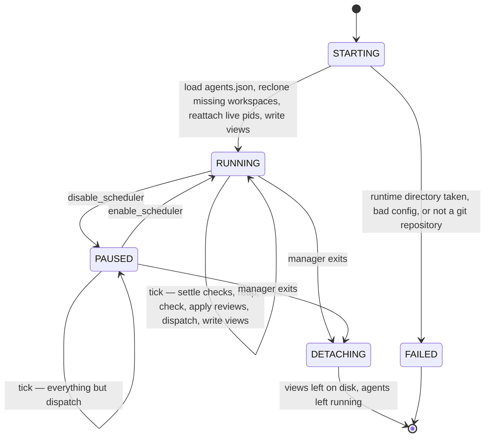

# The server

One `bun` process, started by the manager over stdio, owning every mutation of the graph.

## The state machine

## STARTING

- take the [runtime directory's lock](runtime-directory.md#one-server-at-a-time) before anything else is touched, so a second server never writes over a live one
- load `agents.json` and build the fixed pool — every slot exists from this moment, idle ones included
- reject the config outright if anything in it is wrong; a config that would fail on the tenth dispatch should fail on startup
- reclone any task whose `workspace.worktree` is gone, from its branch in the repo
- reattach to live pids: read the graph, find claims whose `claimed_pid` is still alive, and pick their rpc streams back up
- write the five views once, so a console or a manager attaching immediately sees a whole document
- `FAILED` is a runtime directory another server holds, a bad config, or a directory that is not a git repository — none of them is a condition a tick could recover from

## The tick

Every tick, in order:

1. **settle checks** — reap finished check processes, apply `pass` or `fail`
2. **reap** — release claims whose process is gone; a task held under a pid that no longer exists keeps its state and loses its holder, which puts it back in the queue where it stands
3. **check** — start the commands of anything in `CHECK` that has none running
4. **apply reviews** — map settled agents through [the settle path](settle.md)
5. **dispatch** — hand free slots to [the queue](scheduler.md), unless paused
6. **write views** — five renames, all stamped with the same `seq`

Dispatch is last on purpose: everything before it can free a slot or move a task, so the queue the dispatcher plans against is the graph as it is after this tick's facts, not before them.

## PAUSED

- `PAUSED` still applies transitions
- disabling the scheduler means "start nothing new", not "stop watching"
- an agent mid-run when the manager pauses still gets its submit applied and its slot released
- checks still run, claims are still reaped, views are still written

## DETACHING

- the MCP server dies with the manager; the agents are detached and do not
- the next manager reads `slots.json`, finds pids that are still alive, and reattaches to their rpc streams instead of orphaning live work
- this is why the [runtime directory](runtime-directory.md) exists at all: everything needed to pick the pool back up is a file, not process memory
- `shutdown` is the other exit — it aborts every live turn and kills the processes, which is what a test harness or an operator wants and what a manager exiting does not

## The console command channel

The server watches its own runtime root for a `console-command` file:

- one JSON object, validated against a three-arm discriminated union: `scheduler`, `agent`, `slot_abort`
- the file is read and deleted in one step, so a command is applied exactly once
- a writer that finds the file already there does not write — the previous command has not been picked up yet, and queueing switch flips would be worse than dropping one
- an unparseable or invalid file is dropped silently rather than crashing the server; it is a file anything on the machine can write
- this is the only channel besides MCP that can change the server's behaviour, and it can only do what [the console](console.md) can do: toggle the scheduler, toggle an agent, abort one slot
