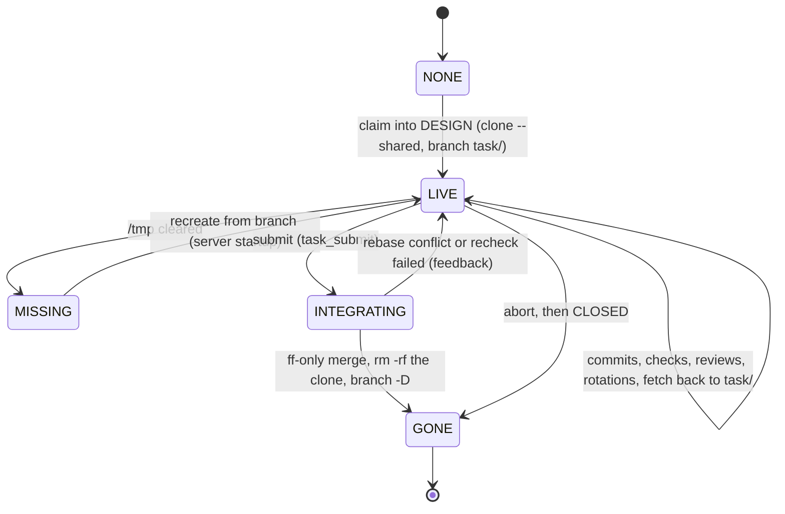

# The workspace

Every task gets one clone of the repo, on its own branch, for its whole life.

## The worktree state machine



- the workspace is created on the first claim into `DESIGN`
- it survives every design → plan → work → check → review round trip:
  - the review needs the tree the checks ran in
  - the sessions live beside it
  - the rotated assignments are the record of every attempt

## Lifecycle

```bash
# claim, then create
git clone --quiet --shared --branch master <repo> \
  /tmp/task-graph-server/-home-model-task-graph-template/000042/worktree
git -C …/000042/worktree checkout -b task/000042

# inside the workspace: the range to review, and what a submit is checked against
git log --patch $(git merge-base refs/remotes/origin/master HEAD)..HEAD
git rev-list --count refs/remotes/origin/master..HEAD
git status --porcelain

# whenever an agent finishes, bring the branch back
git -C <repo> fetch --force …/000042/worktree task/000042:task/000042

# accept
git merge --ff-only task/000042        # after rebase + recheck
rm -rf /tmp/task-graph-server/-home-model-task-graph-template/000042/worktree
git branch -D task/000042

# close: the whole runtime directory goes, worktree and all
rm -rf /tmp/task-graph-server/-home-model-task-graph-template/000042
```

## The workspace is a clone

Not a linked worktree:

- a linked worktree keeps its refs, its index and its objects in the repo's `.git`, so committing in one writes to the repo
- an agent that cannot write the repo cannot commit in a linked worktree at all
- `git worktree add` and a read-only repo are mutually exclusive — that is why the workspace is a clone

`--shared`:

- points the clone's `objects/info/alternates` at the repo's object store
- no history is copied, the clone costs a checkout, and nothing is written to the repo to create one
- what a clone does _not_ copy is local config, so the commit identity is read out of the repo and set in the clone; without that, the first commit fails in any repo that keeps `user.email` local

Objects only flow the other way on a `fetch`:

- the server fetches `task/<id>` out of the workspace whenever an agent finishes, and again after the merge rebase
- so the branch is a fact in the repo rather than in a directory under `/tmp`
- everything the server and the manager read — `diff --name-only`, `merge-base --is-ancestor`, `merge --ff-only`, the reclone after a cleared `/tmp` — reads the repo's own refs
- it is also what makes the work durable, since a `git gc --prune` in the repo can collect objects that only a clone's alternates still reach

The base is always `refs/remotes/origin/<base>`, never the bare name:

- a clone made from the base has a local branch of that name
- one recloned from a surviving `task/<id>` after `/tmp` was cleared has only the remote-tracking ref — and `git merge-base master HEAD` in that clone is a fatal error, not a fallback
- the remote-tracking ref is there in both cases, so the review range and the commit count read the same way whether the workspace is the original or a reclone
- the one exception is the merge rebase, which does `fetch origin <base>:<base>` right before it, precisely to have a local ref to rebase onto

The branch name is minted exactly once:

- `task/<id>`, at the claim that creates the workspace
- everything afterwards reads `workspace.branch` out of the task document: the fetch back, the reclone, the review guard, the fast-forward merge, the abort check, the teardown
- nothing derives the name a second time, so the prefix is a fact about new workspaces rather than a rule the whole system has to agree on, and a task already carrying a branch keeps it
- changing the prefix needs no migration and no code that knows the old one

Two commit streams that never collide:

- **work branches** carry code. Agents commit there.
- **the graph** carries state. It is not in git at all: a transition is a file write under the graph directory, outside the repo.

So there is exactly one graph, no worktree carries a copy of it, and there is never a second one to reconcile.

## Integration

The manager-review `submit` is not a graph decision the manager can make alone — whether a branch landed is a fact about git — so the tool call does the work first and applies the transition only if it worked:

```text
attemptMerge(task):
    fetch the base into the workspace, rebase the workspace onto it
        conflict → abort the rebase, error back to the manager
    run every check again, in the rebased workspace
        failure  → error back to the manager, with the command and its tail
    fetch the rebased branch back into the repo
    fast-forward the base onto the branch
        refused  → error back to the manager
    assert the branch is now an ancestor of the base
    apply submit        → CLOSED
    remove the workspace, delete the branch

attemptAbort(task):
    refuse unless the task is in MANAGER_REVIEW or a held state
    refuse if the branch is already an ancestor of the base
    apply abort         → CLOSED
    (the workspace and branch are torn down when the task closes)
```

- every failure in `attemptMerge` is an error on the tool call, and the task stays in `MANAGER_REVIEW`
- the manager asked whether the branch lands; "no, and here is why" is the answer to that question, not a reason to write a todo on the manager's behalf and hand the task to an agent
- whether a conflicted rebase is worth an agent round trip, a rewritten task or an abort is exactly the judgement `MANAGER_REVIEW` exists for, and the task is already sitting in that state when it finds out

The rebase and the recheck happen **after** the manager accepts, not before:

- a green review does not mean a mergeable branch — the base moved
- rebasing before review means reviewing a diff that no longer exists

`abort` is the other outcome:

- the work is being thrown away because the task was the wrong shape
- what replaces it is whatever the manager writes into the graph, which it may do at any time
- requiring the branch to be unmerged is what stops it from being used to disown work that already landed

The same judgement is available while a task waits:

- a task in `WORK`, `PLAN` or `DESIGN` is one the manager already regrets and no agent has claimed yet — it may never have been started, or it may have come back from a failed check or a review finding
- waiting for it to be dispatched, worked, checked and reviewed before it can be thrown away spends a slot on an answer the manager already has
- `task_hold` parks it and `task_abort` then throws it away, with the same branch rule: a task that was worked before it came back keeps its branch and worktree until it closes, exactly as an abort from `MANAGER_REVIEW` does
- the race between that and the dispatcher is [the scheduler's](scheduler.md#losing-the-race-with-an-abort)
